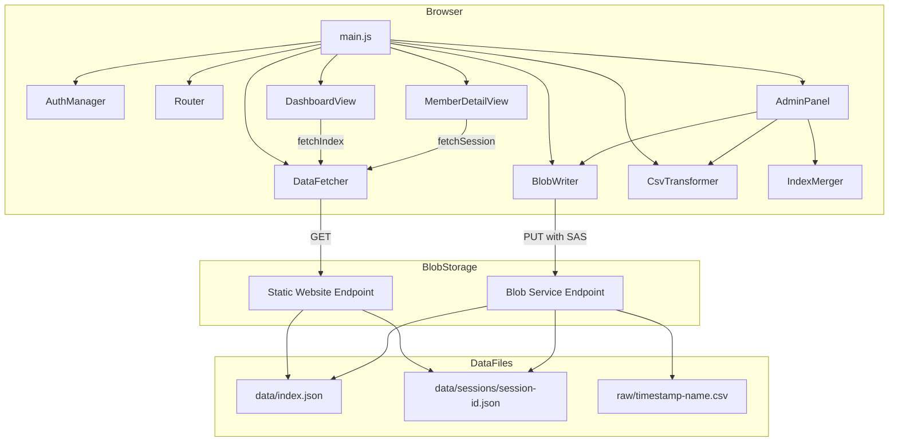
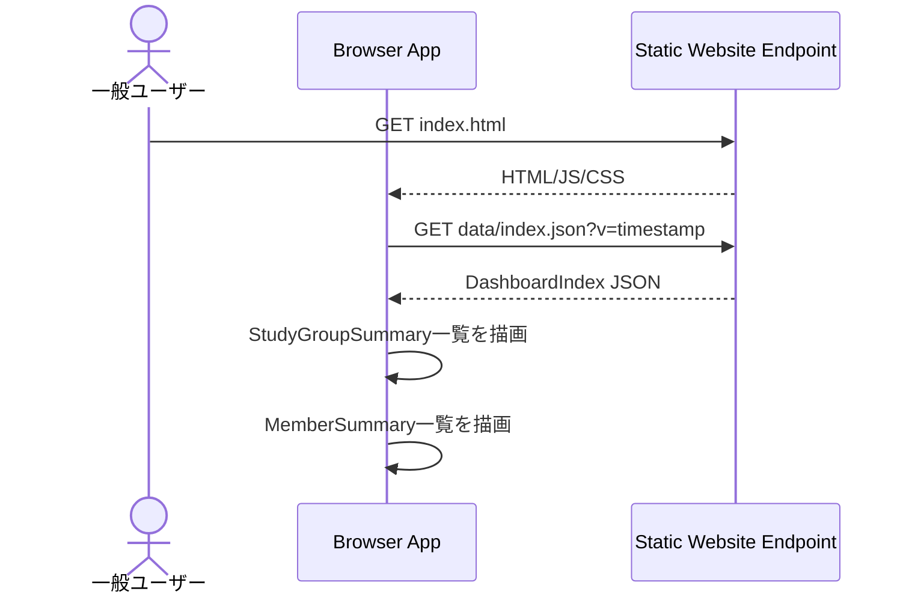
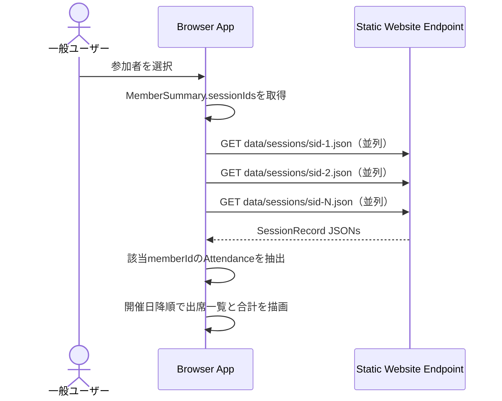
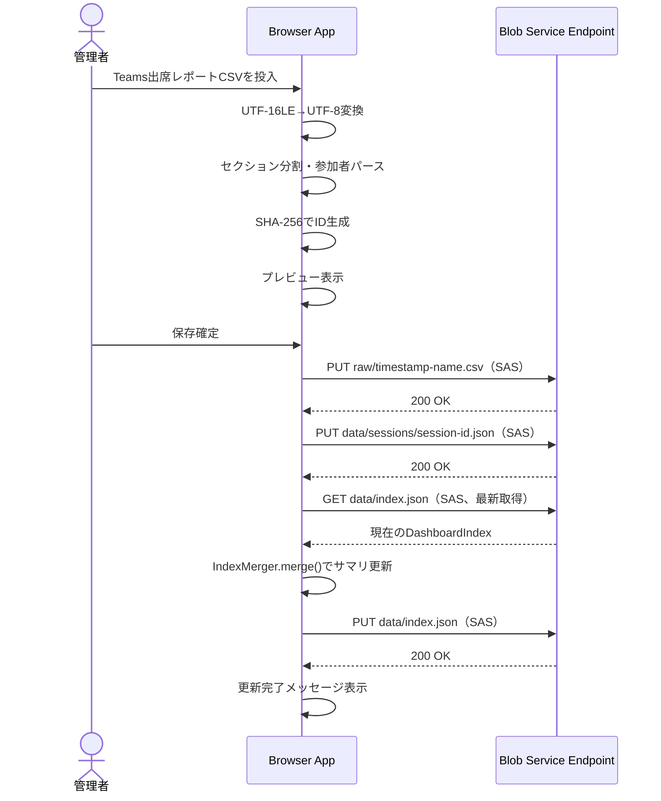

# Design Document — apply-domain-model

## Overview

**Purpose**: ダミーデータの汎用データモデル（DashboardItem/ItemDetail）を、Teams出席レポートベースの勉強会学習時間管理モデルに置き換える。トップ画面を index.json 単体で描画可能にし、CSVアップロード時は2ファイル書き込みで完結する集約設計を実現する。

**Users**: 一般ユーザーが勉強会グループ別・参加者別の学習時間を閲覧し、管理者がTeams出席レポートCSVをアップロードしてデータを更新する。

**Impact**: CsvTransformer、IndexMerger、UI層（DashboardView, DetailView, AdminPanel）の大幅変更。AuthManager、DataFetcher、BlobWriter はインターフェース変更なし。全87テストの書き直し。

### Goals
- Teams出席レポートCSVから勉強会ドメインモデルへの自動変換
- トップ画面を `data/index.json` の1ファイル取得で描画完結
- CSVアップロード時の書き込みを SessionRecord + DashboardIndex の2ファイルに限定
- 既存のCore層・Data層基盤（AuthManager, DataFetcher, BlobWriter）を再利用

### Non-Goals
- セッションの削除・編集機能（追加のみ）
- リアルタイムの参加者間コラボレーション
- Teams API との直接連携（CSVファイルを手動エクスポートする運用前提）
- セッションごとのドリルダウン画面（個人ドリルダウンのみ）

## Architecture

### Existing Architecture Analysis

既存の4層アーキテクチャ（Core / Data / Logic / UI）を維持する。

| 層 | 変更影響 | 詳細 |
|---|---|---|
| Core（AuthManager, Router） | 軽微 | Router のルート定義のみ変更 |
| Data（DataFetcher, BlobWriter, IndexMerger） | IndexMerger のみ大幅変更 | DataFetcher, BlobWriter はパス非依存で変更不要 |
| Logic（CsvTransformer） | 全面書き換え | Teams出席レポート専用パーサーに置換 |
| UI（DashboardView, DetailView, AdminPanel） | 全面書き換え | 新ドメインモデルに合わせた描画ロジック |

### Architecture Pattern & Boundary Map



**Architecture Integration**:
- Selected pattern: 既存の SPA + Blob直接アクセスパターンを維持
- Domain/feature boundaries: 閲覧（index.json → トップ画面、sessions/*.json → ドリルダウン）と管理（CSV→JSON変換→2ファイル書き込み）
- Existing patterns preserved: キャッシュバスター付きindex取得、不変リソースのブラウザキャッシュ、SASトークンによる認証
- New components rationale: DetailView → MemberDetailView にリネーム（ドリルダウン対象が個人に特化）
- Steering compliance: バックエンド不要の静的配信、最小コスト運用

### Technology Stack

| Layer | Choice / Version | Role in Feature | Notes |
|-------|------------------|-----------------|-------|
| Frontend | Vanilla JS (ES Modules) | UI・ロジック全般 | 変更なし |
| CSV Parser | PapaParse v5.x | TSVパース | UTF-16LE→UTF-8変換後に使用 |
| Hash | Web Crypto API (SHA-256) | ID生成 | ブラウザ標準、追加依存なし |
| Encoding | TextDecoder API | UTF-16LE→UTF-8変換 | ブラウザ標準 |
| Data / Storage | Azure Blob Storage | 静的サイト + データ保管 | 変更なし |

## System Flows

### 閲覧フロー（トップ画面）



### 閲覧フロー（個人ドリルダウン）



**Key Decisions**: SessionRecord は不変リソースとしてブラウザキャッシュが効く。並列fetchで初回も高速。

### 更新フロー（CSVアップロード）



**Key Decisions**: 書き込み順序は `raw → session → index`。index は最後に書き込み、直前にBlobから最新版を取得してマージする。

## Requirements Traceability

| Requirement | Summary | Components | Interfaces | Flows |
|-------------|---------|------------|------------|-------|
| 1.1 | 4ドメインエンティティの採用 | 全コンポーネント | DashboardIndex, SessionRecord型定義 | — |
| 1.2 | 会議タイトルのクリーニング | CsvTransformer | cleanMeetingTitle() | 更新フロー |
| 1.3 | StudyGroup ID = SHA-256先頭8桁 | CsvTransformer | generateId() | 更新フロー |
| 1.4 | Session ID = groupId + date | CsvTransformer | generateSessionId() | 更新フロー |
| 1.5 | Member ID = email SHA-256先頭8桁 | CsvTransformer | generateId() | 更新フロー |
| 1.6 | 学習時間の秒単位正規化 | CsvTransformer | parseDuration() | 更新フロー |
| 2.1 | 勉強会グループ一覧の表示 | DashboardView | DataFetcher.fetchIndex | 閲覧フロー（トップ） |
| 2.2 | グループ名・開催回数・合計時間の表示 | DashboardView | — | 閲覧フロー（トップ） |
| 2.3 | ローディング表示 | DashboardView | — | 閲覧フロー（トップ） |
| 2.4 | エラーメッセージ表示 | DashboardView | — | 閲覧フロー（トップ） |
| 3.1 | 参加者別合計の降順表示 | DashboardView | — | 閲覧フロー（トップ） |
| 3.2 | 名前・合計時間・参加回数の表示 | DashboardView | — | 閲覧フロー（トップ） |
| 3.3 | 参加者選択→ドリルダウン遷移 | DashboardView, Router | Router.navigate | 閲覧フロー（トップ） |
| 4.1 | sessionIds→SessionRecord取得→一覧表示 | MemberDetailView, DataFetcher | DataFetcher.fetchSession | 閲覧フロー（ドリルダウン） |
| 4.2 | 勉強会名・開催日・学習時間の表示 | MemberDetailView | — | 閲覧フロー（ドリルダウン） |
| 4.3 | 合計学習時間と参加回数の表示 | MemberDetailView | — | 閲覧フロー（ドリルダウン） |
| 4.4 | 戻る操作→トップ画面 | MemberDetailView, Router | Router.navigate | 閲覧フロー（ドリルダウン） |
| 4.5 | エラー表示＋トップへの戻り手段 | MemberDetailView | — | 閲覧フロー（ドリルダウン） |
| 5.1 | 参加者セクションのパース | CsvTransformer | parse() | 更新フロー |
| 5.2 | 会議の長さ→秒数変換 | CsvTransformer | parseDuration() | 更新フロー |
| 5.3 | 会議タイトルから勉強会名取得 | CsvTransformer | cleanMeetingTitle() | 更新フロー |
| 5.4 | 開始時刻から開催日特定 | CsvTransformer | parseDate() | 更新フロー |
| 5.5 | プレビュー表示 | AdminPanel | — | 更新フロー |
| 5.6 | フォーマットエラー表示 | AdminPanel, CsvTransformer | — | 更新フロー |
| 6.1 | index.jsonでトップ画面描画完結 | DashboardView, DataFetcher | fetchIndex() | 閲覧フロー（トップ） |
| 6.2 | sessions/session-id.jsonに実績保持 | BlobWriter | executeWriteSequence() | 更新フロー |
| 6.3 | 2ファイル書き込み | BlobWriter, AdminPanel | executeWriteSequence() | 更新フロー |
| 6.4 | サマリのマージ更新 | IndexMerger | merge() | 更新フロー |
| 7.1 | AuthManager再利用 | AuthManager | — | — |
| 7.2 | Router ルート対応 | Router | getCurrentRoute, navigate | 全フロー |
| 7.3 | DataFetcher インターフェース対応 | DataFetcher | fetchIndex, fetchSession | 閲覧フロー |
| 7.4 | BlobWriter 書き込みシーケンス対応 | BlobWriter | executeWriteSequence() | 更新フロー |
| 7.5 | CsvTransformer Teams対応 | CsvTransformer | parse() | 更新フロー |
| 7.6 | テストスイート更新 | 全テストファイル | — | — |

## Components and Interfaces

| Component | Domain/Layer | Intent | Req Coverage | Key Dependencies | Contracts |
|-----------|-------------|--------|-------------|-----------------|-----------|
| AuthManager | Core | SASトークン管理 | 7.1 | — | State（変更なし） |
| Router | Core | ハッシュルーティング | 3.3, 4.4, 7.2 | — | Service |
| DataFetcher | Data | JSONデータ取得 | 2.1, 4.1, 6.1, 7.3 | — | Service |
| BlobWriter | Data | Blob書き込み | 6.2, 6.3, 7.4 | AuthManager (P0) | Service（変更なし） |
| IndexMerger | Data | DashboardIndexマージ | 6.4 | — | Service |
| CsvTransformer | Logic | Teams CSV→ドメインモデル変換 | 1.2–1.6, 5.1–5.4, 7.5 | PapaParse (P0), Web Crypto (P0) | Service |
| DashboardView | UI | トップ画面描画 | 2.1–2.4, 3.1–3.3 | DataFetcher (P0), Router (P1) | — |
| MemberDetailView | UI | 個人ドリルダウン描画 | 4.1–4.5 | DataFetcher (P0), Router (P1) | — |
| AdminPanel | UI | CSV投入・保存UI | 5.5, 5.6, 6.3 | CsvTransformer (P0), BlobWriter (P0), IndexMerger (P0) | — |

### Core Layer

#### AuthManager（変更なし）

7.1 により既存のまま再利用する。インターフェース・実装とも変更不要。

#### Router

| Field | Detail |
|-------|--------|
| Intent | ハッシュベースの画面遷移をトップ / 個人ドリルダウンの2画面構成に対応させる |
| Requirements | 3.3, 4.4, 7.2 |

**Responsibilities & Constraints**
- ルート定義: `#/`（トップ画面）、`#/members/<memberId>`（個人ドリルダウン）
- 旧ルート `#/items/<itemId>` は廃止

**Contracts**: Service [x]

##### Service Interface
```javascript
/**
 * @typedef {{ view: 'dashboard' } | { view: 'memberDetail', memberId: string }} Route
 */

/**
 * @param {Route} route
 * @returns {void}
 */
navigate(route)

/**
 * @returns {Route}
 */
getCurrentRoute()

/**
 * @param {(route: Route) => void} callback
 * @returns {void}
 */
onRouteChange(callback)
```

### Data Layer

#### DataFetcher

| Field | Detail |
|-------|--------|
| Intent | index.json と SessionRecord の取得を担う |
| Requirements | 2.1, 4.1, 6.1, 7.3 |

**Responsibilities & Constraints**
- `fetchIndex()`: `data/index.json?v=<timestamp>` でキャッシュバスター付き取得（既存と同じ）
- `fetchSession(sessionId)`: `data/sessions/<sessionId>.json` でキャッシュバスターなし取得（不変リソース）
- 旧メソッド `fetchItem(itemId)` は `fetchSession(sessionId)` に置換

**Contracts**: Service [x]

##### Service Interface
```javascript
/**
 * @typedef {{ ok: true, data: DashboardIndex } | { ok: false, error: string }} IndexResult
 * @typedef {{ ok: true, data: SessionRecord } | { ok: false, error: string }} SessionResult
 */

/**
 * @returns {Promise<IndexResult>}
 */
fetchIndex()

/**
 * @param {string} sessionId
 * @returns {Promise<SessionResult>}
 */
fetchSession(sessionId)
```

#### BlobWriter（変更なし）

7.4 により既存の `executeWriteSequence()` インターフェースをそのまま利用する。書き込み先パスが `data/items/` から `data/sessions/` に変わるが、BlobWriter はパス非依存のため変更不要。

#### IndexMerger

| Field | Detail |
|-------|--------|
| Intent | 新しい SessionRecord の追加に伴い DashboardIndex の StudyGroupSummary と MemberSummary を更新する |
| Requirements | 6.4 |

**Responsibilities & Constraints**
- 既存の DashboardIndex に新セッションのデータをマージ
- StudyGroupSummary: 該当グループの totalDurationSeconds を加算、sessionIds に追加（なければ新規作成）
- MemberSummary: 該当メンバーの totalDurationSeconds を加算、sessionIds に追加（なければ新規作成）
- 重複セッションID検出時は警告を返す（上書きはしない）
- 元オブジェクトは変更しない（イミュータブル）

**Dependencies**
- なし（純粋なデータ変換ロジック）

**Contracts**: Service [x]

##### Service Interface
```javascript
/**
 * @typedef {object} MergeInput
 * @property {string} sessionId - 新セッションのID
 * @property {string} studyGroupId - 勉強会グループID
 * @property {string} studyGroupName - 勉強会グループ名
 * @property {string} date - 開催日 YYYY-MM-DD
 * @property {Array<{memberId: string, memberName: string, durationSeconds: number}>} attendances
 */

/**
 * @typedef {object} MergeResult
 * @property {DashboardIndex} index - マージ後のDashboardIndex
 * @property {string[]} warnings - 警告メッセージ
 */

/**
 * @param {DashboardIndex} currentIndex - 現在のindex.json
 * @param {MergeInput} newSession - 追加するセッション情報
 * @returns {MergeResult}
 */
merge(currentIndex, newSession)
```

- Preconditions: currentIndex は有効な DashboardIndex 構造
- Postconditions: 新セッションの情報が StudyGroupSummary と MemberSummary に反映されている。updatedAt が更新されている
- Invariants: 元の currentIndex オブジェクトは変更されない

### Logic Layer

#### CsvTransformer

| Field | Detail |
|-------|--------|
| Intent | Teams出席レポートCSV（UTF-16LE/TSV）をパースし、SessionRecord と MergeInput を生成する |
| Requirements | 1.2, 1.3, 1.4, 1.5, 1.6, 5.1, 5.2, 5.3, 5.4, 7.5 |

**Responsibilities & Constraints**
- UTF-16LE → UTF-8 変換（TextDecoder API）
- 3セクション構成の分割（「1. 要約」「2. 参加者」「3. 会議中のアクティビティ」）
- 「1. 要約」から会議タイトル・開始時刻を抽出
- 会議タイトルのクリーニング（`"""...""で会議中"` → 勉強会名）
- 「2. 参加者」セクションをPapaParseでTSVパース
- 「会議の長さ」フィールドの秒数変換
- SHA-256によるStudyGroup ID・Session ID・Member ID生成（Web Crypto API）
- パース結果から SessionRecord と MergeInput を構築

**Dependencies**
- External: PapaParse v5.x — TSVパース (P0)
- External: Web Crypto API — SHA-256ハッシュ (P0)
- External: TextDecoder API — UTF-16LE→UTF-8変換 (P0)

**Contracts**: Service [x]

##### Service Interface
```javascript
/**
 * @typedef {object} ParseSuccess
 * @property {true} ok
 * @property {SessionRecord} sessionRecord - Blob書き込み用
 * @property {MergeInput} mergeInput - IndexMerger用（memberName含む）
 * @property {string[]} warnings
 */

/**
 * @typedef {object} ParseError
 * @property {false} ok
 * @property {string[]} errors
 */

/**
 * @param {File} file - Teams出席レポートCSVファイル
 * @returns {Promise<ParseSuccess | ParseError>}
 */
parse(file)
```

- Preconditions: fileはFile オブジェクト
- Postconditions: 成功時は SessionRecord と MergeInput が生成されている。ID は SHA-256 先頭8桁hex

**Implementation Notes**
- TextDecoder('utf-16le') で ArrayBuffer → 文字列変換
- セクション分割は行単位で `1. 要約` / `2. 参加者` / `3. 会議中の` をマーカーとして検出
- PapaParse は `{ delimiter: '\t', header: true }` で「2. 参加者」セクションのみパース
- 時間パース正規表現: `/(\d+)\s*時間\s*(?:(\d+)\s*分\s*)?(?:(\d+)\s*秒)?|(\d+)\s*分\s*(\d+)\s*秒/`

### UI Layer

#### DashboardView

| Field | Detail |
|-------|--------|
| Intent | トップ画面に勉強会グループ一覧と参加者一覧を描画する |
| Requirements | 2.1, 2.2, 2.3, 2.4, 3.1, 3.2, 3.3 |

**Responsibilities & Constraints**
- `fetchIndex()` で DashboardIndex を取得
- 2つのセクションを描画:
  1. 勉強会グループ一覧（StudyGroupSummary[]）: 名称、開催回数（sessionIds.length）、合計時間
  2. 参加者一覧（MemberSummary[]）: 名前、参加回数（sessionIds.length）、合計時間（降順）
- 参加者クリック → `router.navigate({ view: 'memberDetail', memberId })`
- ローディング・エラー状態の管理

**Implementation Notes**
- 時間表示のフォーマット: 秒数を `X時間Y分` 形式に変換するユーティリティ関数を共有

#### MemberDetailView

| Field | Detail |
|-------|--------|
| Intent | 個人の出席詳細（勉強会名・開催日・学習時間の一覧と合計）を描画する |
| Requirements | 4.1, 4.2, 4.3, 4.4, 4.5 |

**Responsibilities & Constraints**
- DashboardIndex から該当 MemberSummary を取得（合計時間・sessionIds）
- `Promise.all()` で sessionIds に対応する SessionRecord を並列取得
- 各 SessionRecord から該当 memberId の Attendance を抽出
- 開催日降順でソートして一覧表示
- 合計学習時間と参加回数を表示
- 「戻る」リンク → `router.navigate({ view: 'dashboard' })`
- エラー時はトップへの戻り手段を提供

**Dependencies**
- Inbound: DataFetcher — index取得・session取得 (P0)
- Inbound: Router — 画面遷移 (P1)

#### AdminPanel

| Field | Detail |
|-------|--------|
| Intent | Teams出席レポートCSVのアップロード・プレビュー・保存を管理する |
| Requirements | 5.5, 5.6, 6.3 |

**Responsibilities & Constraints**
- CSVファイル受付（ファイル選択 / Drag & Drop）
- `csvTransformer.parse(file)` でパース
- パース成功時: セッション情報（勉強会名・開催日・参加者一覧）のプレビュー表示
- パースエラー時: エラーメッセージ表示
- 保存確定時: `blobWriter.executeWriteSequence()` を呼び出し
  - rawCsv: `raw/<timestamp>-<filename>`
  - newItems: `[{ path: 'data/sessions/<sessionId>.json', content: SessionRecord }]`
  - indexUpdater: `(current) => indexMerger.merge(current, mergeInput).index`
- 書き込み結果の表示（成功/失敗）、リトライボタン提供

## Data Models

### Domain Model

要件定義書の論理データモデル（ER図）の通り。4エンティティ: StudyGroup, Session, Member, Attendance。

### Physical Data Model（Blob Storage）

#### DashboardIndex 集約 (`data/index.json`)

```javascript
/** @type {DashboardIndex} */
{
  "studyGroups": [
    {
      "id": "a3f2b1c9",            // SHA-256先頭8桁（クリーニング済みタイトル）
      "name": "もくもく勉強会",
      "totalDurationSeconds": 28800,
      "sessionIds": ["a3f2b1c9-2026-01-15", "a3f2b1c9-2026-01-16"]
    }
  ],
  "members": [
    {
      "id": "e5d4c3b2",            // SHA-256先頭8桁（メールアドレス）
      "name": "Nakamura Atsushi A (中村 充志)",
      "totalDurationSeconds": 25200,
      "sessionIds": ["a3f2b1c9-2026-01-15", "a3f2b1c9-2026-01-16"]
    }
  ],
  "updatedAt": "2026-02-06T09:00:00+09:00"
}
```

| Path | Content | Mutability | Cache |
|------|---------|-----------|-------|
| `data/index.json` | DashboardIndex | 可変（マージ更新） | キャッシュバスター必須 |

#### SessionRecord 集約 (`data/sessions/<sessionId>.json`)

```javascript
/** @type {SessionRecord} */
{
  "id": "a3f2b1c9-2026-01-15",
  "studyGroupId": "a3f2b1c9",
  "date": "2026-01-15",
  "attendances": [
    {
      "memberId": "e5d4c3b2",
      "durationSeconds": 3552
    },
    {
      "memberId": "f6e5d4c3",
      "durationSeconds": 1259
    }
  ]
}
```

| Path | Content | Mutability | Cache |
|------|---------|-----------|-------|
| `data/sessions/<sessionId>.json` | SessionRecord | 不変（追加のみ） | ブラウザキャッシュ有効 |
| `raw/<timestamp>-<filename>.csv` | 元CSV | 不変（追記のみ） | — |

**Session ID 形式**: `<studyGroupId>-<YYYY-MM-DD>`（例: `a3f2b1c9-2026-01-15`）

## Error Handling

### Error Strategy
既存のエラーハンドリング方針を維持する。ブラウザクライアントのみで完結し、ネットワークエラーとデータエラーを区別する。

### Error Categories and Responses

**CSVパースエラー**:
- UTF-16LEデコード失敗 → 「ファイルのエンコーディングを確認してください」
- セクション構造不正（「2. 参加者」が見つからない） → 「Teams出席レポート形式ではありません」
- 参加者0件 → 「参加者データが見つかりません」
- 時間フォーマット不正 → 警告として返却（該当行をスキップ）

**データ取得エラー**: 既存の DataFetcher のエラーハンドリングを維持（ローディング→エラーメッセージ表示）

**Blob書き込みエラー**: 既存の BlobWriter のエラーハンドリングを維持（失敗ファイル一覧 + リトライボタン）

## Testing Strategy

### Unit Tests
- **CsvTransformer**: UTF-16LEデコード、セクション分割、タイトルクリーニング、時間パース（3パターン）、SHA-256 ID生成、正常CSV→SessionRecord変換、不正CSV→エラー
- **IndexMerger**: 新セッション追加（新規グループ/既存グループ）、新メンバー追加/既存メンバー更新、重複セッションID警告、イミュータブル確認
- **Router**: 新ルート定義（`#/members/<id>`）のパース、navigate、hashchange

### Integration Tests
- **閲覧フロー**: index取得 → トップ画面描画（2セクション）→ 参加者選択 → ドリルダウン表示 → 戻る
- **管理者フロー**: SASトークン → 管理者UI表示 → CSV投入 → プレビュー確認 → 保存 → 2ファイル書き込み確認

### UI Tests
- **DashboardView**: StudyGroupSummary一覧の描画、MemberSummary一覧の降順ソート、参加者クリック→ルーティング
- **MemberDetailView**: sessionIds並列取得、Attendance抽出、開催日降順表示、合計時間・回数表示、戻るリンク
- **AdminPanel**: ファイル投入→パース→プレビュー→保存の一連フロー、エラー表示
