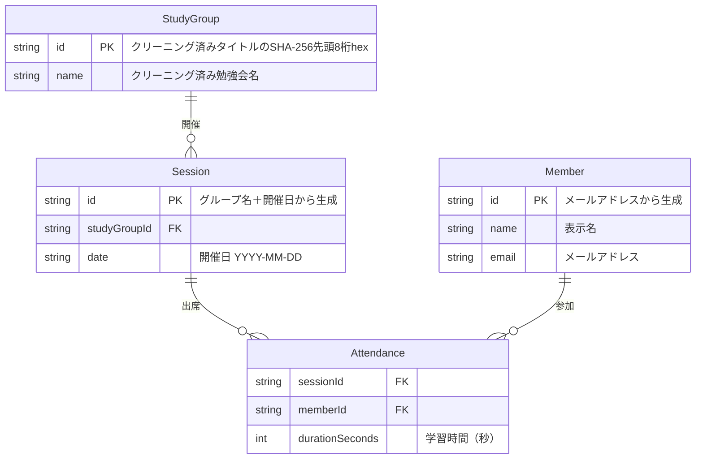
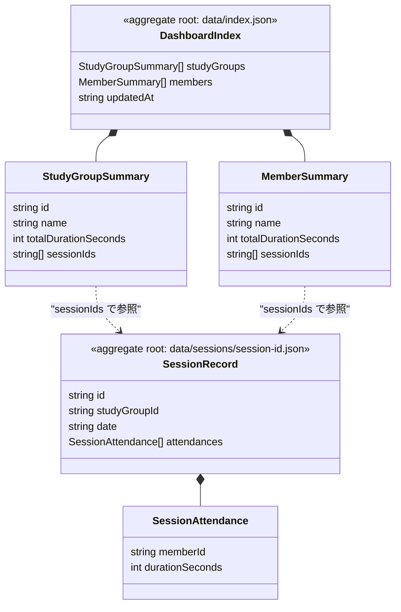

# Requirements Document

## Introduction

現在の blob-static-dashboard は汎用的なダミーデータモデル（`DashboardItem {id, title, summary}` / `ItemDetail {id, title, data}`）で構築されている。実際の運用データは Microsoft Teams の会議出席レポートであり、CSVファイル1件が勉強会1回（1セッション）に対応する。

勉強会は複数存在しうる（例：「もくもく勉強会」「読書会」など）。勉強会の名称はCSV内部の「会議のタイトル」フィールドから取得する。同じタイトルを持つセッションは同一の勉強会グループに属する。

本フィーチャーでは、ダミーデータモデルを実際のドメインモデル（勉強会グループ・セッション・参加者・出席記録）に置き換え、以下の画面構成を実現する：

- **トップ画面**: 勉強会グループごとの合計学習時間の一覧 ＋ 参加者個人ごとの合計時間の一覧
- **ドリルダウン（個人選択時）**: その個人が参加した各回の参加日・学習時間の一覧と合計時間

データソースの特徴：
- ファイル形式: UTF-16LE、タブ区切り、3セクション構成（要約 / 参加者 / アクティビティ）
- 「1. 要約」セクションの「会議のタイトル」フィールドに勉強会名が含まれる
- 主要フィールド: 会議のタイトル（勉強会名）、参加者名、参加時刻、退出時刻、会議の長さ（=学習時間）、メールアドレス
- 時間表記: `X 分 Y 秒` または `X 時間 Y 分 Z 秒` 形式

## Requirements

### Requirement 1: ドメインモデルの定義

**Objective:** 開発者として、勉強会の出席管理に特化したデータモデルを定義したい。これにより、CSVからの変換とJSON配信が一貫した構造で行える。

#### 論理データモデル

#### 集約の境界

論理データモデルのエンティティを、以下の2集約に分割して物理ファイルへマッピングする。
トップ画面は DashboardIndex 集約のみで描画でき、CSVアップロード時は2ファイル（セッション実績＋index）の更新で完結する。

| 集約 | ファイル | 内容 | 用途 |
|------|----------|------|------|
| DashboardIndex | `data/index.json` | StudyGroupSummary[], MemberSummary[] | トップ画面の描画（追加fetchなし） |
| SessionRecord | `data/sessions/<session-id>.json` | 勉強会1回分の出席記録 | ドリルダウン・更新の単位 |

> **設計方針**:
> - DashboardIndex の `totalDurationSeconds` は論理モデル上は派生属性だが、トップ画面を index.json 単体で描画するため事前計算して保持する
> - SessionRecord 内の Attendance は `memberId`（メールベースID）と `durationSeconds` のみ保持し、表示名は持たない（DashboardIndex の MemberSummary から解決する）
> - CSVアップロード時の書き込みは SessionRecord（新規作成）＋ DashboardIndex（マージ更新）の2ファイルで完結する

#### Acceptance Criteria

1.1. The StudyLog Dashboard shall 上記ER図に示す4つのドメインエンティティ（StudyGroup, Session, Member, Attendance）を持つデータモデルを採用する

1.2. The StudyLog Dashboard shall CSV「会議のタイトル」フィールドからTeamsの定型装飾（`"` や `で会議中` 等）を除去してクリーニング済みの勉強会名を得る

1.3. The StudyLog Dashboard shall StudyGroup ID を、クリーニング済み勉強会名の SHA-256 ハッシュ先頭8桁（hex）として生成する

1.4. The StudyLog Dashboard shall Session ID を、StudyGroup ID と開催日（YYYY-MM-DD）の組み合わせから生成する

1.5. The StudyLog Dashboard shall Member ID を、メールアドレスの SHA-256 ハッシュ先頭8桁（hex）として生成する

1.6. The StudyLog Dashboard shall 学習時間を秒単位の数値として正規化して保持する

### Requirement 2: トップ画面 — 勉強会グループ別合計時間一覧

**Objective:** 一般ユーザーとして、勉強会グループごとの合計学習時間を一覧で確認したい。どの勉強会にどれだけの学習時間が費やされているか俯瞰できる。

#### Acceptance Criteria

2.1. When ユーザーがトップ画面を表示した時, the StudyLog Dashboard shall 勉強会グループごとの合計学習時間の一覧を表示する

2.2. The StudyLog Dashboard shall 各勉強会グループに名称、開催回数、合計学習時間を表示する

2.3. While データ取得中, the StudyLog Dashboard shall ローディング状態を表示する

2.4. If データ取得に失敗した場合, the StudyLog Dashboard shall エラーメッセージを表示する

### Requirement 3: トップ画面 — 参加者別合計時間一覧

**Objective:** 一般ユーザーとして、参加者個人ごとの累計学習時間を一覧で確認したい。個人の学習状況を把握できる。

#### Acceptance Criteria

3.1. When ユーザーがトップ画面を表示した時, the StudyLog Dashboard shall 参加者ごとの合計学習時間・参加回数の一覧を合計時間の降順で表示する

3.2. The StudyLog Dashboard shall 各参加者に名前、合計学習時間、参加回数を表示する

3.3. When ユーザーが参加者を選択した時, the StudyLog Dashboard shall その参加者のドリルダウン画面に遷移する

### Requirement 4: ドリルダウン画面 — 個人の出席詳細

**Objective:** 一般ユーザーとして、選択した参加者の勉強会ごとの参加日・学習時間を確認したい。個人の出席履歴を詳細に把握できる。

#### Acceptance Criteria

4.1. When ユーザーが参加者のドリルダウン画面を表示した時, the StudyLog Dashboard shall DashboardIndex の MemberSummary.sessionIds を元に該当する SessionRecord を取得し、出席した勉強会の一覧を開催日の降順で表示する

4.2. The StudyLog Dashboard shall 各出席記録に勉強会名、開催日、学習時間を表示する

4.3. The StudyLog Dashboard shall 出席一覧の上部または下部に合計学習時間と参加回数を表示する

4.4. When ユーザーが「戻る」操作を行った時, the StudyLog Dashboard shall トップ画面に戻る

4.5. If 参加者データの取得に失敗した場合, the StudyLog Dashboard shall エラーメッセージを表示し、トップ画面へ戻る手段を提供する

### Requirement 5: CSV変換ロジックの適合

**Objective:** 管理者として、Teams出席レポートCSVをアップロードしてドメインモデルに変換したい。手動のデータ加工なしに勉強会データを更新できる。

#### Acceptance Criteria

5.1. When Teams出席レポートCSV（UTF-16LE、タブ区切り）がアップロードされた時, the StudyLog Dashboard shall CSVの「2. 参加者」セクションをパースして出席記録を抽出する

5.2. The StudyLog Dashboard shall 「会議の長さ」フィールド（`X 分 Y 秒` / `X 時間 Y 分 Z 秒` 形式）を秒単位の数値に変換する

5.3. The StudyLog Dashboard shall CSV内の「1. 要約」セクションの「会議のタイトル」フィールドから勉強会グループ名を取得する

5.4. The StudyLog Dashboard shall CSV内の「1. 要約」セクションの「開始時刻」フィールドからセッションの開催日を特定する

5.5. When CSV変換が完了した時, the StudyLog Dashboard shall セッション情報と出席記録のプレビューを表示する

5.6. If CSVのフォーマットがTeams出席レポート形式と異なる場合, the StudyLog Dashboard shall エラーメッセージを表示する

### Requirement 6: JSONデータ構造の再設計

**Objective:** 開発者として、Blob Storage上のJSONファイル構成をトップ画面の表示効率とCSV更新時の書き込み最小化の両立に最適化したい。

#### Acceptance Criteria

6.1. The StudyLog Dashboard shall トップ画面の描画に必要なデータ（StudyGroupSummary[], MemberSummary[]）を `data/index.json` に保持し、追加のファイル取得なしにトップ画面を描画可能とする

6.2. The StudyLog Dashboard shall 勉強会1回分の出席記録を `data/sessions/<session-id>.json` に保持する

6.3. When 新しいCSVがアップロードされた時, the StudyLog Dashboard shall SessionRecord（新規作成）と DashboardIndex（マージ更新）の2ファイルのみを書き込む

6.4. When DashboardIndex をマージ更新する時, the StudyLog Dashboard shall 該当する StudyGroupSummary と MemberSummary の totalDurationSeconds および sessionIds を更新する

### Requirement 7: 既存アーキテクチャとの整合

**Objective:** 開発者として、既存のコンポーネント構成（AuthManager, Router, DataFetcher, BlobWriter, CsvTransformer等）を活用しつつドメインモデルを適用したい。アーキテクチャの大幅な再構築を避けられる。

#### Acceptance Criteria

7.1. The StudyLog Dashboard shall 既存の AuthManager（SASトークン管理）をそのまま利用する

7.2. The StudyLog Dashboard shall 既存の Router のルート定義を新しい画面構成（トップ / 個人ドリルダウン）に対応させる

7.3. The StudyLog Dashboard shall 既存の DataFetcher のインターフェースを新しいデータ構造に対応させる

7.4. The StudyLog Dashboard shall 既存の BlobWriter の書き込みシーケンスを新しいファイル構成に対応させる

7.5. The StudyLog Dashboard shall 既存の CsvTransformer を Teams出席レポート形式に対応させる

7.6. The StudyLog Dashboard shall 既存テストスイートを新しいドメインモデルに合わせて更新し、全テストをパスさせる
