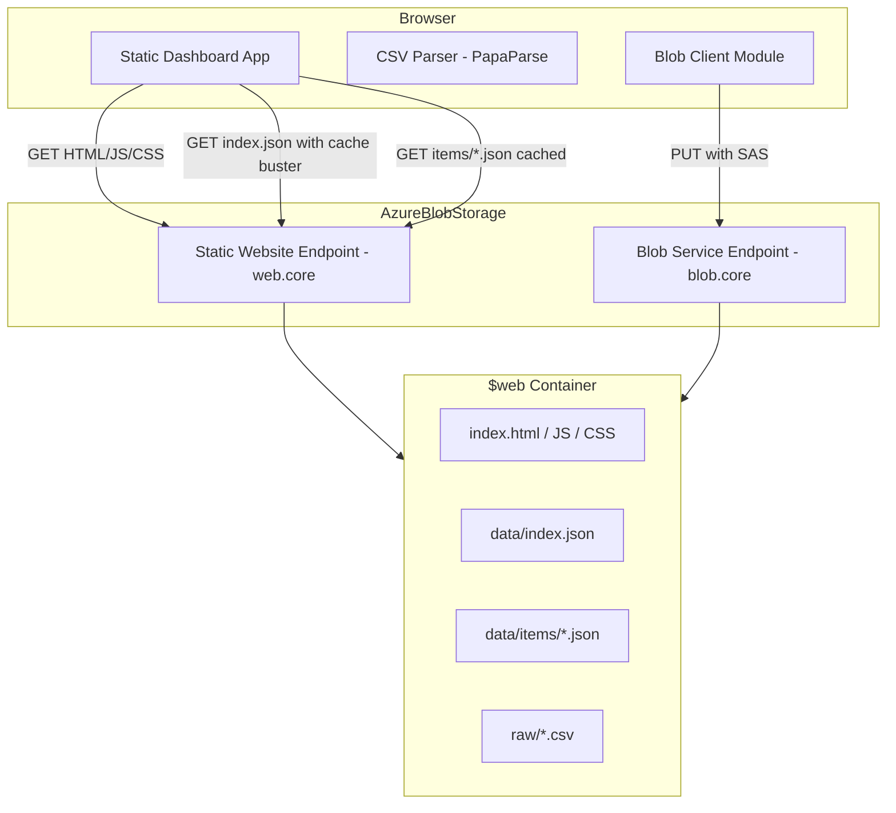
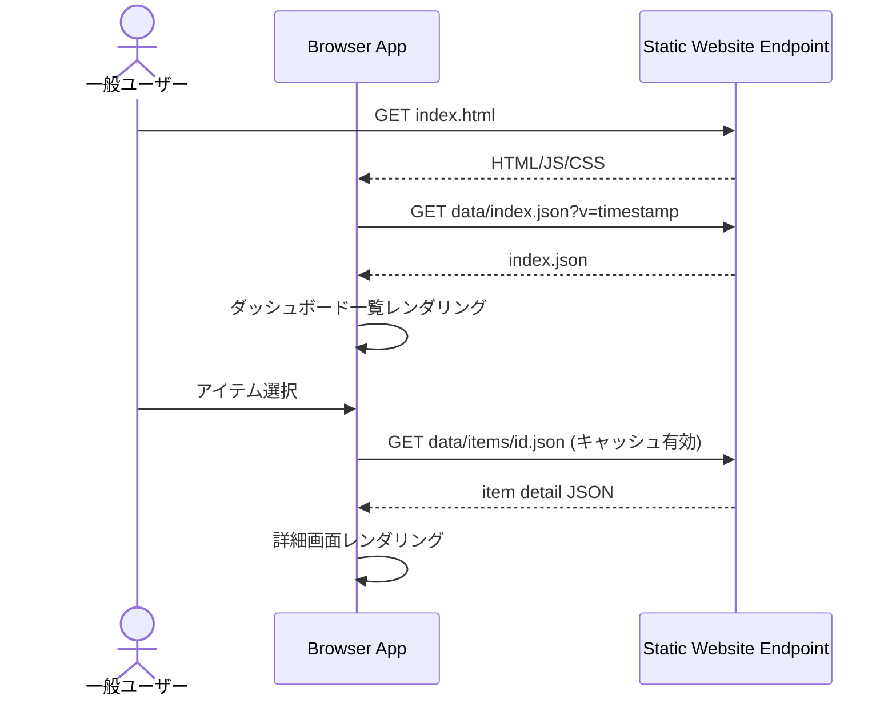
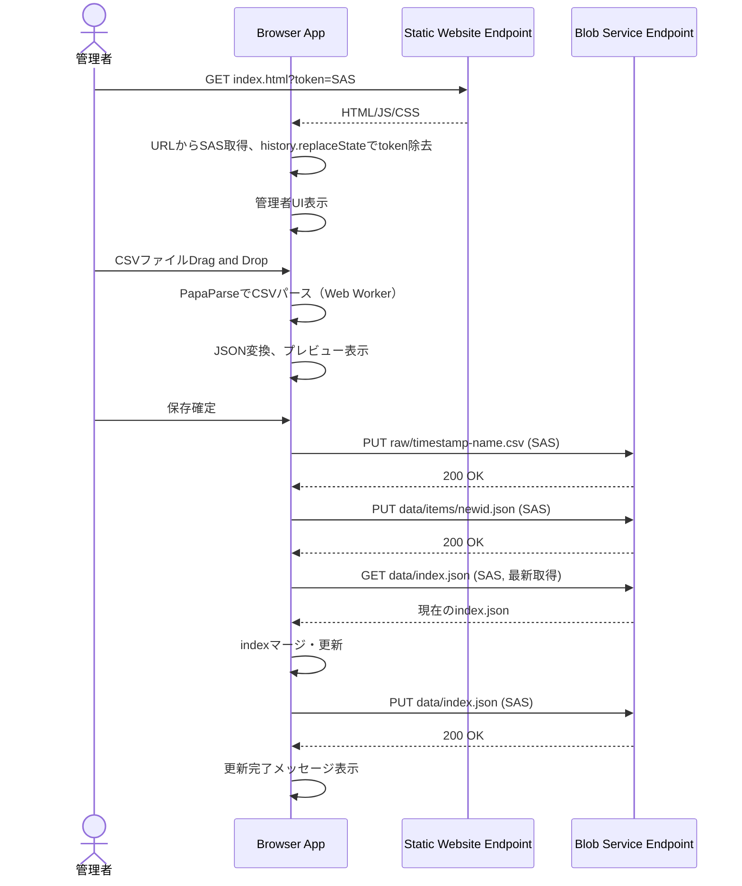
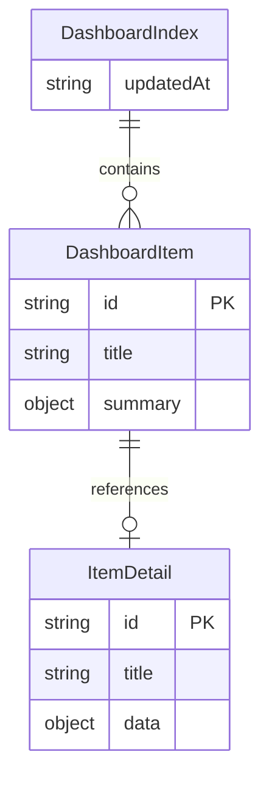

# Design Document — blob-static-dashboard

## Overview

**Purpose**: Azure Blob Storage Static website上にダッシュボード／ドリルダウン閲覧機能を持つ静的サイトを構築する。一般ユーザーには匿名読み取りで高速な閲覧UXを提供し、管理者にはCSV投入→JSON変換→Blob書き込みによるデータ更新機能を提供する。

**Users**: 一般ユーザー（閲覧のみ）と管理者（データ更新）がイントラネット（閉域専用線）経由で利用する。

**Impact**: 新規構築のため既存システムへの影響はない。Azure Blob Storageアカウントの設定（静的サイトホスティング有効化、CORS設定）が前提条件となる。

### Goals
- バックエンド不要の静的配信による安定した閲覧UX
- CSV投入→ブラウザ変換→JSON配信によるデータ更新の省力化
- SASトークンによる管理者/一般ユーザーの簡易分離
- items不変戦略によるブラウザキャッシュの最大活用

### Non-Goals
- サーバサイドのデータ検証・バリデーション
- リアルタイム通知（WebSocket等）による即時反映
- 同時更新の楽観的ロック制御（運用ルールで回避）
- 認証基盤（Azure AD等）との統合

## Architecture

### Architecture Pattern & Boundary Map

SPA + Blob直接アクセスパターンを採用する。ブラウザが静的サイトエンドポイントからUI資材を取得し、データの読み書きはBlobサービスエンドポイントに対してfetch/PUTで直接行う。



**Architecture Integration**:
- Selected pattern: SPA + Blob直接アクセス — サーバレスで最小コスト・最小運用
- Domain/feature boundaries: 閲覧（読み取り専用）と管理（書き込み）をSASトークン有無で分離
- New components rationale: 全コンポーネントが新規。最小構成でVanilla JS + ES Modulesで実装

### Technology Stack

| Layer | Choice / Version | Role in Feature | Notes |
|-------|------------------|-----------------|-------|
| Frontend | Vanilla JS (ES Modules) | UI・ロジック全般 | ビルドツール不要、`$web`直接配置 |
| CSV Parser | PapaParse v5.x | CSVパース・変換 | Web Worker対応、依存ゼロ |
| Data / Storage | Azure Blob Storage | 静的サイトホスティング + データ保管 | Static website + Blob REST API |
| Infrastructure | Azure Storage Account | ホスティング基盤 | 静的サイト有効化 + CORS設定必須 |

## System Flows

### 閲覧フロー



**Key Decisions**: `index.json`はキャッシュバスター付きで常に最新を取得。`items/*.json`は不変リソースとしてキャッシュ有効。

### 更新フロー（管理者）



**Key Decisions**: 書き込み順序は `raw → items → index`。index書き込み直前にBlobから最新版を取得してマージする。

## Requirements Traceability

| Requirement | Summary | Components | Interfaces | Flows |
|-------------|---------|------------|------------|-------|
| 1.1 | index.json取得・一覧レンダリング | DashboardView, DataFetcher | DataFetcher.fetchIndex | 閲覧フロー |
| 1.2 | 静的ファイルのみで表示 | 全コンポーネント | — | — |
| 1.3 | ローディング表示 | DashboardView | — | 閲覧フロー |
| 1.4 | index.json取得失敗時エラー表示 | DashboardView, DataFetcher | — | 閲覧フロー |
| 2.1 | 詳細画面表示 | DetailView, DataFetcher | DataFetcher.fetchItem | 閲覧フロー |
| 2.2 | 一覧画面への遷移 | Router | Router.navigate | 閲覧フロー |
| 2.3 | 詳細取得失敗時エラー表示 | DetailView, DataFetcher | — | 閲覧フロー |
| 3.1 | SASトークン取得・管理者モード有効化 | AuthManager | AuthManager.initialize | 更新フロー |
| 3.2 | URLからtoken除去 | AuthManager | — | 更新フロー |
| 3.3 | 管理者UI表示 | AdminPanel | — | 更新フロー |
| 3.4 | 管理者UI非表示 | AdminPanel | — | 閲覧フロー |
| 4.1 | CSVファイル受付・パース | CsvUploader, CsvTransformer | CsvTransformer.parse | 更新フロー |
| 4.2 | JSON変換 | CsvTransformer | CsvTransformer.toJson | 更新フロー |
| 4.3 | プレビュー表示 | PreviewPanel | — | 更新フロー |
| 4.4 | パースエラー表示 | CsvUploader | — | 更新フロー |
| 5.1 | 書き込み順序制御 | BlobWriter | BlobWriter.executeWriteSequence | 更新フロー |
| 5.2 | 最新index取得・マージ | BlobWriter, IndexMerger | IndexMerger.merge | 更新フロー |
| 5.3 | 新規items追加（上書き禁止） | BlobWriter | BlobWriter.putItem | 更新フロー |
| 5.4 | 元CSV保管 | BlobWriter | BlobWriter.putRawCsv | 更新フロー |
| 5.5 | 更新完了メッセージ | AdminPanel | — | 更新フロー |
| 5.6 | PUT失敗時エラー表示 | BlobWriter, AdminPanel | — | 更新フロー |
| 5.7 | 最新index取得失敗時中断 | BlobWriter | — | 更新フロー |
| 6.1 | index.jsonキャッシュバスター | DataFetcher | DataFetcher.fetchIndex | 閲覧フロー |
| 6.2 | items キャッシュ有効 | DataFetcher | DataFetcher.fetchItem | 閲覧フロー |
| 6.3 | items追加のみ | BlobWriter | BlobWriter.putItem | 更新フロー |
| 7.1 | リトライボタン | BlobWriter, AdminPanel | — | 更新フロー |
| 7.2 | 進捗状態表示 | AdminPanel | — | 更新フロー |
| 7.3 | 成功/失敗ファイル一覧 | AdminPanel | — | 更新フロー |
| 8.1 | 静的配信のみ | 全コンポーネント | — | — |
| 8.2 | HTML/JS/CSS構成 | 全コンポーネント | — | — |
| 8.3 | UIスレッド非ブロック | CsvTransformer | — | 更新フロー |

## Components and Interfaces

| Component | Domain/Layer | Intent | Req Coverage | Key Dependencies | Contracts |
|-----------|-------------|--------|-------------|-----------------|-----------|
| AuthManager | Core | SASトークン管理・管理者モード制御 | 3.1, 3.2 | — | State |
| Router | Core | 画面遷移制御 | 2.2 | — | Service |
| DataFetcher | Data | Blobからのデータ取得 | 1.1, 1.4, 2.1, 6.1, 6.2 | AuthManager (P1) | Service |
| BlobWriter | Data | Blobへのデータ書き込み | 5.1-5.7, 6.3, 7.1 | AuthManager (P0) | Service |
| IndexMerger | Data | index.jsonのマージロジック | 5.2 | — | Service |
| CsvTransformer | Logic | CSVパース・JSON変換 | 4.1, 4.2, 4.4, 8.3 | PapaParse (P0, External) | Service |
| DashboardView | UI | ダッシュボード一覧表示 | 1.1, 1.3, 1.4 | DataFetcher (P0), Router (P1) | — |
| DetailView | UI | ドリルダウン詳細表示 | 2.1, 2.3 | DataFetcher (P0), Router (P1) | — |
| AdminPanel | UI | 管理者向け操作UI | 3.3, 3.4, 4.3, 5.5, 5.6, 7.2, 7.3 | AuthManager (P0), BlobWriter (P0) | — |
| CsvUploader | UI | CSVファイル入力UI | 4.1, 4.4 | CsvTransformer (P0) | — |
| PreviewPanel | UI | 変換結果プレビュー | 4.3 | — | — |

### Core Layer

#### AuthManager

| Field | Detail |
|-------|--------|
| Intent | URLからSASトークンを抽出し、管理者モードの状態を管理する |
| Requirements | 3.1, 3.2, 3.3, 3.4 |

**Responsibilities & Constraints**
- URLクエリパラメータ `token` からSASトークンを取得
- 取得後に `history.replaceState` でURLからtokenを除去
- SASトークンをメモリ内に保持（localStorageには保存しない）
- 管理者モードの有効/無効状態を提供

**Dependencies**
- External: Browser History API — URL操作 (P2)

**Contracts**: State [x]

##### State Management
```typescript
interface AuthState {
  readonly isAdmin: boolean;
  readonly sasToken: string | null;
}

interface AuthManager {
  initialize(): AuthState;
  getSasToken(): string | null;
  isAdminMode(): boolean;
}
```
- Preconditions: ページロード時に1回呼び出される
- Postconditions: SASトークンがURLから除去されている
- Invariants: SASトークンはメモリ内のみに保持

#### Router

| Field | Detail |
|-------|--------|
| Intent | ハッシュベースの画面遷移を制御する |
| Requirements | 2.2 |

**Responsibilities & Constraints**
- URLハッシュ（`#/`, `#/items/<id>`）による画面切替
- ブラウザの戻る/進むに対応

**Contracts**: Service [x]

##### Service Interface
```typescript
type Route =
  | { view: "dashboard" }
  | { view: "detail"; itemId: string };

interface Router {
  navigate(route: Route): void;
  getCurrentRoute(): Route;
  onRouteChange(callback: (route: Route) => void): void;
}
```

### Data Layer

#### DataFetcher

| Field | Detail |
|-------|--------|
| Intent | 静的サイトエンドポイントからJSONデータを取得する |
| Requirements | 1.1, 1.4, 2.1, 6.1, 6.2 |

**Responsibilities & Constraints**
- `data/index.json` の取得時はキャッシュバスター（`?v=<timestamp>`）を付与
- `data/items/<id>.json` の取得時はキャッシュバスターを付与しない（不変リソース）
- 取得先は静的サイトエンドポイント（`web.core.windows.net`）

**Dependencies**
- External: Fetch API — HTTP GET (P0)

**Contracts**: Service [x]

##### Service Interface
```typescript
interface DashboardIndex {
  items: DashboardItem[];
  updatedAt: string;
}

interface DashboardItem {
  id: string;
  title: string;
  summary: Record<string, string | number>;
}

interface ItemDetail {
  id: string;
  title: string;
  data: Record<string, unknown>;
}

type FetchResult<T> =
  | { ok: true; data: T }
  | { ok: false; error: string };

interface DataFetcher {
  fetchIndex(): Promise<FetchResult<DashboardIndex>>;
  fetchItem(itemId: string): Promise<FetchResult<ItemDetail>>;
}
```
- Preconditions: 静的サイトエンドポイントにアクセス可能であること
- Postconditions: 成功時はパース済みJSONオブジェクトを返却

#### BlobWriter

| Field | Detail |
|-------|--------|
| Intent | SASトークンを用いてBlobサービスエンドポイントにデータを書き込む |
| Requirements | 5.1, 5.2, 5.3, 5.4, 5.5, 5.6, 5.7, 6.3, 7.1 |

**Responsibilities & Constraints**
- 書き込み順序: (1) `raw/*.csv` → (2) `data/items/<id>.json` → (3) `data/index.json`
- `data/index.json` の書き込み直前にBlobから最新版を取得
- `data/items/` への書き込みは新規追加のみ（既存の上書き禁止）
- 書き込み先はBlobサービスエンドポイント（`blob.core.windows.net`）
- 各PUT操作の結果（成功/失敗）を個別に追跡

**Dependencies**
- Inbound: AuthManager — SASトークン取得 (P0)
- Inbound: IndexMerger — index.jsonマージ処理 (P0)
- External: Fetch API — HTTP PUT/GET (P0)
- External: Azure Blob REST API v2025-01-05 — PUT Blob (P0)

**Contracts**: Service [x]

##### Service Interface
```typescript
interface WriteOperation {
  path: string;
  content: string | Blob;
  contentType: string;
}

interface WriteResult {
  path: string;
  success: boolean;
  error?: string;
}

interface WriteSequenceResult {
  results: WriteResult[];
  allSucceeded: boolean;
}

interface BlobWriter {
  executeWriteSequence(params: {
    rawCsv?: WriteOperation;
    newItems: WriteOperation[];
    indexUpdater: (currentIndex: DashboardIndex) => DashboardIndex;
  }): Promise<WriteSequenceResult>;

  retryFailed(failedResults: WriteResult[]): Promise<WriteSequenceResult>;
}
```
- Preconditions: 有効なSASトークンが利用可能であること
- Postconditions: 成功時はすべてのファイルがBlobに書き込まれている
- Invariants: index.jsonは常に最後に書き込まれる

**Implementation Notes**
- PUT Blobリクエスト時のヘッダー: `x-ms-blob-type: BlockBlob`, `Content-Type`, `x-ms-version: 2025-01-05`
- SASトークンはURLクエリパラメータとして付与（`Authorization`ヘッダー不使用）

#### IndexMerger

| Field | Detail |
|-------|--------|
| Intent | 既存のindex.jsonと新規データをマージする |
| Requirements | 5.2 |

**Responsibilities & Constraints**
- 既存indexの`items`配列に新規アイテムを追加
- 重複IDの検出と警告
- `updatedAt`タイムスタンプの更新

**Contracts**: Service [x]

##### Service Interface
```typescript
interface IndexMerger {
  merge(
    currentIndex: DashboardIndex,
    newItems: DashboardItem[]
  ): DashboardIndex;
}
```
- Preconditions: currentIndexは有効なDashboardIndex構造
- Postconditions: 新規アイテムが追加され、updatedAtが更新されている

### Logic Layer

#### CsvTransformer

| Field | Detail |
|-------|--------|
| Intent | CSVファイルをパースしダッシュボード用JSONに変換する |
| Requirements | 4.1, 4.2, 4.4, 8.3 |

**Responsibilities & Constraints**
- PapaParseのWeb Workerモード（`worker: true`）でパース実行
- UIスレッドをブロックしない
- パースエラーの検出と詳細報告
- CSV→DashboardItem[]およびItemDetail[]への変換

**Dependencies**
- External: PapaParse v5.x — CSVパース (P0)

**Contracts**: Service [x]

##### Service Interface
```typescript
interface ParseResult {
  ok: true;
  dashboardItems: DashboardItem[];
  itemDetails: ItemDetail[];
  warnings: string[];
} | {
  ok: false;
  errors: string[];
}

interface CsvTransformer {
  parse(file: File): Promise<ParseResult>;
}
```
- Preconditions: 有効なCSVファイルが渡されること
- Postconditions: 成功時はDashboardItem[]とItemDetail[]が生成されている

### UI Layer

UIコンポーネントはプレゼンテーション層であり、新たなドメイン境界を導入しない。各コンポーネントはData/Logic層のサービスインターフェースを通じてデータを取得・操作する。

- **DashboardView** (1.1, 1.3, 1.4): DataFetcher.fetchIndexの結果を一覧表示。ローディング・エラー状態を管理
- **DetailView** (2.1, 2.3): DataFetcher.fetchItemの結果を詳細表示。取得失敗時のエラー表示と一覧への遷移手段を提供
- **AdminPanel** (3.3, 3.4, 5.5, 5.6, 7.2, 7.3): AuthManager.isAdminModeで表示/非表示を切替。書き込み進捗・結果を表示
- **CsvUploader** (4.1, 4.4): ファイル選択/Drag&Dropの入力UI。CsvTransformer.parseを呼び出し、エラー時は詳細表示
- **PreviewPanel** (4.3): CsvTransformer.parseの結果をテーブル形式でプレビュー表示

## Data Models

### Domain Model



**Business Rules & Invariants**:
- `DashboardItem.id` はindex内で一意
- `ItemDetail`のIDは対応する`DashboardItem.id`と一致
- `items/`配下のJSONは不変（追加のみ、上書き禁止）
- `index.json`は更新のたびに`updatedAt`を更新

### Physical Data Model（Blob Storage）

**Document Store（JSON files in Blob Storage）**:

| Path | Content | Mutability | Cache |
|------|---------|-----------|-------|
| `data/index.json` | DashboardIndex | 可変（上書き更新） | キャッシュバスター必須 |
| `data/items/<id>.json` | ItemDetail | 不変（追加のみ） | ブラウザキャッシュ有効 |
| `raw/<timestamp>-<name>.csv` | 元CSV | 不変（追記のみ） | — |

- ファイル名規則: `raw/` は `<ISO8601>-<original-filename>.csv`
- `data/items/` のIDは `DashboardItem.id` と同一

## Error Handling

### Error Strategy
ブラウザクライアントのみで構成されるため、エラーハンドリングはすべてフロントエンドで完結する。ネットワークエラーとデータエラーを区別し、リトライ可能な操作にはリトライ手段を提供する。

### Error Categories and Responses

**Data Fetch Errors**: fetch失敗（ネットワーク、404等）→ エラーメッセージ表示、画面遷移手段を維持
**CSV Parse Errors**: フォーマット不正、文字コード問題 → パースエラー詳細表示、アップロード中断
**Blob Write Errors**: PUT失敗（SAS期限切れ、ネットワーク、CORS）→ 失敗ファイル一覧表示、リトライボタン提供
**Index Fetch Errors**: 書き込み直前のindex取得失敗 → 書き込みシーケンス全体を中断、エラー表示

## Testing Strategy

### Unit Tests
- CsvTransformer: 正常CSV→JSON変換、不正CSV→エラー検出、空ファイル処理
- IndexMerger: 新規アイテム追加、重複ID検出、空index/空newItemsの境界値
- AuthManager: SASトークン抽出、token無しURL、URLからのtoken除去

### Integration Tests
- DataFetcher: キャッシュバスター付きindex取得、キャッシュ有効なitem取得
- BlobWriter: 書き込み順序（raw→items→index）の検証、部分失敗シナリオ
- BlobWriter + IndexMerger: 最新index取得→マージ→PUTの一連フロー

### E2E/UI Tests
- 閲覧フロー: index.html表示→一覧表示→アイテム選択→詳細表示→戻る
- 管理者フロー: SAS付きURLアクセス→管理者UI表示→CSV投入→プレビュー→保存
- エラーフロー: 不正CSV投入→エラー表示、ネットワーク切断→エラー表示

## Optional Sections

### Security Considerations
- SASトークンはメモリ内のみに保持し、localStorage/sessionStorageへの永続化は行わない
- `history.replaceState`によるURLからのtoken除去で、ブラウザ履歴への残存を防止
- Stored Access Policyの利用でSASの一括失効を可能にする（運用推奨）
- 閉域ネットワーク＋Storageネットワーク規則が基本的なアクセス制御境界

### Performance & Scalability
- `items/*.json`の不変キャッシュ戦略により、2回目以降のドリルダウンはネットワークアクセスなし
- PapaParseのWeb Workerモードにより、大規模CSV処理中もUIの応答性を維持
- `index.json`の肥大化が進んだ場合はページネーション導入を検討（現時点ではスコープ外）
