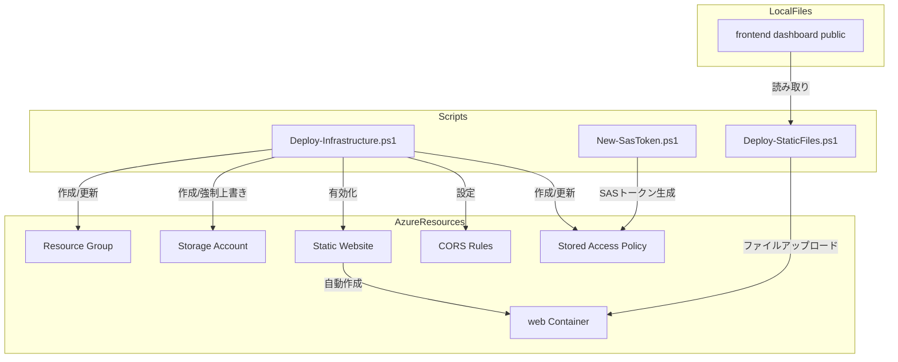
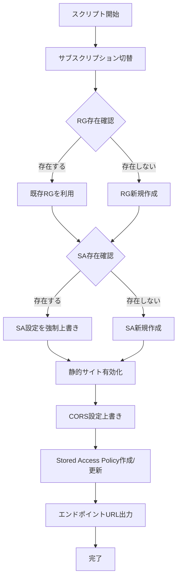

# Design Document — create-azure-resources

## Overview

**Purpose**: blob-static-dashboardの稼働基盤となるAzureリソース（Storage Account、静的サイトホスティング、CORS、Stored Access Policy）を、冪等なPowerShellスクリプトでプロビジョニングする。併せてSASトークン生成・静的ファイルデプロイの運用スクリプトを提供する。

**Users**: インフラ管理者が、Azure環境の初期構築・設定変更・アプリケーションデプロイ・SASトークン更新に使用する。

**Impact**: 新規インフラ自動化スクリプトの追加。既存のフロントエンドコード（`frontend/dashboard/`）への変更はない。

### Goals
- ワンコマンドでAzureリソースの作成と設定を完了する
- 冪等性を担保し、何度実行しても安全に同じ結果を得る
- Storageアカウント設定は常に正しい値に強制上書きする
- コスト最小化（Standard_LRS / Hot / StorageV2）

### Non-Goals
- CI/CDパイプライン統合（将来検討）
- ネットワーク規則（VNet/ファイアウォール）の自動設定
- 複数環境（dev/staging/prod）の自動切替
- Azure AD認証との統合

## Architecture

### Architecture Pattern & Boundary Map

命令的プロビジョニングパターンを採用。3つの独立したPowerShellスクリプトが、それぞれ異なるライフサイクルの運用操作を担当する。



**Architecture Integration**:
- Selected pattern: 命令的プロビジョニング — Azモジュールで全操作をカバーし、存在確認＋条件分岐で冪等性を実現
- Domain/feature boundaries: インフラプロビジョニング / SASトークン運用 / ファイルデプロイの3つのライフサイクルで分離
- New components rationale: 3スクリプトは実行頻度とライフサイクルが異なるため分離（詳細は`research.md`参照）

### Technology Stack

| Layer | Choice / Version | Role in Feature | Notes |
|-------|------------------|-----------------|-------|
| スクリプト | PowerShell 7.x | 全スクリプトの実行環境 | Windows/macOS/Linux対応 |
| Azureモジュール | Az.Storage / Az.Resources | Azure操作コマンドレット | `Az`モジュール最新版 |
| Infrastructure | Azure Storage Account (StorageV2) | 静的サイトホスティング基盤 | Standard_LRS / Hot |

## System Flows

### プロビジョニングフロー



**Key Decisions**: 各ステップは順次実行。前ステップの成功が後続の前提条件となる。エラー発生時は即座に中断する。

## Requirements Traceability

| Requirement | Summary | Components | Interfaces | Flows |
|-------------|---------|------------|------------|-------|
| 1.1 | PowerShell Azモジュールで記述 | Deploy-Infrastructure | — | — |
| 1.2 | サブスクリプション切替 | Deploy-Infrastructure | Set-AzContext | プロビジョニングフロー |
| 1.3 | 既存RGの利用 | Deploy-Infrastructure | Get-AzResourceGroup | プロビジョニングフロー |
| 1.4 | RG新規作成 | Deploy-Infrastructure | New-AzResourceGroup | プロビジョニングフロー |
| 1.5 | SA設定の強制上書き | Deploy-Infrastructure | Set-AzStorageAccount | プロビジョニングフロー |
| 1.6 | SA新規作成 | Deploy-Infrastructure | New-AzStorageAccount | プロビジョニングフロー |
| 1.7 | 実行状況のコンソール出力 | Deploy-Infrastructure | Write-Host | プロビジョニングフロー |
| 1.8 | エラー時の中断 | Deploy-Infrastructure | ErrorAction Stop | プロビジョニングフロー |
| 2.1 | StorageV2/Standard_LRS/Hot | Deploy-Infrastructure | New/Set-AzStorageAccount | プロビジョニングフロー |
| 2.2 | TLS1_2 | Deploy-Infrastructure | New/Set-AzStorageAccount | プロビジョニングフロー |
| 2.3 | HTTPSのみ許可 | Deploy-Infrastructure | New/Set-AzStorageAccount | プロビジョニングフロー |
| 2.4 | 既存SAの設定強制上書き | Deploy-Infrastructure | Set-AzStorageAccount | プロビジョニングフロー |
| 3.1 | 静的サイト有効化・インデックスドキュメント | Deploy-Infrastructure | Enable-AzStorageStaticWebsite | プロビジョニングフロー |
| 3.2 | エラードキュメント（SPAフォールバック） | Deploy-Infrastructure | Enable-AzStorageStaticWebsite | プロビジョニングフロー |
| 3.3 | 静的サイトエンドポイントURL出力 | Deploy-Infrastructure | PrimaryEndpoints.Web | プロビジョニングフロー |
| 3.4 | BlobサービスエンドポイントURL出力 | Deploy-Infrastructure | PrimaryEndpoints.Blob | プロビジョニングフロー |
| 4.1 | CORS AllowedOrigins | Deploy-Infrastructure | Set-AzStorageCORSRule | プロビジョニングフロー |
| 4.2 | CORS AllowedMethods | Deploy-Infrastructure | Set-AzStorageCORSRule | プロビジョニングフロー |
| 4.3 | CORS AllowedHeaders | Deploy-Infrastructure | Set-AzStorageCORSRule | プロビジョニングフロー |
| 4.4 | CORS ExposedHeaders | Deploy-Infrastructure | Set-AzStorageCORSRule | プロビジョニングフロー |
| 4.5 | CORS設定の常時上書き | Deploy-Infrastructure | Set-AzStorageCORSRule | プロビジョニングフロー |
| 5.1 | Stored Access Policy作成 | Deploy-Infrastructure | New/Set-AzStorageContainerStoredAccessPolicy | プロビジョニングフロー |
| 5.2 | ポリシー権限rcwl | Deploy-Infrastructure | New/Set-AzStorageContainerStoredAccessPolicy | プロビジョニングフロー |
| 5.3 | ポリシー有効期限パラメータ | Deploy-Infrastructure | param() | — |
| 5.4 | 既存ポリシーの上書き | Deploy-Infrastructure | Set-AzStorageContainerStoredAccessPolicy | プロビジョニングフロー |
| 6.1 | PowerShell Azモジュールで記述 | New-SasToken | — | — |
| 6.2 | PolicyベースSAS生成 | New-SasToken | New-AzStorageContainerSASToken | — |
| 6.3 | 管理者用完全URL出力 | New-SasToken | Write-Output | — |
| 6.4 | SAパラメータ（デフォルト値） | New-SasToken | param() | — |
| 7.1 | PowerShell Azモジュールで記述 | Deploy-StaticFiles | — | — |
| 7.2 | ファイルアップロード | Deploy-StaticFiles | Set-AzStorageBlobContent | — |
| 7.3 | Content-Type設定 | Deploy-StaticFiles | MIMEマッピング | — |
| 7.4 | SAパラメータ（デフォルト値） | Deploy-StaticFiles | param() | — |
| 7.5 | アップロード結果出力 | Deploy-StaticFiles | Write-Host | — |
| 8.1 | param()ブロック定義 | 全スクリプト | param() | — |
| 8.2 | デフォルト値設定 | 全スクリプト | param() | — |
| 8.3 | コマンドライン引数で上書き可能 | 全スクリプト | param() | — |
| 8.4 | パラメータ説明コメント | 全スクリプト | コメント | — |

## Components and Interfaces

| Component | Domain/Layer | Intent | Req Coverage | Key Dependencies | Contracts |
|-----------|-------------|--------|-------------|-----------------|-----------|
| Deploy-Infrastructure.ps1 | インフラ | Azureリソースの作成と設定 | 1.1-1.8, 2.1-2.4, 3.1-3.4, 4.1-4.5, 5.1-5.4, 8.1-8.4 | Az.Storage (P0), Az.Resources (P0) | Batch |
| New-SasToken.ps1 | 運用 | SASトークン生成と管理者URL出力 | 6.1-6.4, 8.1-8.4 | Az.Storage (P0) | Batch |
| Deploy-StaticFiles.ps1 | 運用 | 静的ファイルの`$web`コンテナへのアップロード | 7.1-7.5, 8.1-8.4 | Az.Storage (P0) | Batch |

### インフラ Layer

#### Deploy-Infrastructure.ps1

| Field | Detail |
|-------|--------|
| Intent | Azureリソース（RG、Storage Account、静的サイト、CORS、Stored Access Policy）の冪等なプロビジョニング |
| Requirements | 1.1-1.8, 2.1-2.4, 3.1-3.4, 4.1-4.5, 5.1-5.4, 8.1-8.4 |

**Responsibilities & Constraints**
- サブスクリプション切替後、RG→SA→静的サイト→CORS→Policyの順序で処理
- 各ステップで存在確認を行い、作成/更新を判断
- SAの設定は常に強制上書き（冪等かつ宣言的な最終状態の保証）
- エラー発生時は即座に中断（`$ErrorActionPreference = 'Stop'`）

**Dependencies**
- External: Az.Resources モジュール — RG操作 (P0)
- External: Az.Storage モジュール — SA/静的サイト/CORS/Policy操作 (P0)

**Contracts**: Batch [x]

##### Batch / Job Contract

**パラメータ定義**:

```powershell
param(
    [string]$SubscriptionId = "9f8bb535-5bea-4687-819e-7605b47941b5",
    [string]$ResourceGroupName = "z2-rg-usr-z23004-dev-002",
    [string]$StorageAccountName = "ststudylogprod",
    [string]$Location = "japaneast",
    [string]$PolicyName = "dashboard-admin",
    [int]$PolicyExpiryDays = 30
)
```

**処理ステップ**:

| Step | Operation | Cmdlet | 冪等性 |
|------|-----------|--------|--------|
| 1 | サブスクリプション切替 | `Set-AzContext` | 常時実行 |
| 2 | RG存在確認→作成/利用 | `Get-AzResourceGroup` / `New-AzResourceGroup` | 存在確認後に分岐 |
| 3 | SA存在確認→作成/上書き | `Get-AzStorageAccount` / `New-AzStorageAccount` / `Set-AzStorageAccount` | 新規作成 or 設定強制上書き |
| 4 | 静的サイト有効化 | `Enable-AzStorageStaticWebsite` | 常時実行（上書き安全） |
| 5 | CORS設定 | `Set-AzStorageCORSRule` | 常時上書き |
| 6 | Policy作成/更新 | `Get-AzStorageContainerStoredAccessPolicy` / `New-AzStorageContainerStoredAccessPolicy` / `Set-AzStorageContainerStoredAccessPolicy` | 存在確認後に分岐 |
| 7 | エンドポイントURL出力 | `Get-AzStorageAccount` → `PrimaryEndpoints` | — |

**SA作成/更新時の設定値**:

| 設定項目 | 値 | パラメータ |
|---------|---|-----------|
| Kind | `StorageV2` | `-Kind StorageV2` |
| SKU | `Standard_LRS` | `-SkuName Standard_LRS` |
| AccessTier | `Hot` | `-AccessTier Hot` |
| MinimumTlsVersion | `TLS1_2` | `-MinimumTlsVersion TLS1_2` |
| HTTPS Only | `$true` | `-EnableHttpsTrafficOnly $true` |

**CORS設定値**:

| 項目 | 値 |
|------|---|
| AllowedOrigins | 静的サイトエンドポイントURL（動的取得） |
| AllowedMethods | `GET`, `PUT`, `HEAD` |
| AllowedHeaders | `x-ms-blob-type`, `x-ms-blob-content-type`, `content-type`, `x-ms-version` |
| ExposedHeaders | `x-ms-meta-*` |
| MaxAgeInSeconds | `3600` |

**Stored Access Policy設定値**:

| 項目 | 値 |
|------|---|
| Container | `$web`（シングルクォート必須） |
| Policy Name | `dashboard-admin`（デフォルト） |
| Permission | `rcwl`（Read, Create, Write, List — `racwdxltmeop`順序） |
| ExpiryTime | 現在時刻 + `PolicyExpiryDays`日 |

**Implementation Notes**
- `$web`コンテナ名参照時は常にシングルクォート`'$web'`を使用（PowerShell変数展開回避）
- 存在確認には`-ErrorAction SilentlyContinue`を使用し、`$null`チェックで分岐
- CORS設定の`AllowedOrigins`は静的サイト有効化後に`PrimaryEndpoints.Web`から動的取得（末尾スラッシュを除去してオリジン形式にする）

### 運用 Layer

#### New-SasToken.ps1

| Field | Detail |
|-------|--------|
| Intent | Stored Access Policyに紐づくContainer SASトークンを生成し、管理者用URLを出力する |
| Requirements | 6.1-6.4, 8.1-8.4 |

**Responsibilities & Constraints**
- 既存のStored Access Policyを利用してSASトークンを生成
- 静的サイトエンドポイントURLを取得し、管理者用完全URLを組み立てる
- SASトークン生成時に`-Permission`は指定しない（Policyから継承）

**Dependencies**
- External: Az.Storage モジュール — SAS生成 (P0)
- Inbound: Deploy-Infrastructure.ps1 — Stored Access Policyが作成済みであること (P0)

**Contracts**: Batch [x]

##### Batch / Job Contract

**パラメータ定義**:

```powershell
param(
    [string]$SubscriptionId = "9f8bb535-5bea-4687-819e-7605b47941b5",
    [string]$ResourceGroupName = "z2-rg-usr-z23004-dev-002",
    [string]$StorageAccountName = "ststudylogprod",
    [string]$PolicyName = "dashboard-admin"
)
```

**出力**: 管理者用完全URL（`https://<static-site-endpoint>/index.html?token=<SAS>`）

**Implementation Notes**
- `New-AzStorageContainerSASToken`で`-Policy`パラメータを使用（`-Permission`は指定しない）
- 静的サイトエンドポイントURLは`Get-AzStorageAccount`の`PrimaryEndpoints.Web`から取得
- SASトークンの先頭に`?`が含まれる場合はURL結合時に考慮

#### Deploy-StaticFiles.ps1

| Field | Detail |
|-------|--------|
| Intent | `frontend/dashboard/public/`配下の静的ファイルを`$web`コンテナにアップロードする |
| Requirements | 7.1-7.5, 8.1-8.4 |

**Responsibilities & Constraints**
- ファイル拡張子に基づくContent-Typeの明示指定
- ディレクトリ構造を維持したBlob名の生成
- アップロードファイル数のカウントと結果表示

**Dependencies**
- External: Az.Storage モジュール — Blobアップロード (P0)
- Inbound: Deploy-Infrastructure.ps1 — `$web`コンテナが存在すること (P0)

**Contracts**: Batch [x]

##### Batch / Job Contract

**パラメータ定義**:

```powershell
param(
    [string]$SubscriptionId = "9f8bb535-5bea-4687-819e-7605b47941b5",
    [string]$ResourceGroupName = "z2-rg-usr-z23004-dev-002",
    [string]$StorageAccountName = "ststudylogprod",
    [string]$SourcePath = "frontend/dashboard/public"
)
```

**MIMEマッピング**:

| 拡張子 | Content-Type |
|--------|-------------|
| `.html` | `text/html; charset=utf-8` |
| `.css` | `text/css; charset=utf-8` |
| `.js` | `application/javascript; charset=utf-8` |
| `.json` | `application/json; charset=utf-8` |
| `.png` | `image/png` |
| `.svg` | `image/svg+xml` |
| `.ico` | `image/x-icon` |
| その他 | `application/octet-stream` |

**Implementation Notes**
- `Set-AzStorageBlobContent`で`-Properties @{ ContentType = "..." }`を明示指定（自動検出非対応のため）
- `Get-ChildItem -Recurse -File`でファイル一覧取得、相対パスからBlob名を生成
- `-Force`パラメータで既存Blobの上書きを許可
- パス区切りは`\`→`/`に変換（Windows対応）

## Data Models

本機能はデータモデルを持たない。操作対象はAzureリソースの設定値であり、`research.md`のコマンドレットパラメータ調査で網羅されている。

## Error Handling

### Error Strategy
PowerShellの`$ErrorActionPreference = 'Stop'`を設定し、未処理エラーで即座に中断する。各ステップの成否はコンソール出力で報告する。

### Error Categories and Responses

| カテゴリ | 状況 | 対応 |
|---------|------|------|
| 認証エラー | `Connect-AzAccount`未実行 | Azモジュールのデフォルトエラーメッセージに委ねる |
| リソース操作エラー | SA作成/更新失敗、CORS設定失敗等 | エラー内容を表示して非ゼロ終了 |
| 権限不足 | サブスクリプション/RGへのアクセス権なし | Azモジュールのエラーメッセージに委ねる |
| パラメータエラー | 無効なSA名（ハイフン含む等） | Azモジュールのバリデーションエラーに委ねる |

## Testing Strategy

### 手動テスト（Azure環境）
- プロビジョニングスクリプト初回実行：全リソースが新規作成されること
- プロビジョニングスクリプト2回目実行：既存リソースが利用/上書きされ、エラーなく完了すること
- SASトークン生成：有効なSASトークンと管理者URLが出力されること
- ファイルデプロイ：全ファイルが正しいContent-Typeでアップロードされること
- エンドツーエンド：デプロイ後にブラウザで静的サイトにアクセスし、ダッシュボードが表示されること

### 検証項目
- SA設定の強制上書き確認：意図的に設定を変更した後にスクリプト再実行し、正しい値に戻ることを確認
- CORS確認：ブラウザからBlobサービスエンドポイントへのfetch/PUTが成功すること
- SAS確認：生成されたSASトークンで管理者操作（PUT）が可能であること

## Optional Sections

### Security Considerations
- SASトークンはStored Access Policyに紐づけ、ポリシー変更でトークンを一括失効可能にする
- ポリシー権限は`rcwl`（Read, Create, Write, List）に限定し、Delete権限を含めない
- HTTPSトラフィックのみ許可し、TLS1.2以上を強制する
- スクリプト内にシークレット（アカウントキー等）をハードコードしない。`Az`モジュールの認証コンテキストを使用する

## File Layout

```
scripts/
├── Deploy-Infrastructure.ps1    # Req 1-5, 8: リソースプロビジョニング
├── New-SasToken.ps1             # Req 6, 8: SASトークン生成
└── Deploy-StaticFiles.ps1       # Req 7, 8: 静的ファイルデプロイ
```
