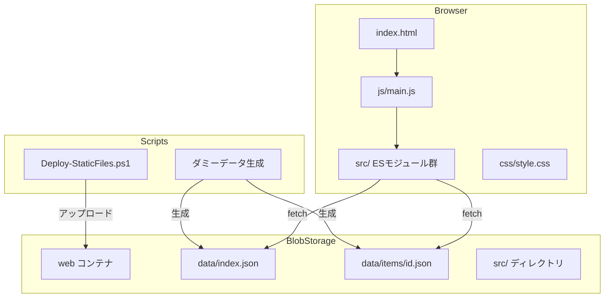
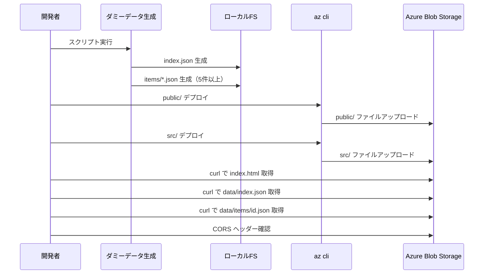
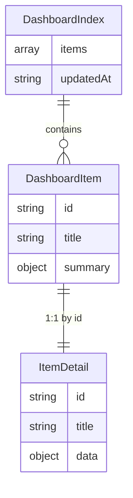

# Design Document: initialize-implement

## Overview
**Purpose**: Azure Blob Storage静的サイトにデプロイ済みのダッシュボードアプリケーションが正しく動作することを検証するため、ダミーデータの自動生成・デプロイおよびE2E検証を行う。

**Users**: 開発者がダッシュボード一覧表示とドリルダウン詳細表示のフローを検証する。

**Impact**: 現在、`src/`ディレクトリがBlobにデプロイされていないためESモジュールの読み込みが失敗している。デプロイ対象の拡張とダミーデータ投入により、アーキテクチャの正当性を確認する。

### Goals
- 5件以上のダミーデータを自動生成し、ローカルとBlobの両方に配置する
- `src/`ディレクトリをBlobにデプロイし、ESモジュールの読み込みを可能にする
- ダッシュボード一覧→ドリルダウン詳細の全フローをHTTPレベルで検証する

### Non-Goals
- 管理者機能（CSVインポート）の動作検証（PapaParseのImport Map未対応）
- 本番データの投入（今回はダミーデータのみ）
- `Deploy-StaticFiles.ps1`以外のPowerShellスクリプトの変更

## Architecture

### Existing Architecture Analysis
- **層構造**: core（AuthManager, Router）→ data（DataFetcher, BlobWriter, IndexMerger）→ logic（CsvTransformer）→ ui（DashboardView, DetailView, AdminPanel）
- **データフロー**: `DataFetcher.fetchIndex()` → `data/index.json` → `DashboardView.render()` → カード一覧描画。カードクリック → `Router.navigate()` → `DetailView.render(itemId)` → `DataFetcher.fetchItem(itemId)` → `data/items/{id}.json`
- **デプロイ構造の問題**: `Deploy-StaticFiles.ps1`は`frontend/dashboard/public/`のみをデプロイ。`main.js`のimportが`../src/`を参照するため、`src/`もBlobの`src/`パスに配置する必要がある
- **既存テスト**: 87テスト（Vitest + jsdom）、全パス。ブラウザ上の動作は未検証

### Architecture Pattern & Boundary Map



**Architecture Integration**:
- Selected pattern: 既存の静的サイト + ESモジュールパターンを維持
- Domain boundaries: データ生成（スクリプト）→ デプロイ（az cli/PowerShell）→ 表示検証（HTTP）
- Existing patterns preserved: DI、Result型、ハッシュベースルーティング
- New components rationale: ダミーデータ生成スクリプト（検証データの自動化）

### Technology Stack

| Layer | Choice / Version | Role in Feature | Notes |
|-------|------------------|-----------------|-------|
| Frontend | Vanilla JS (ES Modules) | ダッシュボード表示 | 既存。変更なし |
| Data Storage | Azure Blob Storage `$web` | 静的JSON配信 | 既存。ダミーデータ追加 |
| Scripts | Bash (シェルスクリプト) | ダミーデータ生成 | 新規。JSON生成用 |
| Deploy | az cli / Deploy-StaticFiles.ps1 | Blobアップロード | 既存。src/デプロイ対応を追加 |

## System Flows

### ダミーデータ生成〜デプロイ〜検証フロー



## Requirements Traceability

| Requirement | Summary | Components | Interfaces | Flows |
|-------------|---------|------------|------------|-------|
| 1.1 | index.jsonとアイテムJSON一括生成 | GenerateDummyData | ファイル出力 | 生成フロー |
| 1.2 | 5件以上、id/title/summary含む | GenerateDummyData | JSONスキーマ | 生成フロー |
| 1.3 | 詳細JSON、配列データ含む | GenerateDummyData | JSONスキーマ | 生成フロー |
| 1.4 | updatedAtタイムスタンプ | GenerateDummyData | JSONスキーマ | 生成フロー |
| 1.5 | public/data/配下に出力 | GenerateDummyData | ファイルパス | 生成フロー |
| 2.1 | data/ファイルをBlobアップロード | DeployProcess | az cli | デプロイフロー |
| 2.2 | Content-Type設定 | DeployProcess | az cli | デプロイフロー |
| 2.3 | 既存スクリプトまたはaz cli | DeployProcess | Deploy-StaticFiles.ps1 | デプロイフロー |
| 3.1 | ルートURLでindex.json取得・一覧表示 | DashboardView, DataFetcher | fetchIndex() | 閲覧フロー |
| 3.2 | title/summary表示 | DashboardView | render() | 閲覧フロー |
| 3.3 | 取得失敗時エラー表示 | DashboardView | render() | 閲覧フロー |
| 3.4 | ローディング→描画 | DashboardView | render() | 閲覧フロー |
| 4.1 | カードクリックで詳細遷移 | Router, DetailView | navigate() | ドリルダウンフロー |
| 4.2 | 詳細JSON取得・テーブル表示 | DetailView, DataFetcher | fetchItem(), render() | ドリルダウンフロー |
| 4.3 | 一覧へ戻る | Router, DetailView | navigate() | ドリルダウンフロー |
| 4.4 | 詳細取得失敗時エラー表示 | DetailView | render() | ドリルダウンフロー |
| 5.1 | index.html正常返却 | 検証手順 | curl/HTTP | 検証フロー |
| 5.2 | index.jsonデータ一致 | 検証手順 | curl/HTTP | 検証フロー |
| 5.3 | items/*.json正常返却 | 検証手順 | curl/HTTP | 検証フロー |
| 5.4 | CORSヘッダー確認 | 検証手順 | curl/HTTP | 検証フロー |
| 5.5 | 検証結果サマリー出力 | 検証手順 | コンソール出力 | 検証フロー |

## Components and Interfaces

| Component | Domain/Layer | Intent | Req Coverage | Key Dependencies | Contracts |
|-----------|-------------|--------|--------------|------------------|-----------|
| GenerateDummyData | Scripts | ダミーデータJSON生成 | 1.1-1.5 | なし | Batch |
| DeployProcess | Scripts/Infra | src/含むBlobデプロイ | 2.1-2.3 | az cli (P0) | Batch |
| DashboardView | UI | 一覧表示（既存） | 3.1-3.4 | DataFetcher (P0) | — |
| DetailView | UI | 詳細表示（既存） | 4.1-4.4 | DataFetcher (P0), Router (P0) | — |
| E2EVerification | 検証 | HTTPレベル検証 | 5.1-5.5 | curl (P0) | — |

### Scripts

#### GenerateDummyData

| Field | Detail |
|-------|--------|
| Intent | 検証用ダミーデータ（index.json + items/*.json）を自動生成する |
| Requirements | 1.1, 1.2, 1.3, 1.4, 1.5 |

**Responsibilities & Constraints**
- `frontend/dashboard/public/data/`配下にindex.jsonと個別アイテムJSONを出力する
- 5件以上のアイテムを生成。各アイテムはid、title、summaryを含む
- 各アイテムの詳細JSONは`data`フィールドに配列データ（内訳等）を含む
- 既存のデータファイルを上書きする（冪等）

**Dependencies**
- External: なし（シェルスクリプト単体で動作）

**Contracts**: Batch [x]

##### Batch / Job Contract
- Trigger: 開発者による手動実行
- Input: なし（スクリプト内部でデータ定義）
- Output: `frontend/dashboard/public/data/index.json` + `frontend/dashboard/public/data/items/item-{NNN}.json`（5件以上）
- Idempotency: 実行のたびに同一ファイルを上書き生成

**生成データスキーマ**:

```
// index.json
{
  items: Array<{
    id: string,        // "item-001" 形式
    title: string,     // 日本語タイトル
    summary: Record<string, string | number>  // 3項目以上
  }>,
  updatedAt: string    // ISO 8601
}

// data/items/{id}.json
{
  id: string,
  title: string,
  data: Record<string, string | number | Array<Record<string, string | number>>>
}
```

**Implementation Notes**
- Bashスクリプトで`cat <<EOF`によるJSON生成を使用
- 生成するダミーデータのバリエーション: 売上、アクセス、在庫、勤怠、プロジェクト進捗など業務系データを模擬

#### DeployProcess

| Field | Detail |
|-------|--------|
| Intent | public/とsrc/の両方をBlobにデプロイする |
| Requirements | 2.1, 2.2, 2.3 |

**Responsibilities & Constraints**
- `frontend/dashboard/public/`配下を`$web`コンテナのルートにアップロード
- `frontend/dashboard/src/`配下を`$web`コンテナの`src/`パスにアップロード
- 各ファイルに適切なContent-Typeを設定（`.js` → `application/javascript; charset=utf-8`、`.json` → `application/json; charset=utf-8`）
- `Deploy-StaticFiles.ps1`のSourcePathを複数パス対応に拡張する

**Dependencies**
- External: az cli (P0) — Blobアップロード
- External: Azure Blob Storage `$web`コンテナ (P0)

**Contracts**: Batch [x]

##### Batch / Job Contract
- Trigger: 開発者による手動実行
- Input: `frontend/dashboard/public/` + `frontend/dashboard/src/`
- Output: Blob Storage `$web`コンテナへのファイルアップロード
- Idempotency: `--overwrite`フラグで既存Blobを上書き

**Implementation Notes**
- 即時検証: az cliで`public/`と`src/`を個別にアップロード
- 恒久対応: `Deploy-StaticFiles.ps1`を修正してSourcePathsパラメータ（配列）で`public/`と`src/`を指定可能にする
- `src/`のアップロード先はBlob上の`src/`パス（`main.js`の`../src/`importが`src/`に解決されるため）

### 検証

#### E2EVerification

| Field | Detail |
|-------|--------|
| Intent | デプロイ済み静的サイトのHTTPレベル検証 |
| Requirements | 5.1, 5.2, 5.3, 5.4, 5.5 |

**Responsibilities & Constraints**
- 静的サイトエンドポイントに対するHTTPリクエストで各リソースの存在と正当性を確認
- index.html、data/index.json、data/items/*.json、src/*.jsの各パスを検証
- CORSヘッダーの存在を確認
- 検証結果をサマリーとして出力

**Dependencies**
- External: curl (P0) — HTTPリクエスト
- Inbound: DeployProcess — デプロイ完了後に実行

**Implementation Notes**
- curlで各エンドポイントにアクセスし、HTTPステータスコードとContent-Typeを確認
- JSONレスポンスの構造（itemsの件数、idの存在）を簡易チェック
- CORSはOriginヘッダー付きのOPTIONSリクエストで確認

## Data Models

### Domain Model

既存のデータモデルを変更なく使用する。



**Invariants**:
- `DashboardIndex.items[].id`は一意
- 各`DashboardItem.id`に対応する`data/items/{id}.json`が存在する
- `summary`は3項目以上のキー・値ペア
- `data`フィールドは配列データを含む場合がある

## Error Handling

### Error Strategy
- ダミーデータ生成: スクリプト実行エラー時は`set -e`で即座に中断
- デプロイ: az cliのエラー出力を確認。ネットワークエラーはIPルール追加で対応
- 検証: HTTPステータスコードが200以外の場合、エラーとして報告

## Testing Strategy

### E2E検証（HTTPレベル）
- 静的サイトルート → index.html（HTTP 200、text/html）
- `data/index.json` → 正しいJSON構造（items配列、5件以上）
- `data/items/{id}.json` → 各アイテムの詳細データ
- `src/core/auth-manager.js` → ESモジュールファイル（HTTP 200、application/javascript）
- CORSプリフライト → Access-Control-Allow-Originヘッダー

### 既存ユニットテスト
- 87テスト全パスを維持（`npm test`で確認）
- ダミーデータ生成スクリプトは既存テストに影響しない
