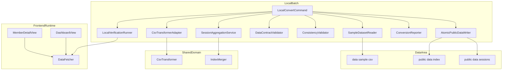
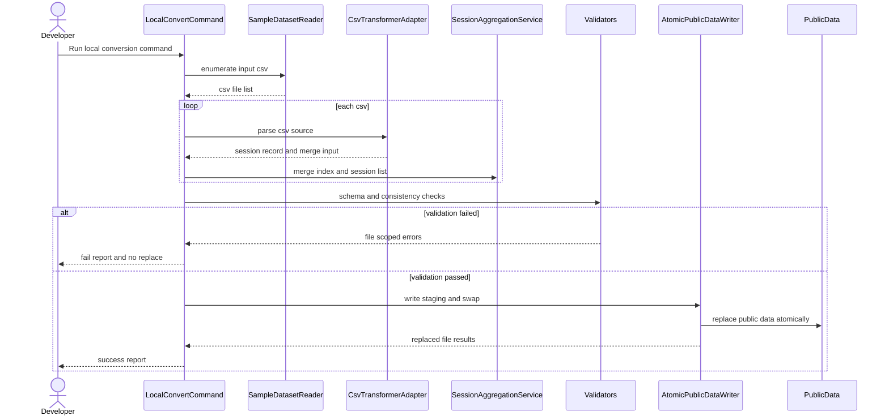
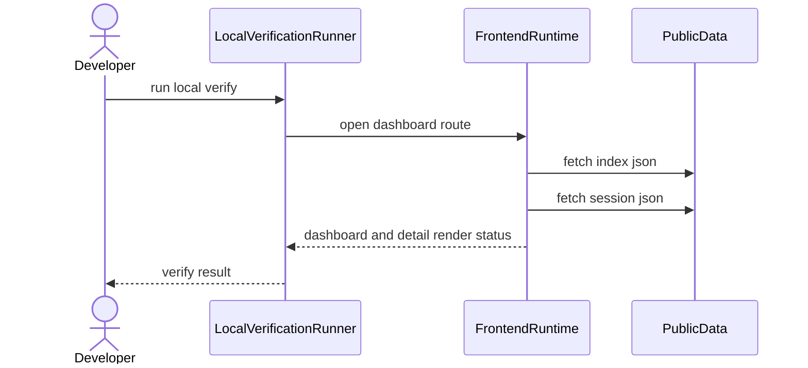
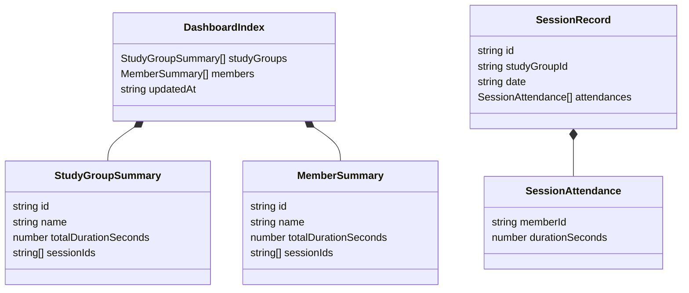
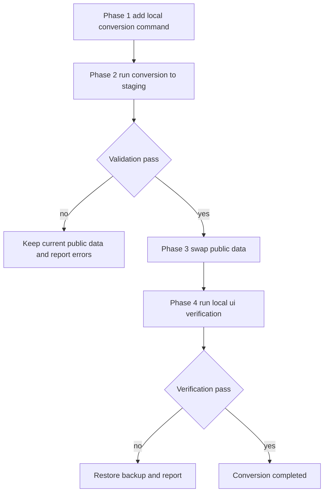

# Design Document — local-real-data-conversion

## Overview
本機能は、`data/sample` 配下の実CSVをローカルでドメインモデルJSONへ変換し、`frontend/dashboard/public/data` を安全に置換して画面動作を検証できるようにする。Azureデプロイ前に、変換精度・データ整合性・UI表示を同一環境で確認できることを目的とする。

対象ユーザーは開発者であり、ローカル実行コマンドで変換を実施し、一覧表示とドリルダウン表示の成立性を確認する。既存のブラウザ実装（`CsvTransformer`、`IndexMerger`、`DataFetcher`、`DashboardView`、`MemberDetailView`）を再利用し、変換仕様の二重管理を避ける。

本設計は既存システムの拡張（Extension）であり、新しい境界は「ローカル変換バッチ境界」のみである。`.kiro/steering` が未配置のため、既存コードと現行specを一次基準として整合性を確保する。

### Goals
- `data/sample/*.csv` を入力としてローカル変換フローを起動できる
- 既存CSV変換JSを再利用し、`public/data` を実データへ置換できる
- 置換前に契約検証・整合性検証を実施し、不完全置換を防止する
- 置換後データで一覧表示とドリルダウン表示をローカル確認できる
- 実行結果を成功/失敗と対象ファイル単位で再実行可能に報告できる

### Non-Goals
- Azure Blobへのアップロード自動化
- 管理者UI（AdminPanel）経由の操作統合
- セッション削除・既存JSONの差分編集機能
- 本番監視基盤へのログ転送

## Architecture

### Existing Architecture Analysis
既存アプリは Core / Data / Logic / UI の分離を持ち、ドメイン変換は `CsvTransformer` + `IndexMerger` に集中している。閲覧は `data/index.json` と `data/sessions/*.json` 契約で成立する。

| 領域 | 既存資産 | 変更方針 |
|------|----------|----------|
| Logic | `CsvTransformer` | 変換ロジックは再利用、入力境界のみ抽象化 |
| Data | `IndexMerger` | 再利用（セッション単位マージ） |
| UI | `DashboardView`, `MemberDetailView` | 変更なし、置換後データで検証 |
| Runtime | Browser中心 | Node.jsローカルバッチ境界を追加 |

### Architecture Pattern & Boundary Map


**Architecture Integration**:
- Selected pattern: 既存ロジック共有 + ローカルバッチオーケストレーション
- Domain/feature boundaries: 変換責務（LocalBatch）と表示責務（FrontendRuntime）を分離
- Existing patterns preserved: 既存のドメイン契約、`IndexMerger` の集計ルール、`DataFetcher` の取得契約
- New components rationale: 要件2.3を満たすため `AtomicPublicDataWriter`、要件3を満たすため検証コンポーネントを追加
- Steering compliance: steering未配置のため、既存コード規約を準拠基準として明示

## Technology Stack & Alignment

| Layer | Choice / Version | Role in Feature | Alignment Note |
|-------|------------------|-----------------|----------------|
| Local Runtime | Node.js 20+ | ローカル変換バッチ実行 | README前提に一致 |
| Shared Logic | Existing ES Modules | `CsvTransformer` / `IndexMerger` 再利用 | 重複実装を回避 |
| CSV Parser | PapaParse `^5.5.0` | 参加者TSVのヘッダー付きパース | 既存依存を継続 |
| Encoding | WHATWG `TextDecoder` | UTF-16LEデコード | Node/Browser両対応 |
| Hashing | Web Crypto `crypto.subtle` | SHA-256 ID生成 | 既存仕様維持 |
| File Operations | Node `fs/promises` | staging出力・置換・復旧 | 追加依存なし |
| UI Verification | Existing frontend + static server | 一覧/詳細のローカル確認 | 既存動作を検証用途で再利用 |

## System Flows

### ローカル変換と安全置換フロー


### ローカル画面確認フロー


**Flow decisions**:
- 置換前検証をゲートにして、検証失敗時は公開ディレクトリを変更しない。
- レポートはステップ単位（入力、変換、検証、置換、UI確認）で結果を分離する。

## Requirements Traceability

| Requirement | Summary | Components | Interfaces | Flows |
|-------------|---------|------------|------------|-------|
| 1.1 | `data/sample` 入力取り込み | SampleDatasetReader, LocalConvertCommand | `SampleDatasetReader.listInputs` | ローカル変換と安全置換フロー |
| 1.2 | CSV時に既存JS変換呼び出し | CsvTransformerAdapter, CsvTransformer | `CsvTransformerAdapter.parse` | ローカル変換と安全置換フロー |
| 1.3 | 入力不足時エラー中断 | SampleDatasetReader, ConversionReporter | `InputValidationResult` | ローカル変換と安全置換フロー |
| 1.4 | ローカルのみで完結 | LocalConvertCommand | `ConvertCommandOptions` | ローカル変換と安全置換フロー |
| 2.1 | `public/data` JSON更新 | AtomicPublicDataWriter | `AtomicPublicDataWriter.publish` | ローカル変換と安全置換フロー |
| 2.2 | 出力JSON契約適合 | DataContractValidator | `DataContractValidator.validate` | ローカル変換と安全置換フロー |
| 2.3 | 不完全置換を防止 | AtomicPublicDataWriter, DataContractValidator | `PublishResult` | ローカル変換と安全置換フロー |
| 2.4 | ファイル単位進捗追跡 | ConversionReporter, AtomicPublicDataWriter | `FileOperationResult` | ローカル変換と安全置換フロー |
| 3.1 | 必須項目検証 | DataContractValidator | `SchemaValidationIssue` | ローカル変換と安全置換フロー |
| 3.2 | スキーマ不一致を不採用 | DataContractValidator, LocalConvertCommand | `ValidationGateResult` | ローカル変換と安全置換フロー |
| 3.3 | 集計と明細の整合確認 | ConsistencyValidator | `ConsistencyCheckResult` | ローカル変換と安全置換フロー |
| 3.4 | エラーのファイル単位提示 | ConversionReporter | `ConversionReport` | ローカル変換と安全置換フロー |
| 4.1 | 一覧画面の読み込み確認 | LocalVerificationRunner, DashboardView, DataFetcher | `LocalVerificationRunner.verifyDashboard` | ローカル画面確認フロー |
| 4.2 | ドリルダウン表示確認 | LocalVerificationRunner, MemberDetailView, DataFetcher | `LocalVerificationRunner.verifyMemberDetail` | ローカル画面確認フロー |
| 4.3 | JSON欠落時のエラー表示確認 | LocalVerificationRunner, DashboardView, MemberDetailView | `VerificationError` | ローカル画面確認フロー |
| 4.4 | 一覧と詳細の最小遷移成立 | LocalVerificationRunner, Router | `NavigationCheckResult` | ローカル画面確認フロー |
| 5.1 | 成功/失敗の明示 | ConversionReporter | `ConversionReport.status` | ローカル変換と安全置換フロー |
| 5.2 | 対象一覧と件数出力 | ConversionReporter | `ConversionReport.summary` | ローカル変換と安全置換フロー |
| 5.3 | 部分失敗の分離報告 | ConversionReporter, AtomicPublicDataWriter | `ConversionReport.fileResults` | ローカル変換と安全置換フロー |
| 5.4 | 同一入力で再実行可能 | LocalConvertCommand, AtomicPublicDataWriter | `RetryableExecutionPolicy` | ローカル変換と安全置換フロー |

## Components & Interface Contracts

| Component | Domain/Layer | Intent | Req Coverage | Key Dependencies (P0/P1) | Contracts |
|-----------|--------------|--------|--------------|--------------------------|-----------|
| LocalConvertCommand | Local Batch | 変換全体の実行制御 | 1.1, 1.4, 2.3, 3.2, 5.4 | SampleDatasetReader (P0), AtomicPublicDataWriter (P0), ConversionReporter (P0) | Service, Batch, State |
| SampleDatasetReader | Local Batch | 入力CSVの列挙と前提検証 | 1.1, 1.3 | File system (P0) | Service |
| CsvTransformerAdapter | Local Batch | ローカル入力を既存変換器へ適合 | 1.2 | CsvTransformer (P0) | Service |
| SessionAggregationService | Local Batch | Session群とDashboardIndex構築 | 2.2, 3.3 | IndexMerger (P0) | Service, State |
| DataContractValidator | Validation | 出力JSONの必須項目検証 | 2.2, 3.1, 3.2 | Shared contract types (P0) | Service |
| ConsistencyValidator | Validation | index と sessions の参照整合検証 | 3.3, 3.4 | SessionAggregationService (P0) | Service |
| AtomicPublicDataWriter | Local Batch | staging経由で公開データ置換 | 2.1, 2.3, 2.4, 5.3 | File system (P0) | Batch, State |
| LocalVerificationRunner | Verification | ローカル画面遷移の成立検証 | 4.1, 4.2, 4.3, 4.4 | DataFetcher (P0), DashboardView (P1), MemberDetailView (P1) | Service |
| ConversionReporter | Reporting | 実行結果の標準出力/ファイル出力 | 2.4, 3.4, 5.1, 5.2, 5.3 | 全コンポーネント (P0) | Service, State |

### Local Batch Layer

#### LocalConvertCommand

| Field | Detail |
|-------|--------|
| Intent | 入力読込から検証・置換・レポートまでの実行順序を統制する |
| Requirements | 1.1, 1.4, 2.3, 3.2, 5.4 |

**Responsibilities & Constraints**
- 実行順序を固定する: `input -> transform -> validate -> publish -> verify -> report`
- 検証失敗時は publish を呼び出さない
- 同一入力再実行で結果が収束するよう、出力ディレクトリを初期化可能にする

**Dependencies**
- Inbound: CLI entrypoint — 実行トリガー (P0)
- Outbound: SampleDatasetReader — 入力列挙 (P0)
- Outbound: CsvTransformerAdapter — CSV変換 (P0)
- Outbound: SessionAggregationService — 集約構築 (P0)
- Outbound: DataContractValidator / ConsistencyValidator — 検証 (P0)
- Outbound: AtomicPublicDataWriter — 置換 (P0)
- Outbound: ConversionReporter — 出力 (P0)

**Contracts**: Service [x] / API [ ] / Event [ ] / Batch [x] / State [x]

##### Service Interface
```typescript
interface ConvertCommandOptions {
  inputDir: string;
  outputDir: string;
  runUiVerification: boolean;
  failOnWarning: boolean;
}

interface ConvertCommandService {
  execute(options: ConvertCommandOptions): Promise<ConversionReport>;
}
```
- Preconditions: `inputDir` が存在し、CSVを1件以上含む
- Postconditions: 成功時は `outputDir` が新契約データで置換済み
- Invariants: 検証失敗時に `outputDir` の公開データは変更されない

##### Batch / Job Contract
- Trigger: ローカルコマンド実行
- Input / validation: CSV存在、出力先書込権限、契約検証ゲート
- Output / destination: `frontend/dashboard/public/data`
- Idempotency & recovery: 同一入力で再実行可能、失敗時は公開データ不変

##### State Management
- State model: `ExecutionStage = input|transform|validate|publish|verify|report`
- Persistence & consistency: ステージ結果を `ConversionReport` に集約
- Concurrency strategy: 単一実行（同時実行禁止）

**Implementation Notes**
- Integration: 既存 `CsvTransformer`/`IndexMerger` を直接利用
- Validation: publish前の二段階検証を必須
- Risks: 同時実行時の競合はコマンドロックで回避

#### SampleDatasetReader

| Field | Detail |
|-------|--------|
| Intent | `data/sample` のCSV入力を収集し、欠落条件を検出する |
| Requirements | 1.1, 1.3 |

**Responsibilities & Constraints**
- 入力ディレクトリから `.csv` を列挙
- 対象0件時は即時エラー
- 不正拡張子や読込不可ファイルを結果に記録

**Dependencies**
- External: Node `fs/promises` — ディレクトリ列挙 (P0)

**Contracts**: Service [x] / API [ ] / Event [ ] / Batch [ ] / State [ ]

##### Service Interface
```typescript
interface CsvInputFile {
  path: string;
  name: string;
  sizeBytes: number;
}

interface SampleDatasetReaderService {
  listInputs(inputDir: string): Promise<Result<CsvInputFile[], InputError>>;
}
```

#### CsvTransformerAdapter

| Field | Detail |
|-------|--------|
| Intent | ローカルファイル入力を `CsvTransformer` 契約へ適合させる |
| Requirements | 1.2 |

**Responsibilities & Constraints**
- Node読込データを `arrayBuffer()` 契約でラップ
- 既存 `CsvTransformer.parse` をそのまま呼び出す
- 変換警告を上位へ透過する

**Dependencies**
- Outbound: CsvTransformer — Teams CSV変換 (P0)

**Contracts**: Service [x] / API [ ] / Event [ ] / Batch [ ] / State [ ]

##### Service Interface
```typescript
interface CsvSource {
  name: string;
  arrayBuffer(): Promise<ArrayBuffer>;
}

interface CsvTransformerAdapterService {
  parse(source: CsvSource): Promise<ParseResult>;
}
```

### Aggregation and Validation Layer

#### SessionAggregationService

| Field | Detail |
|-------|--------|
| Intent | 複数CSVの変換結果から `DashboardIndex` と `SessionRecord[]` を構築する |
| Requirements | 2.2, 3.3 |

**Responsibilities & Constraints**
- CSV単位の `SessionRecord` を保持
- `IndexMerger` で `DashboardIndex` を逐次マージ
- セッションID重複は警告として保持し、重複上書きをしない

**Dependencies**
- Outbound: IndexMerger — index更新 (P0)

**Contracts**: Service [x] / API [ ] / Event [ ] / Batch [ ] / State [x]

##### Service Interface
```typescript
interface AggregationOutput {
  index: DashboardIndex;
  sessions: SessionRecord[];
  warnings: ConversionIssue[];
}

interface SessionAggregationService {
  aggregate(parsedSessions: ParsedSession[]): AggregationOutput;
}
```

#### DataContractValidator

| Field | Detail |
|-------|--------|
| Intent | 出力JSONがフロントエンド契約を満たすか検証する |
| Requirements | 2.2, 3.1, 3.2 |

**Responsibilities & Constraints**
- `index.json` の必須キーと型を検証
- `sessions/*.json` の必須キーと型を検証
- 検証失敗時は publish不可判定を返す

**Contracts**: Service [x] / API [ ] / Event [ ] / Batch [ ] / State [ ]

##### Service Interface
```typescript
interface SchemaValidationIssue {
  filePath: string;
  fieldPath: string;
  message: string;
  severity: 'error' | 'warning';
}

interface DataContractValidator {
  validateIndex(index: DashboardIndex): SchemaValidationIssue[];
  validateSession(sessionPath: string, session: SessionRecord): SchemaValidationIssue[];
}
```

#### ConsistencyValidator

| Field | Detail |
|-------|--------|
| Intent | 集計値と明細値、参照IDの整合性を検証する |
| Requirements | 3.3, 3.4 |

**Responsibilities & Constraints**
- `studyGroups[].sessionIds` が `sessions` 実体に存在することを検証
- `members[].sessionIds` と `SessionRecord.attendances` の対応を検証
- `totalDurationSeconds` と明細合計の差分を検証

**Contracts**: Service [x] / API [ ] / Event [ ] / Batch [ ] / State [ ]

##### Service Interface
```typescript
interface ConsistencyCheckIssue {
  filePath: string;
  issueType: 'missing-session' | 'missing-member-attendance' | 'duration-mismatch';
  message: string;
}

interface ConsistencyValidator {
  validate(index: DashboardIndex, sessions: SessionRecord[]): ConsistencyCheckIssue[];
}
```

### Publishing and Reporting Layer

#### AtomicPublicDataWriter

| Field | Detail |
|-------|--------|
| Intent | `public/data` 置換を staging 経由で安全に実行する |
| Requirements | 2.1, 2.3, 2.4, 5.3 |

**Responsibilities & Constraints**
- stagingディレクトリに全出力を書き込む
- staging検証成功後に公開ディレクトリへ切替
- 失敗時に公開ディレクトリを変更しない
- ファイルごとの処理結果を返す

**Dependencies**
- External: Node `fs/promises` — write/rename/remove (P0)

**Contracts**: Service [ ] / API [ ] / Event [ ] / Batch [x] / State [x]

##### Batch / Job Contract
- Trigger: `LocalConvertCommand` の publish ステージ
- Input / validation: 生成済み index + sessions + 検証通過フラグ
- Output / destination: `frontend/dashboard/public/data`
- Idempotency & recovery: 置換失敗時は既存公開データを保持、再実行で回復可能

##### State Management
- State model: `staging_created`, `staging_written`, `swapped`, `cleanup_done`
- Persistence & consistency: 各状態を `FileOperationResult[]` へ記録
- Concurrency strategy: ロックファイル方式で単一実行

#### ConversionReporter

| Field | Detail |
|-------|--------|
| Intent | 実行結果を成功/失敗、件数、ファイル単位で報告する |
| Requirements | 2.4, 3.4, 5.1, 5.2, 5.3 |

**Responsibilities & Constraints**
- 総合ステータス（success / partial / failure）を計算
- 成功件数・失敗件数・警告件数を出力
- 失敗ファイルの理由を明示

**Contracts**: Service [x] / API [ ] / Event [ ] / Batch [ ] / State [x]

##### State Management
- State model: `ConversionReport`
- Persistence & consistency: 標準出力 + 任意でJSONファイル保存
- Concurrency strategy: 単一実行レポートのみ保持

### Verification Layer

#### LocalVerificationRunner

| Field | Detail |
|-------|--------|
| Intent | 置換後データで一覧表示とドリルダウン遷移を検証する |
| Requirements | 4.1, 4.2, 4.3, 4.4 |

**Responsibilities & Constraints**
- `data/index.json` 読込成功を確認
- 任意メンバー1件以上で `data/sessions/*.json` 読込を確認
- 欠落/不正JSON時に期待エラー表示を確認
- 一覧→詳細→戻るの最小遷移成立を確認

**Dependencies**
- Outbound: DataFetcher — JSON取得 (P0)
- Outbound: DashboardView — 一覧描画 (P1)
- Outbound: MemberDetailView — 詳細描画 (P1)

**Contracts**: Service [x] / API [ ] / Event [ ] / Batch [ ] / State [ ]

##### Service Interface
```typescript
interface LocalVerificationRunner {
  verifyDashboard(): Promise<Result<VerificationSummary, VerificationError>>;
  verifyMemberDetail(memberId: string): Promise<Result<VerificationSummary, VerificationError>>;
}
```

## Data Models

### Domain Model
- Aggregate 1: `DashboardIndex`（トップ表示に必要な集計情報）
- Aggregate 2: `SessionRecord`（セッション単位の明細）
- Value Object: `ConversionIssue`, `FileOperationResult`, `ConversionReport`



### Logical Data Model

**Structure Definition**:
- `DashboardIndex.studyGroups[].sessionIds` は `SessionRecord.id` を参照
- `DashboardIndex.members[].sessionIds` は参加者が出席した `SessionRecord.id` を参照
- `SessionRecord.attendances[].memberId` は `members[].id` と整合する

**Consistency & Integrity**:
- 置換は `DashboardIndex` と `SessionRecord[]` を同一実行単位で生成
- 参照整合検証に通過したデータのみ公開領域へ反映
- `updatedAt` は変換成功時刻（ISO 8601）で更新

### Physical Data Model

| Path | Content | Mutability | Produced By |
|------|---------|-----------|-------------|
| `frontend/dashboard/public/data/index.json` | `DashboardIndex` | 置換対象 | SessionAggregationService |
| `frontend/dashboard/public/data/sessions/<session-id>.json` | `SessionRecord` | 置換対象 | CsvTransformerAdapter |
| `frontend/dashboard/public/data/.staging-*` | 一時生成物 | 一時 | AtomicPublicDataWriter |
| `frontend/dashboard/public/data/.backup-*` | ロールバック用退避 | 一時 | AtomicPublicDataWriter |

### Data Contracts & Integration

```typescript
interface DashboardIndex {
  studyGroups: StudyGroupSummary[];
  members: MemberSummary[];
  updatedAt: string;
}

interface SessionRecord {
  id: string;
  studyGroupId: string;
  date: string;
  attendances: SessionAttendance[];
}

interface ConversionReport {
  status: 'success' | 'partial' | 'failure';
  summary: {
    inputCsvCount: number;
    generatedSessionCount: number;
    writtenFileCount: number;
    failedFileCount: number;
  };
  fileResults: FileOperationResult[];
  issues: ConversionIssue[];
}
```

## Error Handling

### Error Strategy
- Fail Fast: 入力不足、契約違反、整合違反は publish前に停止
- Graceful Degradation: 警告は報告に残し、重大エラーのみ停止条件
- Rollback Safety: publish失敗時は公開データを変更しない

### Error Categories and Responses
- **User Errors**: 入力ディレクトリ不正、CSV不足、フォーマット不正
- **System Errors**: ファイルI/O失敗、権限不足、ディスク不足
- **Business Logic Errors**: ID参照不整合、合計時間不一致、必須項目欠落

### Monitoring
- コマンド実行ごとに `ConversionReport` を出力
- 失敗時はファイル単位のエラー理由を必ず記録
- 検証ステージごとの経過時間を記録可能にする

## Testing Strategy

### Unit Tests
- `SampleDatasetReader`: 入力列挙、CSV不足検知、読み取り失敗
- `CsvTransformerAdapter`: `CsvSource` 入力適合、既存変換器呼び出し
- `DataContractValidator`: index/session 必須項目検証
- `ConsistencyValidator`: 参照整合・合計整合検証
- `AtomicPublicDataWriter`: staging成功、swap失敗時の公開不変保証

### Integration Tests
- 複数CSVを連続変換し `DashboardIndex` が累積更新される
- 検証失敗時に `public/data` が未変更である
- 部分失敗時の `ConversionReport` が成功分/失敗分を分離する
- 同一入力の再実行で結果が再現される

### E2E/UI Tests
- 置換後データで一覧表示が成立する
- 任意メンバーのドリルダウン表示が成立する
- 参照先JSON欠落時にエラー表示が出る
- 一覧から詳細、詳細から戻る遷移が成立する

### Performance/Load
- `data/sample` 内CSV件数増加時の変換時間計測
- セッションJSON件数増加時の検証時間計測
- staging生成時のディスク使用量監視

## Security Considerations
- 本機能はローカル実行のみで、SASトークンや外部認証情報は扱わない
- 入力CSVに個人情報が含まれるため、ログ出力は最小限の識別子に制限する
- 一時ファイルとバックアップファイルの削除ポリシーを定義する

## Migration Strategy


- Phase 1: ローカル変換コマンド導線を追加
- Phase 2: staging生成と契約/整合検証を実行
- Phase 3: 検証成功時のみ `public/data` を置換
- Phase 4: ローカルUI確認後に結果を確定

## Supporting References
- 詳細調査ログ: `.kiro/specs/local-real-data-conversion/research.md`
- 既存変換仕様: `frontend/dashboard/src/logic/csv-transformer.js`
- 既存集約仕様: `frontend/dashboard/src/data/index-merger.js`
