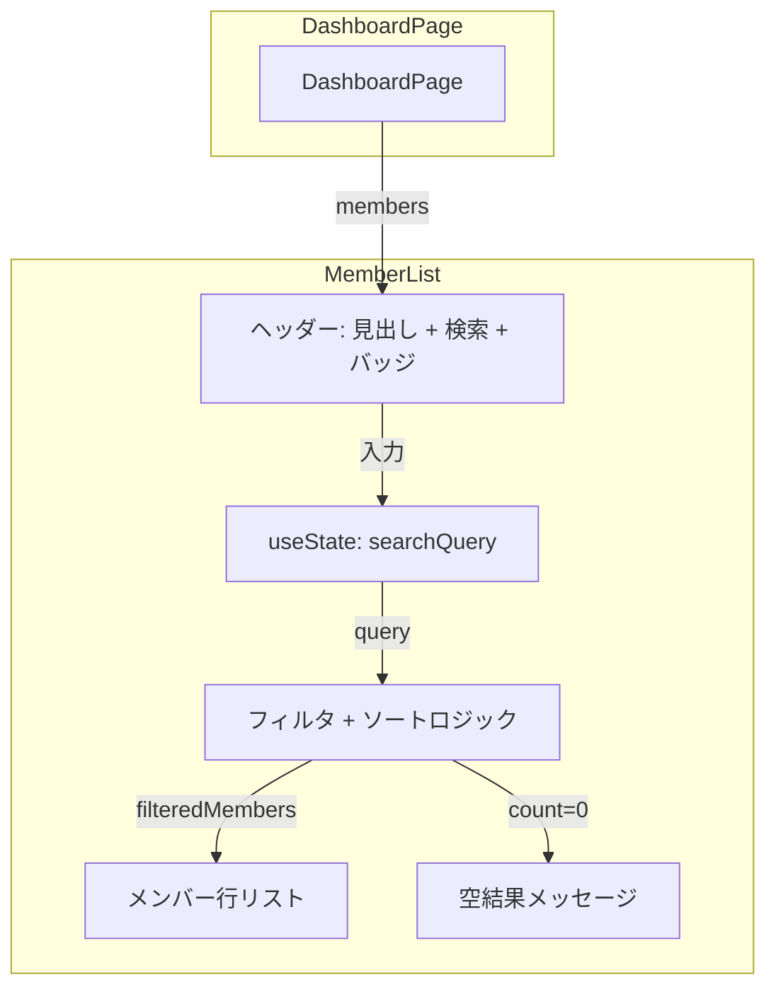

# Design Document — member-list-sort-and-search

## Overview
**Purpose**: メンバー一覧の視認性と検索性を向上させるため、ソート順の変更とインクリメンタルサーチ機能を追加する。

**Users**: ダッシュボードを利用する管理者・ユーザーが、メンバーを名前順で確認し、素早く特定のメンバーを検索できるようになる。

**Impact**: 既存の `MemberList` コンポーネントを拡張し、ソートロジック変更・検索UIの追加・フィルタリングロジックの導入を行う。

### Goals
- メンバー一覧を名称昇順（あいうえお順）で表示する
- ヘッダー部分に検索入力フィールドを配置する
- インクリメンタルサーチで即座にメンバーを絞り込める

### Non-Goals
- ソート基準の切り替えUI（名前順/勉強時間順の選択）
- 検索条件の永続化（URL パラメータやローカルストレージ）
- メンバー名以外の項目での検索（セッション回数、勉強時間など）
- サーバーサイド検索・フィルタリング

## Architecture

### Existing Architecture Analysis
- `MemberList` はステートレスな表示コンポーネント（props のみで動作）
- `DashboardPage` から `members` 配列を props で受け取り
- 現在のソート: `totalDurationSeconds` 降順（コンポーネント内でインライン実行）
- ヘッダー: 左に見出し「メンバー」+ アイコン、右にメンバー数バッジ
- 外部依存: `lucide-react`, `react-router-dom`, `format-duration` ユーティリティ

### Architecture Pattern & Boundary Map

変更は `MemberList` コンポーネント内に閉じ、他コンポーネントへの影響なし。



**Architecture Integration**:
- Selected pattern: コンポーネント内ローカル状態管理（`useState`）
- 既存パターン維持: props 受け取り → 加工 → レンダリング のフローは変更なし
- 新規依存なし: `lucide-react` の `Search` アイコンのみ追加利用

### Technology Stack

| Layer | Choice / Version | Role in Feature | Notes |
|-------|------------------|-----------------|-------|
| Frontend | React (既存) | コンポーネント状態管理 (`useState`) | 新規依存なし |
| UI | Tailwind CSS (既存) | 検索フィールドのスタイリング | 既存デザイントークン使用 |
| Icons | lucide-react (既存) | `Search` アイコン追加利用 | 既にプロジェクトで使用中 |

## Requirements Traceability

| Requirement | Summary | Components | Interfaces | Flows |
|-------------|---------|------------|------------|-------|
| 1.1 | 名称昇順ソート | MemberList (ソートロジック) | — | ソート処理 |
| 1.2 | 勉強時間ソートを名称ソートに置換 | MemberList (ソートロジック) | — | ソート処理 |
| 1.3 | localeCompare による日本語対応 | MemberList (ソートロジック) | — | ソート処理 |
| 2.1 | 検索フィールドの配置 | MemberList (ヘッダー) | — | — |
| 2.2 | プレースホルダーテキスト | MemberList (ヘッダー) | — | — |
| 2.3 | 既存デザインとの一貫性 | MemberList (ヘッダー) | — | — |
| 3.1 | 部分一致フィルタリング | MemberList (フィルタロジック) | — | 検索フロー |
| 3.2 | 空検索時の全件表示 | MemberList (フィルタロジック) | — | 検索フロー |
| 3.3 | ケースインセンシティブ検索 | MemberList (フィルタロジック) | — | 検索フロー |
| 3.4 | 0件時メッセージ表示 | MemberList (空結果表示) | — | 検索フロー |
| 3.5 | 件数バッジの動的更新 | MemberList (ヘッダー) | — | 検索フロー |
| 3.6 | 検索中のソート維持 | MemberList (ソート+フィルタ) | — | 検索フロー |

## Components and Interfaces

| Component | Domain/Layer | Intent | Req Coverage | Key Dependencies | Contracts |
|-----------|------------|--------|-------------|-----------------|-----------|
| MemberList | UI | メンバー一覧の表示・検索・ソート | 1.1–1.3, 2.1–2.3, 3.1–3.6 | DashboardPage (P0) | State |

### UI Layer

#### MemberList（拡張）

| Field | Detail |
|-------|--------|
| Intent | メンバー一覧を名称昇順で表示し、インクリメンタルサーチで絞り込む |
| Requirements | 1.1, 1.2, 1.3, 2.1, 2.2, 2.3, 3.1, 3.2, 3.3, 3.4, 3.5, 3.6 |

**Responsibilities & Constraints**
- メンバー配列を名称昇順にソートして表示する
- 検索クエリによるフィルタリング（部分一致・ケースインセンシティブ）
- フィルタ結果の件数をヘッダーバッジに反映する
- 検索結果が0件の場合にメッセージを表示する

**Dependencies**
- Inbound: `DashboardPage` — `members` 配列の提供 (P0)
- External: `lucide-react` — `Search` アイコン (P2)

**Contracts**: State [x]

##### State Management

```typescript
// コンポーネント内ローカル状態
type MemberListState = {
  searchQuery: string;  // 検索入力値（デフォルト: ""）
};
```

**データ処理パイプライン**:
1. `members` props を受け取る
2. `searchQuery` が空でない場合 → `name` に対してケースインセンシティブ部分一致フィルタ
3. フィルタ結果を `name` の昇順（`localeCompare('ja')`）でソート
4. ソート結果をレンダリング。件数をバッジに反映

**Implementation Notes**
- ソート: `a.name.localeCompare(b.name, 'ja')` で日本語自然順ソートを実現
- フィルタ: `member.name.toLowerCase().includes(query.toLowerCase())` でケースインセンシティブ検索
- ヘッダーレイアウト: 「メンバー」見出し → 検索フィールド → メンバー数バッジ の3カラム構成（`flex` + `gap`）
- 検索フィールド: `<input>` に `Search` アイコンを prefix として配置。Tailwind クラスで既存デザインに統一
- 空結果: `filteredMembers.length === 0` 時に「該当するメンバーが見つかりません」メッセージを表示
- バッジ: `members.length` → `filteredMembers.length` に変更し、絞り込み後件数を表示

## Error Handling

### Error Strategy
本機能はクライアントサイドのフィルタリングのみで構成されるため、エラーハンドリングは最小限。

### Error Categories and Responses
- **空結果** (ビジネスロジック): 検索結果0件 → 「該当するメンバーが見つかりません」メッセージ表示 (3.4)
- **空配列** (データ不在): `members` が空配列の場合 → 既存動作を維持（空リスト表示）

## Testing Strategy

### Unit Tests
- ソートロジック: `localeCompare` による名称昇順ソートの検証（日本語・英語混在）
- フィルタロジック: 部分一致・ケースインセンシティブの検証
- 空結果: フィルタ結果0件時のメッセージ表示確認

### Integration Tests（コンポーネントテスト）
- 検索フィールド入力 → メンバーリストの動的絞り込み
- 検索クリア → 全メンバー表示に復帰
- バッジ件数がフィルタ結果に連動すること
- ソート順が検索フィルタ適用後も維持されること
