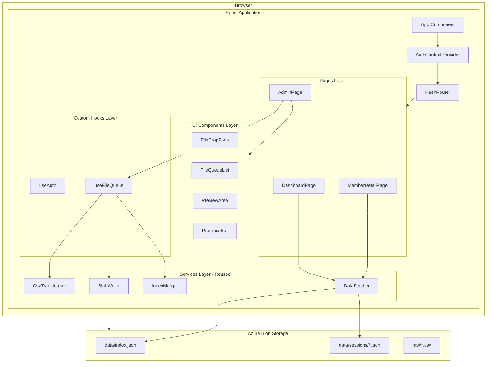
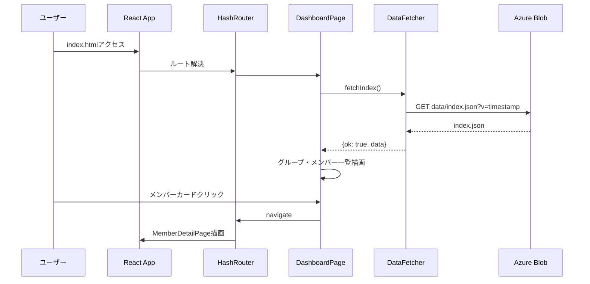
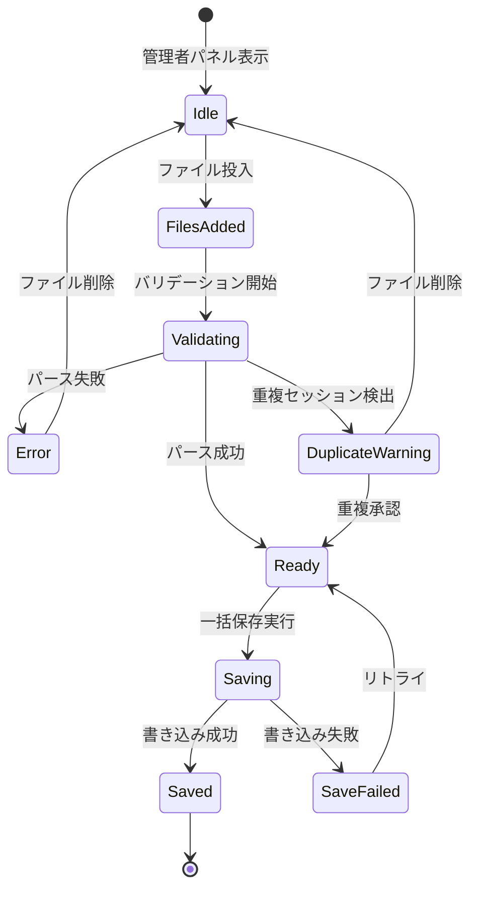
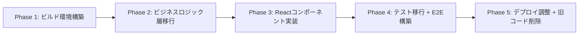

# Design Document: react-migration

## Overview

**Purpose**: 本設計は、Azure Blob Storage上の静的ダッシュボードアプリケーションのフロントエンドを、Vanilla JavaScript（ES Modules）からReact + Viteベースのアーキテクチャへ移行するための技術設計である。

**Users**: 勉強会の参加者（ダッシュボード閲覧）および管理者（CSV投入・データ管理）が、移行後も同一の操作体験でアプリケーションを利用する。

**Impact**: 既存の12個のES Modulesで構成されたフロントエンドを、Reactコンポーネントベースの宣言的UIに置き換える。ビジネスロジック層（csv-transformer, index-merger, blob-writer, data-fetcher）は再利用し、UI層は全面書き換えとなる。

### Goals
- ビジネスロジック層の60-70%コード再利用による効率的な移行
- Reactコンポーネント化による宣言的UI・保守性の向上
- Vitest + React Testing Library + Playwrightによる多層テスト戦略の確立
- 既存デプロイパイプライン（Azure Blob Storage静的配信）との互換性維持

### Non-Goals
- TypeScriptの導入（要件1.4によりJavaScript + JSXを維持）
- CSSフレームワーク（Tailwind等）の導入（既存style.cssを再利用）
- サーバーサイドレンダリング（SSR）の導入
- バックエンド（Azure Functions）との統合変更
- データモデル（index.json, sessions/*.json）の構造変更

## Architecture

### Existing Architecture Analysis

現在のアーキテクチャは以下の特徴を持つ:

- **モジュール構成**: 12個のES Modules（core/, data/, logic/, ui/）
- **DI パターン**: main.jsでインスタンスを生成し、コンストラクタ経由で注入
- **DOM操作**: innerHTML + createElement + addEventListener の手動バインド
- **ルーティング**: window.location.hash + hashchangeイベントの独自実装
- **データ形式**: `{ ok: true, data }` / `{ ok: false, error }` の統一パターン

技術的負債として、UI層（dashboard-view, detail-view, admin-panel）のDOM直接操作の複雑性、FileQueueManagerとAdminPanel間の状態分散が挙げられる。

### Architecture Pattern & Boundary Map



**Architecture Integration**:
- **Selected pattern**: レイヤードアーキテクチャ（Pages → Components → Hooks → Services）
- **Domain boundaries**: UI層（Pages/Components）とビジネスロジック層（Services）を明確に分離。Servicesは既存コードをそのまま再利用
- **Existing patterns preserved**: `{ ok, data/error }` レスポンスパターン、データモデル構造
- **New components rationale**: Pages/Components/Hooksは既存DOM操作UIの宣言的React置換。AuthContextは認証状態のコンポーネントツリー共有に必要
- **Steering compliance**: JavaScript維持、静的配信維持、既存デプロイスクリプト互換

### Technology Stack

| Layer | Choice / Version | Role in Feature | Notes |
|-------|------------------|-----------------|-------|
| Framework | React 19 + ReactDOM 19 | UIコンポーネント描画 | JSX（TypeScriptなし） |
| Build Tool | Vite 6.x + @vitejs/plugin-react | 開発サーバー + プロダクションビルド | HMR、JSX変換 |
| Routing | react-router-dom 7.x | ハッシュベースSPAルーティング | createHashRouter使用 |
| CSV Parse | papaparse 5.x | Teams出席レポートCSV解析 | npm依存に移行（importmap廃止） |
| Unit Test | Vitest 3.x + @testing-library/react | コンポーネント + ロジックテスト | jsdom環境、webcryptoポリフィル |
| E2E Test | @playwright/test 1.48+ | ブラウザベースE2Eテスト | Vite devサーバー連携 |
| Storage | Azure Blob Storage | 静的サイトホスティング + データ格納 | 変更なし |

## System Flows

### 閲覧フロー



### 管理者CSVインポートフロー



ファイルキューの状態遷移はuseReducerで管理する。各状態遷移はdispatchアクション（`ADD_FILES`, `VALIDATE_START`, `VALIDATE_SUCCESS`, `VALIDATE_ERROR`, `DUPLICATE_DETECTED`, `APPROVE_DUPLICATE`, `REMOVE_FILE`, `SAVE_START`, `SAVE_SUCCESS`, `SAVE_FAIL`）に対応する。

## Requirements Traceability

| Requirement | Summary | Components | Interfaces | Flows |
|-------------|---------|------------|------------|-------|
| 1.1 | Viteビルドツール | vite.config.js | — | — |
| 1.2 | React 19依存 | package.json | — | — |
| 1.3 | ビルド出力互換性 | vite.config.js (build.outDir) | — | — |
| 1.4 | JavaScript + JSX | *.jsx拡張子 | — | — |
| 1.5 | PapaParse維持 | CsvTransformer (services) | — | — |
| 2.1 | DashboardView移行 | DashboardPage | — | 閲覧フロー |
| 2.2 | DetailView移行 | MemberDetailPage | — | 閲覧フロー |
| 2.3 | AdminPanel移行 | AdminPage, FileDropZone, FileQueueList, PreviewArea | — | 管理者フロー |
| 2.4 | FileQueueManager移行 | useFileQueue, fileQueueReducer | State | 管理者フロー |
| 2.5 | 宣言的UI | 全Pageコンポーネント | — | — |
| 3.1 | React Router HashRouter | App (createHashRouter) | — | — |
| 3.2 | ルートURL→ダッシュボード | ルート定義 path="/" | — | 閲覧フロー |
| 3.3 | メンバー詳細ルート | ルート定義 path="/members/:memberId" | — | 閲覧フロー |
| 3.4 | 管理者パネルナビゲーション | App (AuthContext条件分岐) | — | — |
| 3.5 | 不明ルートリダイレクト | ルート定義 path="*" → Navigate | — | — |
| 4.1 | SASトークン抽出 | useAuth | Service | — |
| 4.2 | 管理者パネル非表示 | App (AuthContext) | State | — |
| 4.3 | 管理者機能有効化 | AdminPage (AuthContext参照) | State | 管理者フロー |
| 4.4 | AuthManager Hook化 | useAuth, AuthContext | Service, State | — |
| 5.1 | DataFetcher React対応 | DataFetcher (services, そのまま再利用) | Service | 閲覧フロー |
| 5.2 | BlobWriter維持 | BlobWriter (services, そのまま再利用) | Service | 管理者フロー |
| 5.3 | IndexMerger維持 | IndexMerger (services, そのまま再利用) | Service | 管理者フロー |
| 5.4 | CsvTransformer維持 | CsvTransformer (services, そのまま再利用) | Service | 管理者フロー |
| 5.5 | ローディング表示 | DashboardPage, MemberDetailPage | — | 閲覧フロー |
| 5.6 | エラー表示 | DashboardPage, MemberDetailPage | — | 閲覧フロー |
| 6.1 | CSS維持 | style.css (そのまま再利用) | — | — |
| 6.2 | ドラッグ&ドロップ | FileDropZone | — | 管理者フロー |
| 6.3 | プログレスバー | ProgressBar | — | 管理者フロー |
| 6.4 | モバイル対応 | style.css (既存レスポンシブ) | — | — |
| 7.1 | Vitestテスト | vitest.config.js | — | — |
| 7.2 | React Testing Library | UIコンポーネントテスト | — | — |
| 7.3 | ロジックテスト維持 | services/テスト (流用) | — | — |
| 7.4 | 統合テスト | React統合テスト | — | — |
| 7.5 | npm test成功 | 全テストスイート | — | — |
| 8.1 | 静的ファイル出力 | vite.config.js (build) | — | — |
| 8.2 | デプロイスクリプト互換 | Deploy-StaticFiles.ps1調整 | — | — |
| 8.3 | データ構造不変 | — | — | — |
| 8.4 | SSR不要 | Vite SPA設定 | — | — |
| 9.1 | Playwright E2E | playwright.config.js | — | — |
| 9.2 | ダッシュボードE2E | e2e/dashboard.spec.js | — | 閲覧フロー |
| 9.3 | 画面遷移E2E | e2e/navigation.spec.js | — | 閲覧フロー |
| 9.4 | 管理者フローE2E | e2e/admin.spec.js | — | 管理者フロー |
| 9.5 | E2E npmスクリプト | package.json scripts | — | — |
| 9.6 | ヘッドレスモード | playwright.config.js | — | — |
| 9.7 | 失敗時スクリーンショット/トレース | playwright.config.js (use) | — | — |

## Components and Interfaces

| Component | Domain/Layer | Intent | Req Coverage | Key Dependencies | Contracts |
|-----------|-------------|--------|--------------|------------------|-----------|
| App | Core | ルートコンポーネント、AuthContext + HashRouter構成 | 3.1, 3.4, 3.5, 4.2 | react-router-dom (P0) | — |
| useAuth | Hooks | SASトークン抽出・管理者モード判定 | 4.1, 4.3, 4.4 | window.location (P0) | Service, State |
| AuthContext | Core | 認証状態のコンポーネントツリー共有 | 4.2, 4.4 | useAuth (P0) | State |
| DashboardPage | Pages | ダッシュボード画面（グループ・メンバー一覧） | 2.1, 5.1, 5.5, 5.6 | DataFetcher (P0) | — |
| MemberDetailPage | Pages | メンバー詳細画面（セッション参加履歴） | 2.2, 5.1, 5.5, 5.6 | DataFetcher (P0) | — |
| AdminPage | Pages | 管理者パネル（CSVインポート・プレビュー・保存） | 2.3, 6.2, 6.3 | useFileQueue (P0), BlobWriter (P0) | — |
| FileDropZone | UI Components | ファイルドラッグ&ドロップ + ファイル選択 | 2.3, 6.2 | — | — |
| FileQueueList | UI Components | ファイルキュー一覧表示 | 2.3, 2.4 | — | — |
| PreviewArea | UI Components | CSVパース結果プレビュー（テーブル展開/折畳） | 2.3 | — | — |
| ProgressBar | UI Components | 一括保存の進捗表示 | 6.3 | — | — |
| useFileQueue | Hooks | ファイルキュー状態管理（useReducer） | 2.4 | CsvTransformer (P0) | State |
| DataFetcher | Services | index.json/session JSON取得 | 5.1 | fetch API (P0) | Service |
| BlobWriter | Services | Azure Blob PUT/リトライ | 5.2 | fetch API (P0), useAuth (P0) | Service |
| IndexMerger | Services | DashboardIndexマージ・重複検出 | 5.3 | — | Service |
| CsvTransformer | Services | Teams CSV→JSON変換 | 5.4 | papaparse (P0), crypto.subtle (P0) | Service |

### Core Layer

#### App

| Field | Detail |
|-------|--------|
| Intent | アプリケーションのルートコンポーネント。AuthContextとHashRouterを構成する |
| Requirements | 3.1, 3.4, 3.5, 4.2 |

**Responsibilities & Constraints**
- AuthContext.Providerでアプリ全体に認証状態を提供
- createHashRouterでルート定義を管理
- 管理者モード時のみAdminPageをレンダリング

**Dependencies**
- Outbound: AuthContext — 認証状態の提供 (P0)
- External: react-router-dom — createHashRouter, RouterProvider (P0)

**Contracts**: State [x]

##### State Management
- State model: AuthContextから認証状態（sasToken, isAdmin）を取得し、条件分岐でAdminPageの表示/非表示を制御
- Persistence: なし（セッション中のみ有効）

#### AuthContext / useAuth

| Field | Detail |
|-------|--------|
| Intent | SASトークンの抽出・保持と管理者モード判定をReact Contextで共有する |
| Requirements | 4.1, 4.2, 4.3, 4.4 |

**Responsibilities & Constraints**
- URL `?token=<SAS>` パラメータからSASトークンを抽出
- `history.replaceState`でURLからトークンを削除（セキュリティ）
- 認証状態をコンポーネントツリー全体に提供

**Dependencies**
- External: window.location — URLパラメータ読み取り (P0)
- External: window.history — replaceStateによるURL書き換え (P0)

**Contracts**: Service [x] / State [x]

##### Service Interface
```javascript
/**
 * @returns {{ sasToken: string|null, isAdmin: boolean }}
 */
function useAuth() {}
```
- Preconditions: コンポーネントがAuthContext.Provider内にマウントされていること
- Postconditions: sasTokenとisAdminの値が返却される
- Invariants: sasTokenが非nullの場合、isAdminは必ずtrue

##### State Management
- State model: `{ sasToken: string|null, isAdmin: boolean }`
- Persistence: メモリ内のみ。ページリロードでURL再解析
- Concurrency: 初期化時に一度だけ設定、以降は読み取り専用

### Pages Layer

#### DashboardPage

| Field | Detail |
|-------|--------|
| Intent | 勉強会グループ一覧とメンバー一覧を表示するダッシュボード画面 |
| Requirements | 2.1, 5.1, 5.5, 5.6 |

**Responsibilities & Constraints**
- DataFetcherからindex.jsonを取得し表示
- メンバーを合計時間の降順でソート
- メンバーカードクリックで詳細画面へ遷移
- ローディング中/エラー時の状態表示

**Dependencies**
- Outbound: DataFetcher — index.json取得 (P0)
- External: react-router-dom — useNavigate (P0)

**Implementation Notes**
- formatDuration関数はユーティリティとして抽出し、DashboardPage/MemberDetailPage/AdminPageで共有
- 既存のCSSクラス名（study-group-card, member-card等）をそのまま使用

#### MemberDetailPage

| Field | Detail |
|-------|--------|
| Intent | 特定メンバーのセッション参加履歴を詳細表示する |
| Requirements | 2.2, 5.1, 5.5, 5.6 |

**Responsibilities & Constraints**
- URLパラメータ（:memberId）からメンバーIDを取得
- index.jsonからメンバー情報を検索
- 該当メンバーの全セッション詳細をPromise.allで並列取得
- 出席記録を日付降順でソート表示

**Dependencies**
- Outbound: DataFetcher — index.json + session JSON取得 (P0)
- External: react-router-dom — useParams, useNavigate (P0)

**Implementation Notes**
- セッション並列取得はuseEffect内でPromise.allを使用
- 「一覧へ戻る」リンクは`navigate('/')`で実装

#### AdminPage

| Field | Detail |
|-------|--------|
| Intent | CSV投入・プレビュー・一括保存の管理者機能を提供する |
| Requirements | 2.3, 6.2, 6.3 |

**Responsibilities & Constraints**
- useFileQueueフックでファイルキュー状態を管理
- 一括保存時にBlobWriter.executeWriteSequenceを各ファイルに対して実行
- 保存進捗をProgressBarで表示
- 失敗ファイルのリトライ機能

**Dependencies**
- Inbound: useFileQueue — ファイルキュー状態・アクション (P0)
- Outbound: BlobWriter — Blob書き込み (P0)
- Outbound: IndexMerger — インデックスマージ (P0)
- Outbound: DataFetcher — 既存セッションID取得 (P1)

**Implementation Notes**
- AdminPageは複数のUI Components（FileDropZone, FileQueueList, PreviewArea, ProgressBar）を組み合わせる
- AuthContextからisAdminを参照し、非管理者の場合はnullを返却

### UI Components Layer

FileDropZone、FileQueueList、PreviewArea、ProgressBarは表示専用コンポーネントで、新しい境界を導入しない。AdminPageからpropsを受け取り、既存CSSクラスでスタイリングする。

**共通Props基底**:
```javascript
/**
 * @typedef {Object} FileQueueItem
 * @property {string} id - UUID
 * @property {File} file
 * @property {'pending'|'validating'|'ready'|'error'|'duplicate_warning'|'saving'|'saved'|'save_failed'} status
 * @property {Object|null} parseResult
 * @property {string[]} errors
 * @property {string[]} warnings
 */
```

- **FileDropZone**: `{ onFilesAdded: (files: FileList) => void, disabled: boolean }` — ドラッグ&ドロップ + input[type=file]。CSSクラス `csv-drop-zone`, `dragover`
- **FileQueueList**: `{ queue: FileQueueItem[], onRemove: (id) => void, onApproveDuplicate: (id) => void }` — キュー一覧表示
- **PreviewArea**: `{ readyItems: FileQueueItem[] }` — パース結果のサマリーカード + 展開テーブル
- **ProgressBar**: `{ current: number, total: number, visible: boolean }` — 保存進捗表示

### Hooks Layer

#### useFileQueue

| Field | Detail |
|-------|--------|
| Intent | ファイルキューの状態管理（追加・バリデーション・パース・ステータス更新）をuseReducerで提供する |
| Requirements | 2.4 |

**Responsibilities & Constraints**
- ファイル追加時のバリデーション（拡張子、サイズ）
- CsvTransformerによる非同期パース実行
- 重複セッションID検出
- ステータス遷移の管理（pending → validating → ready/error/duplicate_warning → saving → saved/save_failed）

**Dependencies**
- Outbound: CsvTransformer — CSVパース (P0)
- External: crypto.randomUUID — ファイルID生成 (P1)

**Contracts**: State [x]

##### State Management
- State model:
```javascript
/**
 * @typedef {Object} FileQueueState
 * @property {FileQueueItem[]} queue
 * @property {Set<string>} existingSessionIds
 */

/**
 * Reducer actions:
 * - ADD_FILES: ファイル追加（pending状態で投入）
 * - VALIDATE_START: バリデーション開始
 * - VALIDATE_SUCCESS: パース成功（ready状態に遷移）
 * - VALIDATE_ERROR: パース失敗（error状態に遷移）
 * - DUPLICATE_DETECTED: 重複検出（duplicate_warning状態に遷移）
 * - APPROVE_DUPLICATE: 重複承認（ready状態に遷移）
 * - REMOVE_FILE: ファイル削除
 * - SAVE_START: 保存開始
 * - SAVE_SUCCESS: 保存成功
 * - SAVE_FAIL: 保存失敗
 * - SET_EXISTING_IDS: 既存セッションID設定
 */
```
- Concurrency: 非同期パースはuseEffect内で実行し、完了時にdispatchで状態更新。React状態管理により競合は自然に解消

### Services Layer（既存コード再利用）

DataFetcher、BlobWriter、IndexMerger、CsvTransformerは既存のES Moduleクラスをそのままコピーして再利用する。APIの変更はない。

#### DataFetcher

| Field | Detail |
|-------|--------|
| Intent | Azure Blob StorageからJSON データ（index.json、session詳細）を取得する |
| Requirements | 5.1 |

**Contracts**: Service [x]

##### Service Interface
```javascript
/**
 * @returns {Promise<{ok: true, data: Object} | {ok: false, error: string}>}
 */
async fetchIndex() {}

/**
 * @param {string} sessionId
 * @returns {Promise<{ok: true, data: Object} | {ok: false, error: string}>}
 */
async fetchSession(sessionId) {}
```

#### BlobWriter

| Field | Detail |
|-------|--------|
| Intent | Azure Blob StorageへのPUT操作とリトライ機能を提供する |
| Requirements | 5.2 |

**Contracts**: Service [x]

##### Service Interface
```javascript
/**
 * @param {{ rawCsv: Object, newItems: Object[], indexUpdater: Function }}
 * @returns {Promise<{ results: Array, allSucceeded: boolean }>}
 */
async executeWriteSequence({ rawCsv, newItems, indexUpdater }) {}

/**
 * @param {Array} failedResults
 * @returns {Promise<{ results: Array, allSucceeded: boolean }>}
 */
async retryFailed(failedResults) {}
```

#### IndexMerger

| Field | Detail |
|-------|--------|
| Intent | DashboardIndexへの新規セッションマージと重複セッション検出を行う |
| Requirements | 5.3 |

**Contracts**: Service [x]

##### Service Interface
```javascript
/**
 * @param {Object} currentIndex
 * @param {Object} newSession
 * @returns {{ index: Object, warnings: string[] }}
 */
merge(currentIndex, newSession) {}
```

#### CsvTransformer

| Field | Detail |
|-------|--------|
| Intent | Teams出席レポートCSV（UTF-16LE）をJSONに変換する |
| Requirements | 5.4 |

**Contracts**: Service [x]

##### Service Interface
```javascript
/**
 * @param {File} file
 * @returns {Promise<{ok: true, sessionRecord: Object, mergeInput: Object, warnings: string[]} | {ok: false, errors: string[]}>}
 */
async parse(file) {}
```

## Data Models

### Domain Model

データモデルは既存構造をそのまま維持する。変更は加えない。

- **DashboardIndex** (index.json): `{ studyGroups: StudyGroupSummary[], members: MemberSummary[], updatedAt: string }`
- **StudyGroupSummary**: `{ id: string, name: string, totalDurationSeconds: number, sessionIds: string[] }`
- **MemberSummary**: `{ id: string, name: string, totalDurationSeconds: number, sessionIds: string[] }`
- **SessionRecord** (sessions/*.json): `{ id: string, studyGroupId: string, date: string, attendances: Attendance[] }`
- **Attendance**: `{ memberId: string, memberName: string, durationSeconds: number }`

### Data Contracts & Integration

**API Data Transfer**: fetch APIによるJSON読み書き（変更なし）
- GET `data/index.json?v=<timestamp>` → DashboardIndex
- GET `data/sessions/<id>.json` → SessionRecord
- PUT `data/index.json` → DashboardIndex（SASトークン認証）
- PUT `data/sessions/<id>.json` → SessionRecord（SASトークン認証）
- PUT `raw/<timestamp>-<filename>.csv` → 生CSVバックアップ（SASトークン認証）

## Error Handling

### Error Strategy
既存の`{ ok: true, data }` / `{ ok: false, error }`パターンをReactコンポーネントで一貫して使用する。

### Error Categories and Responses
- **データ取得エラー**: DataFetcherの`ok: false`をページコンポーネントで検出し、エラーメッセージを表示。CSSクラス`error`を使用
- **CSVパースエラー**: CsvTransformerの`ok: false`をuseFileQueueでキャッチし、FileQueueItemのstatusを`error`に遷移。errorsフィールドにメッセージを格納
- **Blob書き込みエラー**: BlobWriterの`allSucceeded: false`をAdminPageで検出し、失敗アイテムを`save_failed`に遷移。リトライボタンを表示
- **ルーティングエラー**: キャッチオールルート（`path="*"`）でダッシュボードにリダイレクト

## Testing Strategy

### Unit Tests（Vitest + jsdom）
- **CsvTransformer**: UTF-16LEデコード、日付フォーマット変換、時間パース、SHA-256 ID生成（既存テスト流用）
- **IndexMerger**: マージロジック、重複検出、新規グループ/メンバー追加（既存テスト流用）
- **useAuth**: SASトークン抽出、管理者モード判定、URL書き換え
- **useFileQueue (reducer)**: 状態遷移テスト（各アクションに対する正しい状態更新）
- **formatDuration**: 秒数→「X時間Y分」変換

### Integration Tests（Vitest + React Testing Library）
- **DashboardPage**: データ取得→グループ・メンバー一覧描画→メンバーカードクリック遷移
- **MemberDetailPage**: データ取得→セッション並列取得→出席記録表示→「戻る」リンク
- **AdminPage**: ファイル投入→プレビュー表示→一括保存→結果表示

### E2E Tests（Playwright）
- **ダッシュボード表示**: index.htmlアクセス→グループ・メンバーカードが描画される
- **画面遷移**: メンバーカードクリック→詳細画面→「戻る」→ダッシュボード
- **管理者フロー**: SASトークン付きURL→管理者パネル表示→CSVファイル投入→プレビュー確認

### テスト環境設定
- `vitest.setup.js`: webcryptoポリフィル（`import { webcrypto } from 'crypto'; global.crypto = webcrypto;`）+ React Testing Library cleanup
- `playwright.config.js`: webServer（Vite devサーバー）、screenshot: 'only-on-failure'、trace: 'on-first-retry'

## Migration Strategy



- **Phase 1**: Vite + React + React Routerのセットアップ。package.json更新、vite.config.js作成、エントリーポイント（src/main.jsx, src/App.jsx）作成
- **Phase 2**: 既存のdata/, logic/モジュールをsrc/services/にコピー。import文の調整。formatDurationユーティリティ抽出
- **Phase 3**: Pages（DashboardPage, MemberDetailPage, AdminPage）とUI Components（FileDropZone, FileQueueList, PreviewArea, ProgressBar）の実装。useAuth, useFileQueue Hooksの実装
- **Phase 4**: Vitest設定更新（React Testing Library追加、webcryptoポリフィル）。UIコンポーネントテスト作成。Playwright設定・E2Eテスト作成
- **Phase 5**: Deploy-StaticFiles.ps1のパス調整。public/js/、public/lib/の旧コード削除。最終動作確認

各フェーズ完了時にテストを実行し、リグレッションがないことを確認する。Phase 3完了時点でVite devサーバーでの動作検証が可能になる。
