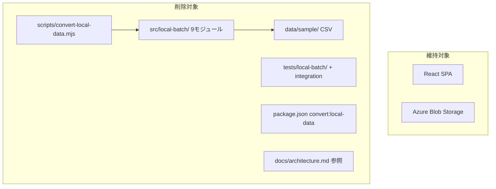

# 設計ドキュメント: remove-convert-local-data

## Overview

**目的**: `convert-local-data.mjs` スクリプトとその依存リソース一式を削除し、リポジトリからローカル変換パイプライン全体を除去する。

**対象ユーザー**: 開発者がリポジトリをクリーンに保ち、不要なコードの保守負荷を排除するために実施する。

**影響**: ローカル変換フロー（`data/sample` → `public/data` のバッチ処理）が完全に利用不可となる。フロントエンド SPA および管理者更新フローには影響しない。

### ゴール
- ローカル変換パイプラインに関するすべてのコード・テスト・データ・ドキュメント参照を削除する
- 削除後のプロジェクト整合性（テスト・lint）を維持する

### ノンゴール
- フロントエンド SPA のリファクタリング
- 管理者更新フローの変更
- 新たな変換機能の追加

## Architecture

### 既存アーキテクチャ分析

現行システムは3つのフローで構成されている:
1. **閲覧系フロー** — 影響なし
2. **管理者更新フロー** — 影響なし
3. **ローカル変換フロー** — **完全削除対象**

ローカル変換フローは以下のコンポーネントで構成されている:
- エントリポイント: `scripts/convert-local-data.mjs`
- ビジネスロジック: `src/local-batch/`（9モジュール）
- テスト: `tests/local-batch/`（9テスト）、`tests/integration/local-conversion-pipeline.test.js`
- サンプルデータ: `data/sample/`（13 CSV）
- npm スクリプト: `package.json` の `convert:local-data`

`local-batch` モジュールは `convert-local-data.mjs` からのみインポートされており、フロントエンドとの依存関係はない。

### Architecture Pattern & Boundary Map

削除操作のため新規アーキテクチャパターンは導入しない。既存の2フロー（閲覧・管理者更新）はそのまま維持される。

### Technology Stack

| レイヤー | 選択 / バージョン | フィーチャーでの役割 | 備考 |
|---------|-----------------|-------------------|------|
| ランタイム | Node.js | 削除対象スクリプトの実行環境 | 削除後は不使用 |
| パッケージ管理 | pnpm 10.27.0 | `package.json` スクリプト削除 | 既存 |
| テスト | Vitest 3.x | 削除後の整合性確認 | 既存 |
| lint | ESLint 8.x | 削除後の整合性確認 | 既存 |

## Requirements Traceability

| 要件 | 概要 | 削除対象 | 検証方法 |
|------|------|---------|---------|
| 1.1 | エントリポイント削除 | `scripts/convert-local-data.mjs` | ファイル不存在確認 |
| 1.2 | npm スクリプト削除後の動作 | `package.json` | `pnpm run` 実行 |
| 2.1 | local-batch ディレクトリ削除 | `src/local-batch/` | ディレクトリ不存在確認 |
| 2.2 | 全9モジュール削除 | 各 .js ファイル | ファイル不存在確認 |
| 3.1 | テストディレクトリ削除 | `tests/local-batch/` | ディレクトリ不存在確認 |
| 3.2 | 統合テスト削除 | `tests/integration/` | ディレクトリ不存在確認 |
| 3.3 | テストスイート正常動作 | — | `pnpm test` 実行 |
| 4.1 | サンプルデータ削除 | `data/sample/` | ディレクトリ不存在確認 |
| 5.1 | npm スクリプトエントリ削除 | `package.json` | JSON 内容確認 |
| 5.2 | pnpm run の動作 | — | `pnpm run` 実行 |
| 6.1-6.3 | ドキュメント参照削除 | `docs/architecture.md` | テキスト検索 |
| 7.1 | テスト全パス | — | `pnpm test` 実行 |
| 7.2 | lint エラーなし | — | `pnpm lint` 実行 |
| 7.3 | import 参照なし | — | Grep 検索 |

## Components and Interfaces

本フィーチャーはコード削除のため、新規コンポーネントやインターフェースの設計は不要。以下に削除操作の対象をコンポーネント単位で整理する。

| コンポーネント | レイヤー | 操作 | 要件カバレッジ |
|--------------|---------|------|-------------|
| convert-local-data.mjs | スクリプト | ファイル削除 | 1.1 |
| src/local-batch/ | ビジネスロジック | ディレクトリ削除 | 2.1, 2.2 |
| tests/local-batch/ | テスト | ディレクトリ削除 | 3.1 |
| tests/integration/ | テスト | ディレクトリ削除 | 3.2 |
| data/sample/ | データ | ディレクトリ削除 | 4.1 |
| package.json | 設定 | スクリプトエントリ削除 | 5.1, 5.2 |
| docs/architecture.md | ドキュメント | 参照行の削除・更新 | 6.1, 6.2, 6.3 |

### ドキュメント更新

#### docs/architecture.md の変更箇所

| セクション | 変更内容 |
|-----------|---------|
| 1. 目的と前提 | 「ローカル変換フロー」の箇条書き項目を削除 |
| 2.1 稼働境界 | 「ローカル変換: Node.js バッチ」行を削除 |
| 3. 全体アーキテクチャ | Mermaid図から `Local` サブグラフと `Repo` サブグラフの `SAMPLE` ノード、関連エッジを削除 |
| 7.3 ローカル変換フロー | セクション全体を削除 |
| 8.3 運用支援スクリプト | `convert-local-data.mjs` の行を削除 |
| 10. テスト構成 | `local-batch` のテスト記述を削除 |
| 12. ディレクトリ要約 | `local-batch/`、`data/sample/`、`convert-local-data.mjs` の行を削除 |

## Testing Strategy

### 削除後の検証テスト
- **テストスイート実行**: `pnpm test` で全テストがパスすること（要件 7.1）
- **lint 実行**: `pnpm lint` でエラーがないこと（要件 7.2）
- **残存参照チェック**: `local-batch` への import/require が残っていないことを Grep で確認（要件 7.3）
- **ファイル不存在確認**: 削除対象のファイル・ディレクトリが存在しないことを確認（要件 1.1, 2.1, 3.1, 3.2, 4.1）
