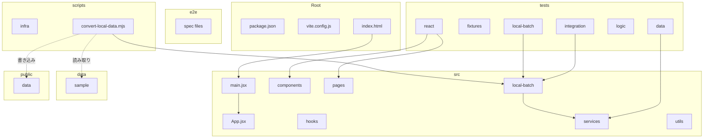
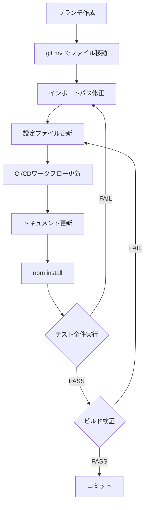
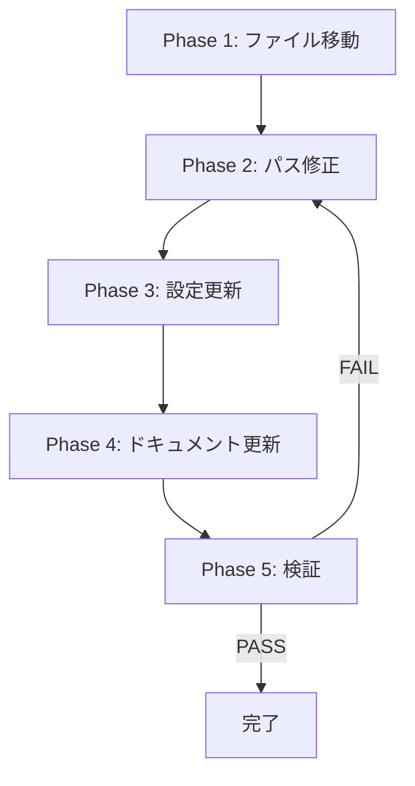

# Design Document — repo-structure-redesign

## Overview

**Purpose**: 単一フロントエンドアプリケーション（React SPA）のみで構成されるリポジトリにおいて、`frontend/dashboard/` の冗長な2階層ネストを排除し、フラットでわかりやすいディレクトリ構造に再設計する。

**Users**: このリポジトリで開発を行う開発者およびAIエージェント。日常的なファイル操作、ビルド、テスト実行、CI/CDが対象。

**Impact**: プロジェクトルートとアプリケーションルートが一致し、パス指定の簡素化と構造の直感的理解を実現する。

### Goals
- `frontend/dashboard/` の2階層ネストを完全に解消する
- `package.json` をルート直下に配置し、プロジェクトルート = アプリケーションルートとする
- テスト、E2E、ローカルバッチ、スクリプトの配置を整理し、各ディレクトリの役割を明確にする
- ビルド・テスト・CI/CDが新構造で正常に動作することを保証する

### Non-Goals
- TypeScript移行（言語変更は本スコープ外）
- monorepoツール（npm workspaces, turborepo等）の導入
- React / Vite / Vitest のバージョンアップ
- アプリケーションのロジック変更や機能追加
- `src/` 内部のディレクトリ構造変更（components, pages, hooks, services, utils は維持）

## Architecture

### Existing Architecture Analysis

現在の構造には以下の問題がある:

- **冗長なネスト**: `frontend/dashboard/` は単一アプリ構成に対して過剰。`backend/` は空で未使用
- **プロジェクトルートの不一致**: `package.json` が `frontend/dashboard/` にあり、CI/CDも `working-directory` で補正している
- **`local-batch/` の位置**: `src/` 外に配置されているが、`src/services/` を直接参照しており事実上アプリケーションコードの一部
- **スクリプト名の衝突**: ルートの `scripts/`（インフラ）と `frontend/dashboard/scripts/`（バッチ実行）が混在

### Architecture Pattern & Boundary Map

**Architecture Integration**:
- **選択パターン**: フラットルート構造 — 単一アプリに最適化された標準的なViteプロジェクト構造
- **ドメイン境界**: `src/`（アプリコード） / `tests/`（テスト） / `e2e/`（E2E） / `scripts/`（ツール） / `data/`（入力データ）
- **既存パターン**: `src/` 内部のサブディレクトリ構造（components, pages, hooks, services, utils）を完全に維持
- **新コンポーネント**: `scripts/infra/` サブディレクトリ（インフラスクリプトの分離）

### Technology Stack

| Layer | Choice / Version | Role in Feature | Notes |
|-------|------------------|-----------------|-------|
| ビルド | Vite 6.4 | ルートからの静的サイトビルド | 設定パスのみ変更 |
| テスト | Vitest 3.0 | `tests/` パターンの更新 | `include` パス修正 |
| E2E | Playwright 1.58 | `e2e/` ディレクトリ参照更新 | `testDir` パス修正 |
| CI/CD | GitHub Actions | `working-directory` 削除 | パスフィルタ更新 |
| CSS | Tailwind 4.1 | `content` パス更新 | `src/` 参照維持 |

## System Flows

### ファイル移動フロー

## Requirements Traceability

| Requirement | Summary | Components | Interfaces | Flows |
|-------------|---------|------------|------------|-------|
| 1.1, 1.2, 1.3, 1.4 | ディレクトリ平坦化 | FileRelocator | — | ファイル移動 |
| 2.1, 2.2, 2.3, 2.4 | テスト配置 | TestRelocator, ConfigUpdater | Vitest設定 | テスト検証 |
| 3.1, 3.2, 3.3 | 不要ディレクトリ削除 | CleanupTask | — | 削除 |
| 4.1, 4.2, 4.3, 4.4 | バッチ・スクリプト再配置 | ScriptRelocator, ImportPathUpdater | npm scripts | バッチ検証 |
| 5.1, 5.2, 5.3 | データディレクトリ | — | — | — |
| 6.1, 6.2, 6.3, 6.4, 6.5, 6.6 | 設定ファイル整合性 | ConfigUpdater, CIUpdater | Vite/Vitest/Playwright/Tailwind/CI | ビルド・テスト検証 |
| 7.1, 7.2, 7.3, 7.4, 7.5, 7.6 | ドキュメント更新 | DocUpdater | — | — |
| 8.1, 8.2, 8.3 | 目標構造 | 全コンポーネント | — | — |

## Components and Interfaces

| Component | Domain/Layer | Intent | Req Coverage | Key Dependencies | Contracts |
|-----------|--------------|--------|--------------|------------------|-----------|
| FileRelocator | 移行 | ファイル移動（git mv） | 1.1-1.4, 3.1-3.3 | Git (P0) | Batch |
| ImportPathUpdater | 移行 | インポートパスの一括修正 | 4.1, 2.1 | — | — |
| ConfigUpdater | 設定 | ビルド・テスト設定の更新 | 6.1-6.6 | Vite (P0), Vitest (P0), Tailwind (P1) | — |
| CIUpdater | CI/CD | GitHub Actionsワークフロー更新 | 6.3 | GitHub Actions (P0) | — |
| ScriptRelocator | 移行 | スクリプトの再配置とパス修正 | 4.1-4.4 | Node.js (P0) | Batch |
| DocUpdater | ドキュメント | パス参照とツリー図の更新 | 7.4-7.6 | — | — |

### 移行レイヤー

#### FileRelocator

| Field | Detail |
|-------|--------|
| Intent | `git mv` を使用してファイル・ディレクトリを新しい位置に移動する |
| Requirements | 1.1, 1.2, 1.3, 1.4, 3.1, 3.2, 3.3, 4.1, 4.2, 4.3 |

**Responsibilities & Constraints**
- `git mv` コマンドでファイル移動を行い、Git履歴のリネーム検出を維持する
- 移動順序に依存関係がある（先に移動先が空であることを確認）
- `node_modules/` と `dist/` は移動対象外（`.gitignore` 対象）

**Dependencies**
- External: Git — ファイル移動 (P0)

**Contracts**: Batch [x]

##### Batch / Job Contract
- Trigger: 手動実行（`git mv` コマンド群）
- Input: 現在のディレクトリ構造
- Output: 新しいディレクトリ構造
- 実行順序:
  1. `frontend/dashboard/src/` → `src/`
  2. `frontend/dashboard/local-batch/` → `src/local-batch/`
  3. `frontend/dashboard/tests/` → `tests/`
  4. `frontend/dashboard/e2e/` → `e2e/`
  5. `frontend/dashboard/public/` → `public/`
  6. `frontend/dashboard/scripts/` → `scripts/`（バッチスクリプト）
  7. `scripts/` の既存インフラスクリプト → `scripts/infra/`
  8. `frontend/dashboard/` のルート設定ファイル群 → ルート直下
  9. `frontend/staticwebapp.config.json` → ルート直下
  10. `backend/` と `frontend/` の削除

**Implementation Notes**
- `git mv` は一度に1ファイル/ディレクトリずつ実行し、エラー時に即座に対処可能にする
- `scripts/` の移動はインフラスクリプトの退避（→ `scripts/infra/`）を先に行い、その後バッチスクリプトを配置

#### ImportPathUpdater

| Field | Detail |
|-------|--------|
| Intent | ファイル移動に伴う相対インポートパスの一括修正 |
| Requirements | 1.4, 2.1, 4.1 |

**Responsibilities & Constraints**
- `tests/` 内のインポートパスを修正（`../../src/` → `../src/`、`../../local-batch/` → `../src/local-batch/`）
- `src/local-batch/` 内のインポートパスを修正（`../src/services/` → `../services/`）
- `scripts/convert-local-data.mjs` のパス解決ロジックを修正

**修正対象ファイルと修正ルール**:

| ファイル群 | 現在のパス | 修正後のパス |
|-----------|-----------|------------|
| `tests/data/*.test.js` | `../../src/services/` | `../src/services/` |
| `tests/logic/*.test.js` | `../../src/services/` | `../src/services/` |
| `tests/react/pages/*.test.jsx` | `../../../src/pages/` | `../../src/pages/` |
| `tests/react/components/*.test.jsx` | `../../../src/components/` | `../../src/components/` |
| `tests/react/hooks/*.test.jsx` | `../../../src/hooks/` | `../../src/hooks/` |
| `tests/react/utils/*.test.js` | `../../../src/utils/` | `../../src/utils/` |
| `tests/local-batch/*.test.js` | `../../local-batch/` | `../src/local-batch/` |
| `tests/integration/*.test.js` | `../../local-batch/` | `../src/local-batch/` |
| `tests/integration/*.test.js` | `../../src/services/` | `../src/services/` |
| `src/local-batch/*.js` | `../src/services/` | `../services/` |
| `scripts/convert-local-data.mjs` | `../local-batch/` | `../src/local-batch/` |
| `scripts/convert-local-data.mjs` | `projectRoot = resolve(__dirname, '..', '..', '..')` | `projectRoot = resolve(__dirname, '..')` |
| `scripts/convert-local-data.mjs` | `dashboardRoot = resolve(__dirname, '..')` | 削除（projectRootと同一になる） |

**Implementation Notes**
- `src/` 内部のファイル間インポート（`../services/`, `../components/` 等）は修正不要（内部構造が変わらないため）

### 設定レイヤー

#### ConfigUpdater

| Field | Detail |
|-------|--------|
| Intent | ビルド・テスト関連の設定ファイルをルート直下で動作するよう更新 |
| Requirements | 6.1, 6.2, 6.4, 6.5, 6.6 |

**修正対象**:

| ファイル | 修正内容 |
|---------|---------|
| `vite.config.js` | パス変更なし（`tests/` 参照は相対的に同じ） |
| `tailwind.config.js` | パス変更なし（`./src/**/*` は同じ） |
| `postcss.config.js` | 変更なし |
| `playwright.config.js` | パス変更なし（`./e2e` は同じ） |
| `index.html` | パス変更なし（`./src/main.jsx` は同じ） |
| `package.json` | `"convert:local-data"` スクリプトのパスは `scripts/convert-local-data.mjs` のまま |

**Implementation Notes**
- 設定ファイル自体はルート直下に移動するだけで、内部のパス参照は相対パスのため修正不要
- `vite.config.js` の `include: ['tests/**/*.test.{js,jsx}']` はそのまま有効

#### CIUpdater

| Field | Detail |
|-------|--------|
| Intent | GitHub Actionsワークフローを新しいディレクトリ構造に対応させる |
| Requirements | 6.3 |

**修正対象**: `.github/workflows/test.yml`

| 項目 | 現在の値 | 修正後 |
|-----|---------|--------|
| `defaults.run.working-directory` | `frontend/dashboard` | 削除（ルート直下で実行） |
| `on.push.paths` | `frontend/dashboard/**` | `src/**`, `tests/**`, `package.json`, `vite.config.js` |
| `on.pull_request.paths` | `frontend/dashboard/**` | `src/**`, `tests/**`, `package.json`, `vite.config.js` |
| `cache-dependency-path` | `frontend/dashboard/package-lock.json` | `package-lock.json` |

### ドキュメントレイヤー

#### DocUpdater

| Field | Detail |
|-------|--------|
| Intent | ドキュメント内のパス参照とディレクトリツリー図を新構造に更新 |
| Requirements | 7.4, 7.5, 7.6 |

**修正対象**:

| ファイル | 修正内容 |
|---------|---------|
| `README.md` | セットアップ手順の `cd frontend/dashboard` を削除、ディレクトリ構造図を更新 |
| `CLAUDE.md` | `frontend/dashboard/` への参照をルート直下パスに更新 |
| `AGENTS.md` | 必要に応じてパス参照を更新 |
| `docs/architecture.md` | ディレクトリ構造図と説明を新構造に全面更新 |

## Data Models

本機能はデータモデルの変更を伴わない。`public/data/` 内のJSONスキーマ、`data/sample/` 内のCSVフォーマットは変更なし。

## Error Handling

### Error Strategy
ファイル移動・パス修正はすべてGit管理下で行うため、問題発生時は `git restore` で即座に復元可能。

### Error Categories and Responses
- **`git mv` 失敗**: 移動先ディレクトリの存在確認を先に行い、競合を防止
- **インポートパス修正漏れ**: テスト全件実行で検出。`Module not found` エラーとして発現
- **ビルド失敗**: Vite設定のパス参照エラー。`npm run build` で検証

## Testing Strategy

### 検証テスト
1. **`npm run test`**: 全ユニットテスト・統合テストがパスすること
2. **`npm run build`**: Viteビルドがエラーなく完了すること
3. **`npm run convert:local-data`**: ローカル変換バッチが正常動作すること
4. **インポート解決検証**: テスト実行で `Module not found` エラーが発生しないこと

### E2Eテスト
- `npm run test:e2e` はローカル開発サーバー依存のため、新構造での `npm run dev` 起動を確認した上で実行

## Migration Strategy

**Phase 1: ファイル移動**（要件 1, 3, 4, 5）
- `git mv` でファイルを新しい位置に移動
- `backend/` の削除

**Phase 2: インポートパス修正**（要件 1, 4）
- テストファイルの相対パス修正
- `local-batch/` のインポートパス修正
- `scripts/convert-local-data.mjs` のパス解決修正

**Phase 3: 設定・CI更新**（要件 6）
- GitHub Actionsワークフロー更新
- `node_modules` 再インストール

**Phase 4: ドキュメント更新**（要件 7）
- README, CLAUDE.md, architecture.md の更新

**Phase 5: 検証**（要件 6, 8）
- テスト全件実行、ビルド検証、バッチ動作確認

### ロールバック
- 全変更がGit管理下のため、`git checkout main -- .` で即座に復元可能
- 段階的にコミットすることで、問題のあるフェーズを特定可能
