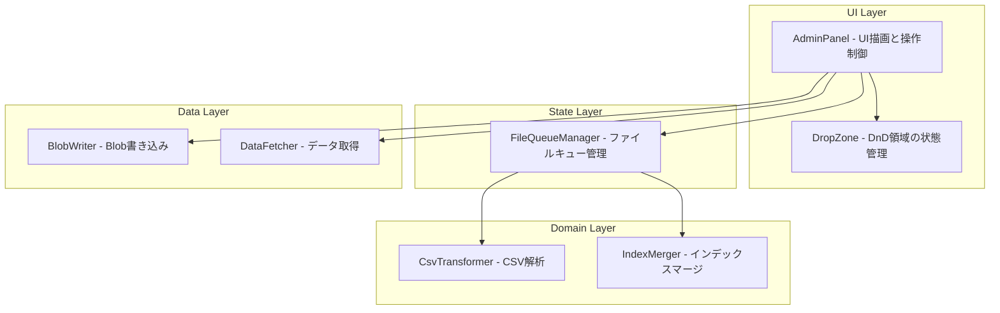
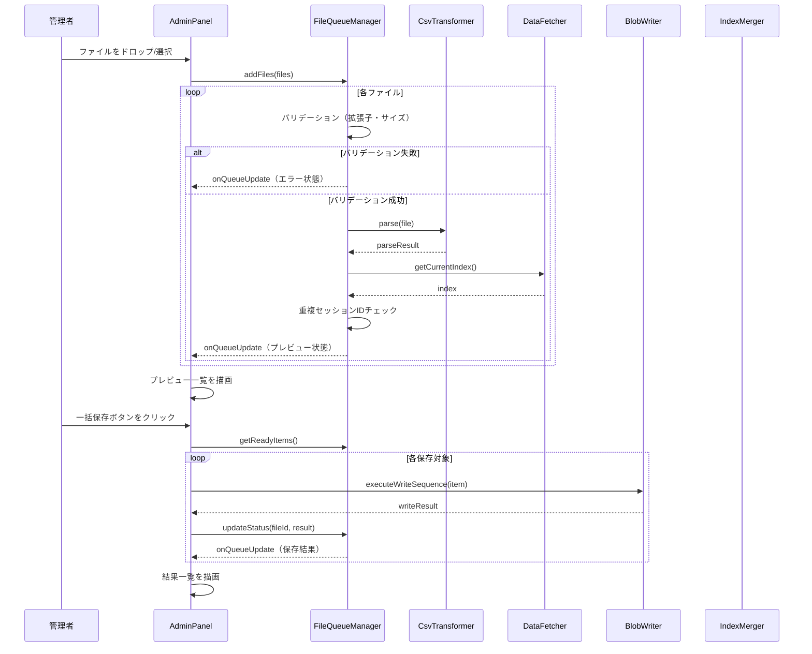
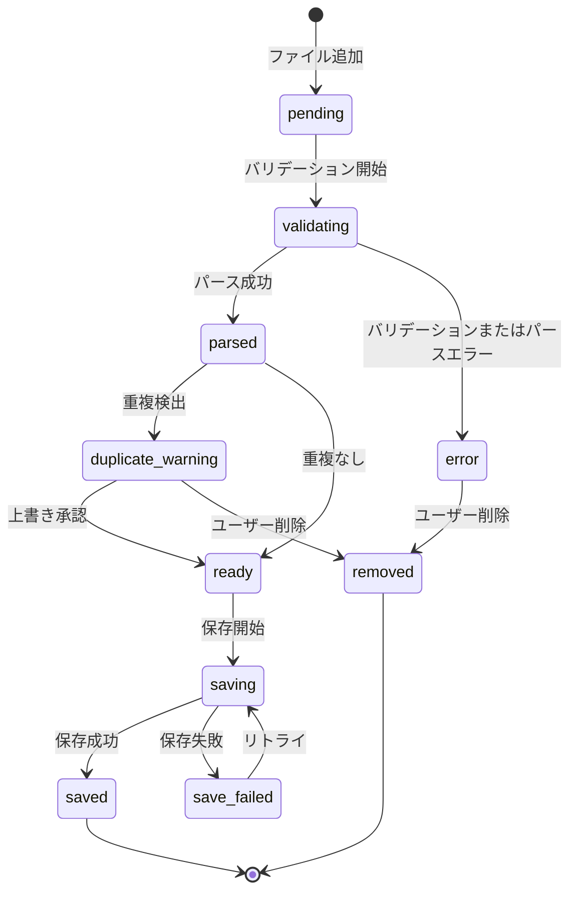

# 技術設計ドキュメント — upload-ui

## Overview

**目的**: 学習ダッシュボードの管理者パネルにおけるCSVアップロード機能を、単一ファイル処理から複数ファイル一括処理に拡張し、プレビュー・バリデーション・進捗表示・UIの操作性を改善する。

**利用者**: 管理者が勉強会の出席レポートCSVを複数件まとめて投入するワークフローで利用する。

**影響**: 既存のAdminPanel（単一ファイル処理）をリファクタリングし、FileQueueManager（新規）による複数ファイル状態管理を導入する。BlobWriter・IndexMerger・CsvTransformerのインターフェースは変更しない。

### ゴール
- 複数CSVファイルの一括アップロード・プレビュー・保存を実現する
- バリデーションエラーと進捗状態を明確にフィードバックする
- ドラッグ&ドロップUIの操作性を向上させる

### 非ゴール
- BlobWriter・IndexMerger・CsvTransformerのインターフェース変更
- リアルタイムの外部通知（WebSocket等）
- モバイル専用UIの最適化
- ファイルアップロードのバックグラウンド処理（Service Worker等）

## Architecture

### 既存アーキテクチャ分析

現在のAdminPanelは以下のパターンで動作する:

- **単一ファイル状態管理**: `#currentFile`, `#currentParseResult` の2フィールド
- **同期的なUI遷移**: アップロード → パース → プレビュー → 保存 → 結果表示
- **依存関係**: CsvTransformer（パース）、BlobWriter（保存）、IndexMerger（マージ）を直接利用
- **レンダリング**: innerHTML直接書き換えによるDOM操作

拡張にあたり維持すべきパターン:
- Vanilla JS + ES Modulesによるクラスベース設計
- コンストラクタによる依存注入
- innerHTML + addEventListenerによるUI構築

### Architecture Pattern & Boundary Map



**アーキテクチャ統合**:
- **選択パターン**: 既存のクラスベースレイヤード構成を踏襲し、状態管理レイヤーを追加
- **境界分離**: UI描画（AdminPanel）と状態管理（FileQueueManager）を明確に分離
- **既存パターンの維持**: コンストラクタ注入、innerHTML描画、イベントリスナー方式
- **新規コンポーネントの理由**: FileQueueManagerは複数ファイルの状態遷移を一元管理するため必須

### Technology Stack

| レイヤー | 技術/バージョン | フィーチャーでの役割 | 備考 |
|---------|---------------|-------------------|------|
| フロントエンド | Vanilla JS (ES Modules) | UI描画、イベント処理 | 既存と同一 |
| CSS | CSS3 + @keyframes | アニメーション、状態表示 | 新規アニメーション追加 |
| CSV解析 | PapaParse (既存) | TSV/CSVパース | 変更なし |
| ストレージ | Azure Blob Storage | データ永続化 | 変更なし |
| テスト | Vitest 3.x + jsdom | 単体テスト、統合テスト | 既存と同一 |

## System Flows

### 複数ファイルアップロード→保存フロー



### 状態遷移



## Requirements Traceability

| 要件 | サマリー | コンポーネント | インターフェース | フロー |
|------|---------|--------------|----------------|-------|
| 1.1 | 複数ファイルDnD | AdminPanel, FileQueueManager | addFiles, onQueueUpdate | アップロードフロー |
| 1.2 | 複数ファイル選択 | AdminPanel | file input multiple属性 | アップロードフロー |
| 1.3 | キュー一覧表示 | AdminPanel, FileQueueManager | getQueue, onQueueUpdate | - |
| 1.4 | 個別ファイル削除 | AdminPanel, FileQueueManager | removeFile | - |
| 2.1 | サマリーカード表示 | AdminPanel | renderPreviewList | プレビュー描画 |
| 2.2 | 詳細テーブル展開 | AdminPanel | toggleDetail | - |
| 2.3 | 重複セッション警告 | FileQueueManager, AdminPanel | duplicateSessionIds | アップロードフロー |
| 2.4 | ファイル別プレビュー | AdminPanel | renderPreviewList | プレビュー描画 |
| 3.1 | CSV拡張子チェック | FileQueueManager | validateFile | アップロードフロー |
| 3.2 | パースエラー詳細 | FileQueueManager, AdminPanel | onQueueUpdate (error) | アップロードフロー |
| 3.3 | ファイルサイズ制限 | FileQueueManager | validateFile | アップロードフロー |
| 3.4 | エラー/成功スタイル | AdminPanel (CSS) | - | - |
| 4.1 | プログレスバー | AdminPanel | renderProgressBar | 保存フロー |
| 4.2 | 保存中ステータス | AdminPanel, FileQueueManager | onQueueUpdate (saving) | 保存フロー |
| 4.3 | 個別完了ステータス | AdminPanel, FileQueueManager | updateStatus | 保存フロー |
| 4.4 | 失敗リトライ | AdminPanel, FileQueueManager | getFailedItems, retryFailed | 保存フロー |
| 5.1 | ドラッグハイライト | AdminPanel (CSS) | - | - |
| 5.2 | ドロップアニメーション | AdminPanel (CSS) | - | - |
| 5.3 | アイコンとガイド | AdminPanel | renderDropZone | - |
| 5.4 | ドロップゾーン縮小 | AdminPanel (CSS/JS) | onQueueUpdate | - |

## Components and Interfaces

| コンポーネント | ドメイン/レイヤー | 責務 | 要件カバレッジ | 主要依存 | コントラクト |
|--------------|----------------|------|-------------|---------|------------|
| FileQueueManager | State | ファイルキュー状態管理 | 1.1-1.4, 2.3, 3.1-3.3, 4.2-4.4 | CsvTransformer (P0) | Service, State |
| AdminPanel (拡張) | UI | UI描画、イベント処理 | 1.1-1.4, 2.1-2.4, 3.4, 4.1-4.4, 5.1-5.4 | FileQueueManager (P0), BlobWriter (P0) | State |

### State Layer

#### FileQueueManager

| フィールド | 詳細 |
|-----------|------|
| 責務 | 複数ファイルのキュー管理、バリデーション、パース実行、状態遷移 |
| 要件 | 1.1, 1.2, 1.3, 1.4, 2.3, 3.1, 3.2, 3.3, 4.2, 4.3, 4.4 |

**責務と制約**
- ファイルの追加・削除・状態更新を一元管理する
- バリデーション（拡張子、サイズ）とCsvTransformerによるパースを実行する
- 重複セッションIDの検出を行う（既存indexとの照合）
- 状態変更時にコールバックで通知する

**依存関係**
- Inbound: AdminPanel — ファイル追加・削除・保存指示 (P0)
- Outbound: CsvTransformer — CSVパース (P0)
- Outbound: なし（IndexMergerの重複チェックはsessionIdの文字列比較で代替）

**コントラクト**: Service [x] / State [x]

##### Service Interface

```javascript
/**
 * @typedef {'pending'|'validating'|'parsed'|'duplicate_warning'|'ready'|'saving'|'saved'|'save_failed'|'error'|'removed'} FileStatus
 *
 * @typedef {object} QueueItem
 * @property {string} id - 一意識別子（crypto.randomUUID()）
 * @property {File} file - 元ファイルオブジェクト
 * @property {FileStatus} status - 現在の状態
 * @property {object|null} parseResult - CsvTransformer.parse()の結果
 * @property {string[]} errors - バリデーション/パースエラー
 * @property {string[]} warnings - 警告メッセージ
 * @property {boolean} hasDuplicate - 重複セッション検出フラグ
 */

class FileQueueManager {
  /**
   * @param {object} csvTransformer - CsvTransformerインスタンス
   * @param {function} onQueueUpdate - キュー変更時コールバック (queue: QueueItem[]) => void
   */
  constructor(csvTransformer, onQueueUpdate) {}

  /**
   * ファイルをキューに追加し、バリデーション→パースを実行する
   * @param {FileList|File[]} files - 追加するファイル群
   * @returns {Promise<void>}
   */
  async addFiles(files) {}

  /**
   * キューからファイルを削除する
   * @param {string} fileId - 削除対象のQueueItem.id
   */
  removeFile(fileId) {}

  /**
   * 重複警告を承認し、readyに遷移させる
   * @param {string} fileId - 対象のQueueItem.id
   */
  approveDuplicate(fileId) {}

  /**
   * 保存可能（ready状態）なアイテムを返す
   * @returns {QueueItem[]}
   */
  getReadyItems() {}

  /**
   * 保存失敗アイテムを返す
   * @returns {QueueItem[]}
   */
  getFailedItems() {}

  /**
   * アイテムの状態を更新する
   * @param {string} fileId - 対象のQueueItem.id
   * @param {FileStatus} status - 新しい状態
   * @param {object} [extra] - 追加情報（errors, warnings等）
   */
  updateStatus(fileId, status, extra) {}

  /**
   * 重複チェック用の既存セッションID一覧を設定する
   * @param {Set<string>} sessionIds - 既存のセッションIDセット
   */
  setExistingSessionIds(sessionIds) {}

  /**
   * 現在のキューを返す
   * @returns {QueueItem[]}
   */
  getQueue() {}
}
```

- 前提条件: `csvTransformer`が有効なインスタンスであること
- 事後条件: `addFiles`完了後、全ファイルがparsedまたはerror状態に遷移していること
- 不変条件: キュー内のidは一意であること

##### State Management

- **状態モデル**: `QueueItem[]`配列。各アイテムはFileStatus列挙型で状態を管理
- **永続化**: なし（ブラウザセッション内のみ）
- **同期戦略**: シングルスレッド（ブラウザJS）のため排他制御不要。パースはawaitで逐次実行

**実装メモ**
- バリデーションロジック: 拡張子チェック（`.csv`のみ）、サイズチェック（10MB上限）を`addFiles`内で実行
- 重複チェック: `setExistingSessionIds`で渡されたSetとparse結果のsessionIdを比較
- `onQueueUpdate`はキュー全体を渡す（差分通知ではない）。キューサイズが小規模（1-10件）のため、全量渡しで十分

### UI Layer

#### AdminPanel（拡張）

| フィールド | 詳細 |
|-----------|------|
| 責務 | UI描画、ユーザー操作のイベントハンドリング、保存フローの実行 |
| 要件 | 1.1-1.4, 2.1-2.4, 3.4, 4.1-4.4, 5.1-5.4 |

**責務と制約**
- FileQueueManagerのコールバックに応じてUI（キュー一覧、プレビュー、プログレス）を再描画する
- ドラッグ&ドロップイベントを処理し、FileQueueManagerにファイルを渡す
- 保存処理の逐次実行とBlobWriterの呼び出しを制御する
- 保存ロジック自体はAdminPanelが保持（BlobWriter呼び出しのオーケストレーション）

**依存関係**
- Inbound: main.js — 初期化とDOMコンテナ提供 (P0)
- Outbound: FileQueueManager — ファイル状態管理 (P0)
- Outbound: BlobWriter — データ保存 (P0)
- Outbound: IndexMerger — インデックスマージ (P0)
- Outbound: DataFetcher — 既存インデックス取得 (P1)

**コントラクト**: State [x]

##### State Management

- **状態モデル**: FileQueueManagerの`onQueueUpdate`コールバックで受け取るキュー状態を元に描画
- **UIの状態**:
  - `idle`: 初期状態、ドロップゾーン表示
  - `has_files`: キューにファイルあり、プレビュー一覧表示
  - `saving`: 保存処理中、プログレスバー表示
  - `completed`: 全保存完了、結果一覧表示

**実装メモ**
- コンストラクタに `dataFetcher` パラメータを追加（既存index取得用）
- `initialize()` 内でDataFetcherから既存indexを取得し、FileQueueManagerに`setExistingSessionIds`で渡す
- プレビューのサマリーカードはクリックで詳細テーブルをtoggle（CSS `display` 切替）
- プログレスバーはHTML `<progress>` 要素を使用（`value`/`max`属性で制御）
- 保存中はボタンに`disabled`属性を付与

## Data Models

### Domain Model

既存のドメインモデル（SessionRecord, MergeInput, DashboardIndex）に変更なし。

新規追加:

```javascript
/**
 * @typedef {object} QueueItem
 * @property {string} id - crypto.randomUUID()で生成
 * @property {File} file - ブラウザFileオブジェクト
 * @property {FileStatus} status - 状態列挙
 * @property {object|null} parseResult - {ok, sessionRecord, mergeInput, warnings} | {ok: false, errors}
 * @property {string[]} errors - エラーメッセージ配列
 * @property {string[]} warnings - 警告メッセージ配列
 * @property {boolean} hasDuplicate - 重複フラグ
 */
```

QueueItemはブラウザセッション内のみで使用される一時的なデータ構造であり、永続化されない。

### バリデーションルール

| ルール | 条件 | エラーメッセージ |
|-------|------|----------------|
| 拡張子チェック | ファイル名が`.csv`で終わらない | 「CSVファイルのみ対応しています」 |
| サイズチェック | ファイルサイズ > 10MB (10 * 1024 * 1024 bytes) | 「ファイルサイズが10MBを超えています」 |
| パースチェック | CsvTransformer.parse()がok:falseを返す | parse結果のerrorsをそのまま表示 |

## Error Handling

### エラー戦略

フェーズごとにエラーを分離し、1ファイルのエラーが他ファイルの処理をブロックしない設計とする。

### エラーカテゴリと対応

**ユーザーエラー（バリデーション）**:
- ファイル種別不正 → キューにerror状態で追加、エラーメッセージ表示、削除ボタン提供
- ファイルサイズ超過 → 同上
- 重複セッション → duplicate_warning状態、上書き確認UI表示

**パースエラー**:
- CSV構造不正 → error状態、エラー詳細（CsvTransformerからの情報）を表示
- 他ファイルの処理は継続する

**保存エラー**:
- BlobWriter失敗 → save_failed状態、失敗したファイルのみリトライ可能
- ネットワークエラー → 同上

### モニタリング
- コンソールログ（console.warn/error）でエラー詳細を出力
- UIには利用者向けメッセージのみ表示

## Testing Strategy

### 単体テスト
1. **FileQueueManager**: addFiles（複数ファイル追加）、removeFile、状態遷移、バリデーション（拡張子・サイズ）、重複チェック
2. **AdminPanel描画**: キュー状態に応じたUI描画（プレビュー、プログレスバー、エラー表示）
3. **バリデーションロジック**: 境界値テスト（10MBちょうど、拡張子大文字小文字）

### 統合テスト
1. **アップロード→プレビュー→保存フロー**: 複数ファイルをキューに追加し、プレビュー確認後に保存実行
2. **エラーハンドリングフロー**: 不正ファイル混在時に正常ファイルのみ処理継続
3. **リトライフロー**: 保存失敗後のリトライボタン動作確認

### E2E/UIテスト
1. **ドラッグ&ドロップ**: ファイルのドロップ→キュー表示→プレビュー→保存の全フロー
2. **プログレスバー**: 保存中の進捗表示と完了後のステータス更新
3. **アニメーション**: ドロップ時のフェードインアニメーション確認
