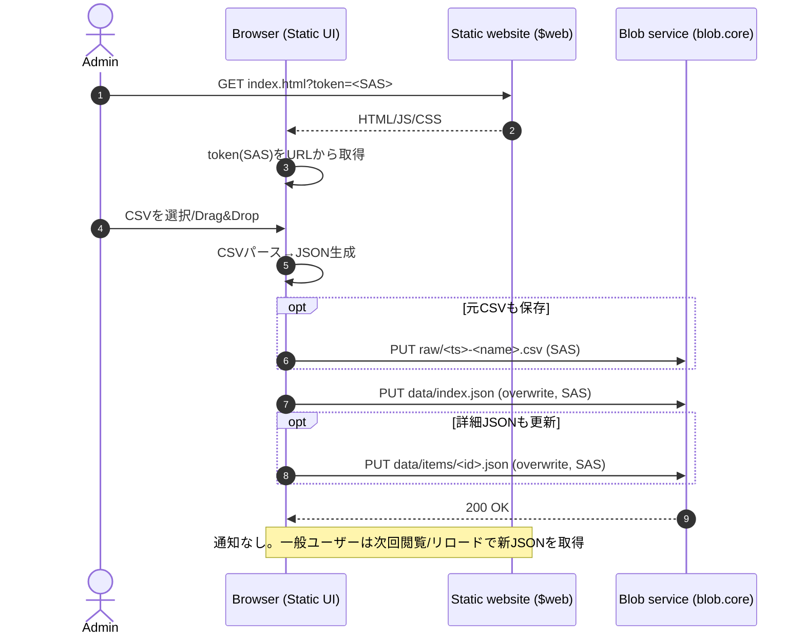

# Blob AccountによるStatic Web Site構築

## 背景

* ダッシュボード／ドリルダウン閲覧を提供する静的サイトを運用したい。
* 利用頻度が低く、常時稼働のDBやバックエンドを置くのはコスト・運用負荷に見合わない。
* 閲覧時UXを損ねたくない（バックエンド待ちやコールドスタートを避けたい）。
* 更新情報はCSVで与えられ、手作業の登録（Issue等）は避けたい。
* Azure Functions は配置ポリシー上 App Service プランのみで安価に使いづらい。
* 環境は専用線により閉域接続が成立しており、イントラ内からのみ利用する前提が取れる。
* 取り扱うデータは機密性が高くなく、SASのURL漏洩は重大問題としない（ただし過度な複雑化は避けたい）。

## 目的

1. **閲覧の安定UX**：静的配信のみで完結し、低頻度アクセスでも高速
2. **最小コスト／最小運用**：DB/常時稼働APIを持たない
3. **更新の省力化**：CSV投入→クライアント側で変換→JSON更新で反映
4. **シンプルな権限制御**：一般ユーザーは読み取りのみ、管理者は書き込み可能（SASで簡易分離）

## アーキテクチャ概要

* ホスティング：**Azure Blob Storage Static website（$web）**

  * 静的サイト本体（HTML/JS/CSS）
  * 描画用JSON（サイトからfetchしてレンダリング）
* 更新処理：**ブラウザJavaScriptのみ**

  * 管理者はSAS付きURLでアクセスし、SASを用いてBlobへPUT（上書き/追加）
  * 一般ユーザーはSASなしで読み取りのみ
* アクセス制御：**閉域（専用線）＋Storageネットワーク規則**を基本境界とする

## コンポーネントと責務

### 1) Azure Blob Storage（Static website）

* `$web/` に以下を格納

  * `index.html` / JS / CSS（UI）
  * `data/index.json`（一覧・集約）
  * `data/items/<id>.json`（詳細：任意）
  * `raw/<timestamp>-<name>.csv`（元データ保管：任意）
* 一般ユーザーは `web.core.windows.net` の静的サイトエンドポイントから **匿名read** で取得

### 2) ブラウザ（一般ユーザー）

* `data/index.json` 等を取得して画面をレンダリング
* 更新機能は利用しない（UIを非表示にしてもよい）

### 3) ブラウザ（管理者）

* 管理者向けに配布したURL：

  * `https://<site>/index.html?token=<SAS>`
* `token`（SAS）を用いて **Blobサービスエンドポイント（blob.core...）** に対し、

  * `raw/*.csv` のアップロード
  * `data/*.json` の上書き更新
    を行う

## データ設計

### 配信用（閲覧用）

* `data/index.json`：ダッシュボードの一覧・集約（推奨：1ファイルに寄せる）
* `data/items/<id>.json`：ドリルダウン詳細（必要な場合のみ）

### 保管用（復元・監査用）

* `raw/<timestamp>-<name>.csv`：投入された元CSVをそのまま保存（任意）

  * 失敗時の復元がしやすい
  * データの正当性確認や差分比較の材料になる

## 処理フロー

### 閲覧フロー

1. ユーザーが `index.html` を開く
2. JavaScriptが `data/index.json`（必要なら `data/items/...`）を取得
3. 取得したJSONを集計してレンダリング

### 更新フロー（管理者のみ）

1. 管理者が `index.html?token=<SAS>` でサイトを開く（ブックマーク運用）
2. CSVをファイル選択/Drag&Dropで受け取る
3. CSVをブラウザでパースし、配信用JSONに変換
4. （任意）元CSVを `raw/` に保存
5. 生成したJSONを `data/` に上書き保存
6. 一般ユーザーは次回アクセス/手動リロードで新JSONを取得して反映

## 更新時シーケンス（Mermaid）

## セキュリティ（割り切りを含む）

* 一般ユーザーにはSASを配布しない（閲覧は匿名read）
* 管理者のみSASを配布し、更新はSASの権限で実施
* SAS漏洩は重大問題としない前提だが、影響を局所化するために以下を推奨

  * SASの権限は必要最小限（例：`raw/` と `data/` のみ）
  * 期限を設ける／Stored access policyで失効しやすくする（可能なら）
  * URLに残ったtokenは、読み取ったら `history.replaceState` で除去するなど“拡散防止”は任意で実施
* アカウント/コンテナの到達性は閉域（専用線）とStorageネットワーク規則で制御

## 非機能（性能・可用性）

* 閲覧：静的配信のみで高速・安定（バックエンド依存なし）
* 更新：ブラウザ処理のため、CSVサイズが増えると端末性能に依存
* 反映：JSON上書き後、次回アクセスまたはリロードで反映（即時通知はしない）

## 運用

* 管理者URL（SAS付き）の配布・更新（期限切れ時の再配布）
* JSON破損時の復旧：`raw/` のCSVから再生成（あるいは前世代JSONを復元）
* キャッシュ対策：

  * `data/index.json?v=<timestamp>` のようなキャッシュバスター
  * もしくは `index.json` を上書きせず `index.<version>.json` にして参照を更新

## トレードオフ

* サーバ側の検証・監査が弱く、データ品質はクライアント実装と運用に依存
* 同時更新が起きると上書き競合する可能性（運用ルールで回避するか、追記方式に変更）
* URLにSASを入れる方式は漏洩に弱い（ただし本方式は許容前提）
