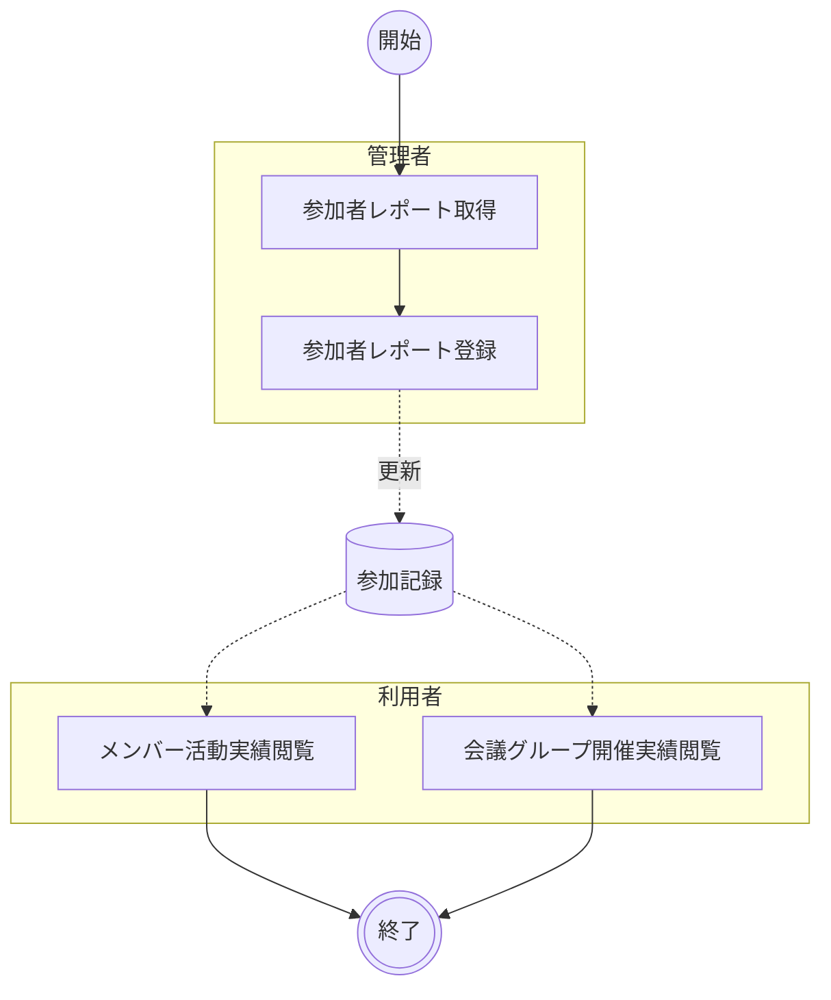

# 参加状況管理

Microsoft Teams の参加者レポートを取り込み、会議グループ（勉強会・ミーティング）の開催実績とメンバーの参加記録を管理・可視化する。管理者が参加者レポートを投入すると、システムがレポートを解析して会議グループ・会議・メンバーの情報を生成し、ダッシュボードで利用者が実績を確認できるようにする。

## ユースケース

### 正常系の事前条件

- Teamsに新しい参加者レポートが存在する
- 管理者が管理機能ににアクセスできる

### アクティビティ図

!!! info
    A01「参加者レポート取得」は Teams Board 外の作業であり、Microsoft Teams で行われる。管理者による登録（A02）の後、利用者は実績確認（A03・A04）を行う。

### 正常系の事後条件

- 参加者レポートから生成された会議情報が保存されている

### ユースケース一覧

| # | アクター | ユースケース | 説明 |
|--|--|--|--|
| A01 | 管理者 | 参加者レポート取得 | Microsoft Teams から対象会議の参加者レポートを取得する（Teams Board 外の作業） |
| A02 | 管理者 | 参加者レポート登録 | 管理者パネルで参加者レポートを投入し、解析結果を確認して一括保存する |
| A03 | 利用者 | メンバー活動実績閲覧 | メンバー詳細画面で会議グループ別の参加履歴と参加時間を確認する |
| A04 | 利用者 | 会議グループ開催実績閲覧 | 会議グループ詳細画面で会議別の参加者と開催実績を確認する |

## シナリオ一覧

| # | シナリオ | 概要 |
|--|--|--|
| 1 | [参加者レポートの取込とメンバー活動実績の確認](シナリオ/01.参加者レポートの取込とメンバー活動実績の確認.md) | 管理者が参加者レポートを取り込み、利用者がメンバーの活動実績を確認する |
| 2 | [参加者レポートの取込と会議グループ開催実績の確認](シナリオ/02.参加者レポートの取込と会議グループ開催実績の確認.md) | 管理者が参加者レポートを取り込み、利用者が会議グループの開催実績を確認する |
