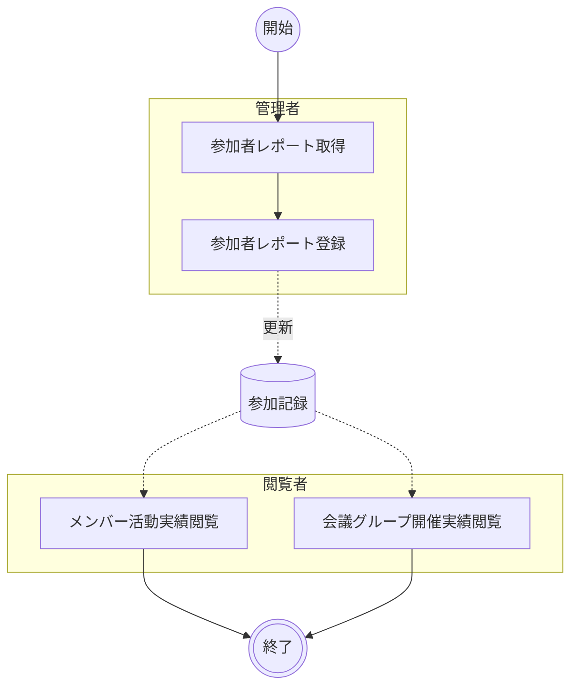

# 参加状況管理

Microsoft Teams の参加者レポートを取り込み、会議グループ（勉強会・ミーティング）の開催実績とメンバーの参加記録を管理・可視化する。管理者が参加者レポートを投入すると、システムがレポートを解析して会議グループ・会議・メンバーの情報を生成し、ダッシュボードで閲覧者が実績を確認できるようにする。

## ユースケース

### 正常系の事前条件

- Teamsに新しい参加者レポートが存在する
- 管理者が SAS トークン付き URL でシステムにアクセスできる

### アクティビティ図

!!! info
    A01「参加者レポート取得」は Teams Board 外の作業であり、Microsoft Teams 管理センターで行われる。管理者による登録（A02）と閲覧者による実績確認（A03・A04）はデータストア（参加記録）を介して非同期に連携される。

### 正常系の事後条件

- 参加者レポートから生成された会議情報が保存されている

### ユースケース一覧

| # | アクター | ユースケース | 説明 |
|--|--|--|--|
| A01 | 管理者 | 参加者レポート取得 | Microsoft Teams 管理センターから対象会議の参加者レポートをダウンロードする（Teams Board 外の作業） |
| A02 | 管理者 | 参加者レポート登録 | 管理者パネルで参加者レポートを投入し、解析結果を確認して一括保存する |
| A03 | 閲覧者 | メンバー活動実績閲覧 | メンバー詳細画面で会議グループ別の参加履歴と学習時間を確認する |
| A04 | 閲覧者 | 会議グループ開催実績閲覧 | 会議グループ詳細画面で会議別の参加者と開催実績を確認する |

### オブジェクト一覧

| # | オブジェクト名 | 説明 |
|--|--|--|
| 1 | 参加者レポート | Microsoft Teams が出力する参加者情報ファイル |
| 2 | 会議グループ | 勉強会・ミーティングの活動単位。会議タイトルから自動生成される |
| 3 | 会議 | 会議グループの1回の開催記録。開催日と参加者一覧を含む |
| 4 | メンバー | 参加者。メールアドレスで一意に識別される |
| 5 | 参加 | 会議へのメンバーの参加時間を記録する |
| 6 | インデックス | 会議グループ・メンバーの集約情報。総参加時間・会議一覧を含む |

### 制約

- 参加者レポートは Microsoft Teams が出力するファイルであること
- メンバーはメールアドレスで一意に識別される。同一メールアドレスは常に同一メンバーとして扱われる
- 会議グループは会議タイトルで一意に識別される。同一タイトルは同一会議グループとして扱われる
- 同一会議グループの同一開催日の会議がすでに存在する場合、管理者の承認なしには取り込まれない
- 参加者レポート登録では保存直前に最新 `data/index.json` を取得して更新する。サーバー側の条件付き更新は行わないため、同時更新時は最終書き込みが優先される

## シナリオ一覧

| # | シナリオ | 概要 |
|--|--|--|
| 1 | [参加者レポートの取込とメンバー活動実績の確認](シナリオ/01.参加者レポートの取込とメンバー活動実績の確認.md) | 管理者が参加者レポートを取り込み、閲覧者がメンバーの活動実績を確認する |
| 2 | [参加者レポートの取込と会議グループ開催実績の確認](シナリオ/02.参加者レポートの取込とグループ開催実績の確認.md) | 管理者が参加者レポートを取り込み、閲覧者が会議グループの開催実績を確認する |

## 詳細

### 業務設定要件

| # | 項目 | 内容 | 備考 |
|--|--|--|--|
| 1 | 参加者レポート取得元 | Microsoft Teams 管理センター | A01 で使用 |
| 2 | データ保存先 | Azure Blob Storage `$web` コンテナー配下（`data/index.json`, `data/sessions/*.json`, `data/sources/*.csv`） | A02 で更新 |
| 3 | 認証方式 | SAS トークン | 管理者更新時のみ必要 |

### ジョブスケジュール

| # | 項目 | 内容 | 対応 |
|--|--|--|--|
| 1 | 実行可能時間帯 | 制限なし（管理者の手動操作時に随時実行） | - |
| 2 | スケジュールされた時間帯を超えた場合の挙動 | スケジュール実行はなく、都度実行のため対象外 | - |
| 3 | ファイル連携予定時刻 | 固定時刻なし。会議終了後に管理者が任意タイミングで実施 | - |

### アーカイブ

| # | 機能 | 期間[日] | 方式 | 説明 |
|--|--|--|--|--|
| 1 | 参加者レポート登録（A02） | 無期限 | コピー | 取り込み時に `data/sources/*.csv` へ原本を保存し、監査・再確認に利用する |
| 2 | 参加記録参照（A03/A04） | 無期限 | コピー | `data/index.json` と `data/sessions/*.json` は最新状態の表示に利用するため保持する |

