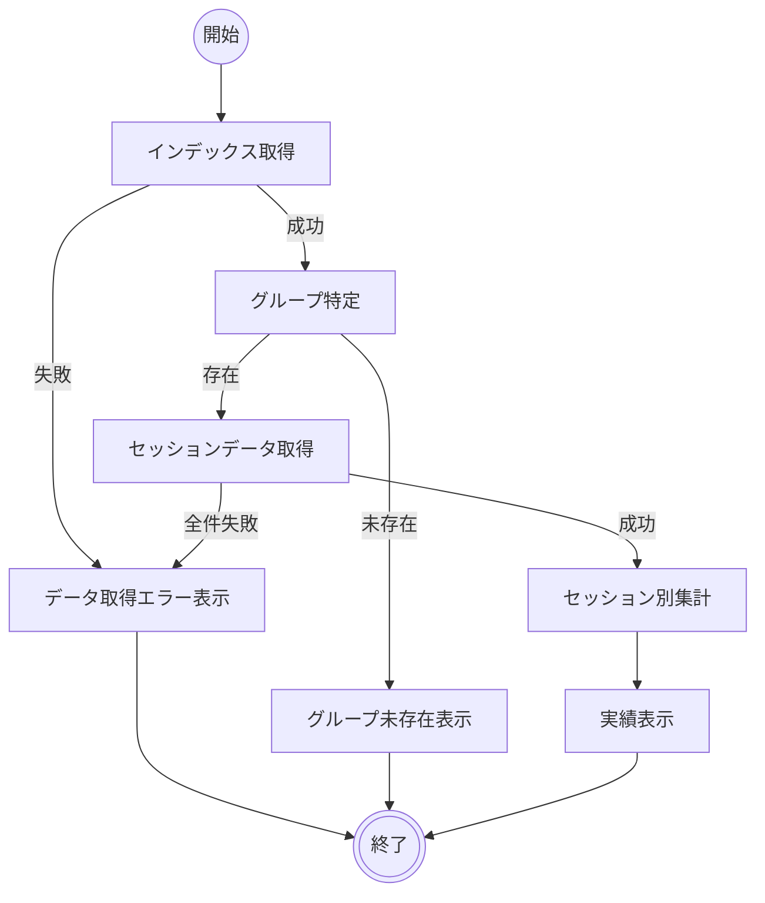

# グループ開催実績閲覧

## 機能タイプ

画面

## 概要

特定のグループについて、セッション別の参加者と開催実績を表示する機能。ダッシュボードのグループ一覧から遷移して利用する。

業務定義のアクティビティ A04「グループ開催実績閲覧」に対応する。

### 画面一覧

| # | 画面名 | 説明 |
|---|--------|------|
| 1 | ダッシュボード | [メンバー活動実績閲覧](メンバー活動実績閲覧.md)を参照 |
| 2 | グループ詳細 | セッション別の参加者と開催実績を表示する画面 |

## アクティビティ

### 正常系の事前条件

- ネットワーク接続が確立されている
- 確認対象のグループがインデックスに存在する（過去に1回以上のセッションを開催している）

### 正常系の事後条件

- グループの名前・セッション数・累計学習時間が表示されている
- セッション別の参加者一覧（各参加者の名前と参加時間）が表示されている

## シナリオ一覧

| No. | シナリオ | 概要 |
|-----|---------|------|
| 1 | 正常表示 | グループの開催実績が正常に表示される |
| 2 | 複数セッション開催 | 複数セッションを開催したグループの実績が表示される |
| 3 | グループ未存在 | 指定されたグループIDがインデックスに存在しない |
| 4 | データ取得失敗 | ネットワーク障害等によりデータ取得に失敗する |

## 制約

- セッションが1件のみの場合、参加者一覧がデフォルトで展開表示される
- セッションは開催日の降順で表示される
- 各セッション内の参加者は名前の日本語ロケール順で表示される
- 参加時間は「X時間Y分」形式で表示される
- セッションデータの取得に一部失敗した場合でも、取得に成功したセッションの情報は表示される
