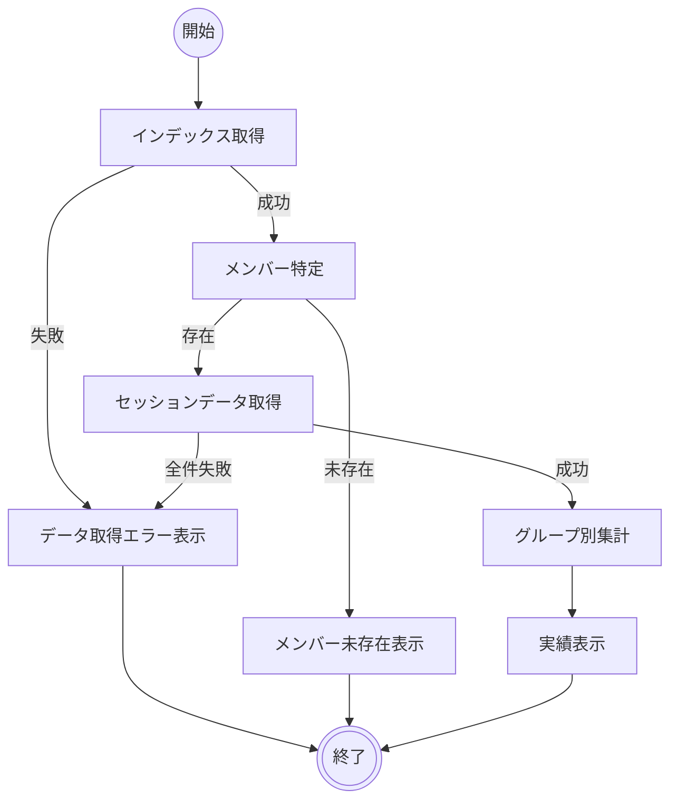

# メンバー活動実績閲覧

## 機能タイプ

画面

## 概要

特定のメンバーについて、グループ別の参加履歴と各セッションの参加時間を表示する機能。ダッシュボードのメンバー一覧から遷移して利用する。

業務定義のアクティビティ A03「メンバー活動実績閲覧」に対応する。

### 画面一覧

| # | 画面名 | 説明 |
|---|--------|------|
| 1 | ダッシュボード | メンバー一覧を表示し、メンバー詳細への遷移起点となる画面。グループ一覧・統計サマリーも表示する。[グループ開催実績閲覧](グループ開催実績閲覧.md)と共用 |
| 2 | メンバー詳細 | グループ別の参加履歴と学習時間を表示する画面 |

## アクティビティ

### 正常系の事前条件

- ネットワーク接続が確立されている
- 確認対象のメンバーがインデックスに存在する（過去に1回以上のセッションに参加している）

### 正常系の事後条件

- メンバーの名前・累計学習時間・参加セッション数が表示されている
- グループ別の参加履歴（各セッションの日付と参加時間）が表示されている

## シナリオ一覧

| No. | シナリオ | 概要 |
|-----|---------|------|
| 1 | 正常表示 | メンバーの活動実績が正常に表示される |
| 2 | 複数グループ参加 | 複数グループに参加しているメンバーの実績が表示される |
| 3 | メンバー未存在 | 指定されたメンバーIDがインデックスに存在しない |
| 4 | データ取得失敗 | ネットワーク障害等によりデータ取得に失敗する |

## 制約

- グループが1つのみの場合、そのグループの参加履歴がデフォルトで展開表示される
- グループは名前の日本語ロケール順で表示される
- 各グループ内のセッションは開催日の降順で表示される
- 参加時間は「X時間Y分」形式で表示される
- セッションデータの取得に一部失敗した場合でも、取得に成功したセッションの情報は表示される
