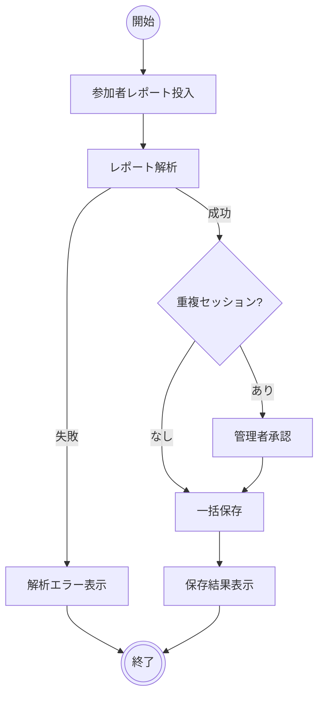

# 参加者レポート登録

## 機能タイプ

画面

## 概要

Microsoft Teams の参加者レポートを管理者パネルに投入し、システムが自動解析した結果を確認・承認した上で、セッション情報とインデックスを一括保存する機能。

業務定義のアクティビティ A02「参加者レポート登録」に対応する。

### 画面一覧

| # | 画面名 | 説明 |
|---|--------|------|
| 1 | 管理者パネル | 参加者レポートの投入・解析結果確認・一括保存を行う画面。AdminPage の CSV 取り込み区画 |

## アクティビティ

### 正常系の事前条件

- 管理者が SAS トークン付き URL でシステムにアクセスしている
- 管理者パネルが表示されている
- 参加者レポートファイル（CSV）が手元に準備されている

!!! info
    解析はファイル投入時に自動実行される。複数ファイルを投入した場合、個別に解析結果が表示される。重複が検出されたファイルは管理者が承認するまで保存対象に含まれない。

### 正常系の事後条件

- 参加者レポートの原本ファイルがストレージに保存されている
- セッション情報が個別の JSON ファイルとして保存されている
- インデックスにグループ・メンバーの集約情報が反映されている

## シナリオ一覧

| No. | シナリオ | 概要 |
|-----|---------|------|
| 1 | 正常登録 | 参加者レポートを投入し、解析成功、一括保存が正常完了する |
| 2 | 複数ファイル登録 | 複数の参加者レポートを投入し、すべて正常に保存される |
| 3 | 重複セッション検出 | 既存セッションと同一のセッションIDが検出され、管理者が承認して保存する |
| 4 | 解析エラー | 参加者レポートの形式が不正で解析に失敗する |
| 5 | 保存エラー | ネットワーク障害等により保存に失敗する。リトライで回復する |
| 6 | 保存エラー（リトライ失敗） | リトライしても保存に失敗する |

## 制約

### ファイル形式

- 参加者レポートは UTF-16LE エンコーディングのタブ区切りファイルであること。他のエンコーディングや区切り文字には対応しない
- 拡張子は `.csv` であること。他の拡張子のファイルは受け付けない
- ファイルサイズの上限は 10MB とする

### ID 生成

- グループIDは会議タイトル（装飾除去後）の SHA-256 ハッシュ先頭8桁（16進数）で生成される
- セッションIDは `{グループID}-{開催日}` の形式で生成される。同一グループの同一開催日は同一セッションとみなされる
- メンバーIDはメールアドレスの SHA-256 ハッシュ先頭8桁（16進数）で生成される

### 会議タイトルの正規化

- 先頭・末尾のダブルクォーテーションを除去する
- 末尾の「で会議中」を除去する
- 残余のダブルクォーテーションを除去する

### 日時の解析

- `YYYY/M/D HH:MM:SS` 形式（4桁年）と `M/D/YY, HH:MM:SS AM/PM` 形式（2桁年）に対応する
- 2桁年は 50 以上を 1900年代、50 未満を 2000年代として解釈する

### 参加時間の解析

- `X時間Y分Z秒` 形式と `X分Y秒` 形式に対応する
- 参加時間が解析できない参加者の記録はスキップされ、警告として表示される

### 重複検出

- セッションIDが既存のインデックスに存在する場合、重複警告が表示される
- 重複を含むファイルは管理者が明示的に承認しない限り「準備完了」ステータスにならず、保存対象に含まれない

### 保存処理

- 一括保存はファイルごとに順次実行される（原本ファイル → セッション JSON → インデックス更新の順）
- 一括保存中はドロップゾーンが無効化され、追加の投入ができない
- インデックス更新時は楽観的ロック（updatedAt タイムスタンプ比較）を使用し、同時編集時は保存が失敗する
- 保存に失敗したファイルはリトライ可能である
