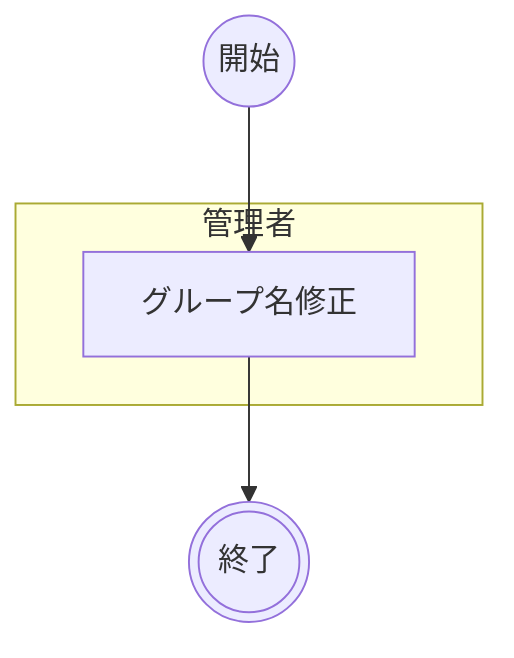

# グループ情報管理業務

Teams 会議タイトルから自動生成されたグループ名を、組織の命名規則に準拠した名称に修正する業務。参加者レポートの取り込み時に会議タイトルがそのままグループ名となるため、表記ゆれや不要な装飾文字列が含まれる場合がある。管理者がグループ名を修正することで、ダッシュボードの可読性を向上させる。

!!! info
    本業務は日常的な参加状況管理業務とは異なり、必要に応じて実施するメンテナンス業務として位置づけられる。

## アクティビティ

### 正常系の事前条件

- 管理者が SAS トークン付き URL でシステムにアクセスしている
- 修正対象のグループが既にインデックスに登録されている
- 修正後の名称が組織の命名規則に準拠している

### 正常系の事後条件

- インデックスの対象グループの名称が新しい名称に更新されている
- グループIDは変更されていない
- ダッシュボードに更新後のグループ名が反映されている

### アクター一覧

| # | アクター名 | 種別 | 説明 |
|--|--|--|--|
| 1 | 管理者 | ビジネスアクター | グループ名の修正を行う |

### アクティビティ一覧

| # | アクター | アクティビティ | 説明 |
|--|--|--|--|
| B01 | 管理者 | グループ名修正 | 管理者パネルのグループ管理でグループ名を編集・検証・保存する |

### オブジェクト一覧

| # | オブジェクト名 | 説明 |
|--|--|--|
| 1 | グループ | 勉強会・ミーティングの活動単位。ID（不変）と名称（変更可能）を持つ |
| 2 | インデックス | グループ・メンバーの集約情報。更新日時を持つ |

### 制約

- グループ名を変更してもグループIDは変更されない
- 同時編集を防止するため、インデックス更新時は排他制御を行う

## シナリオ一覧

| # | シナリオ | 概要 |
|--|--|--|
| 1 | [グループ名称の修正](01.グループ名称の修正.md) | 管理者が自動生成されたグループ名を組織の命名規則に準拠した名称に修正する |
