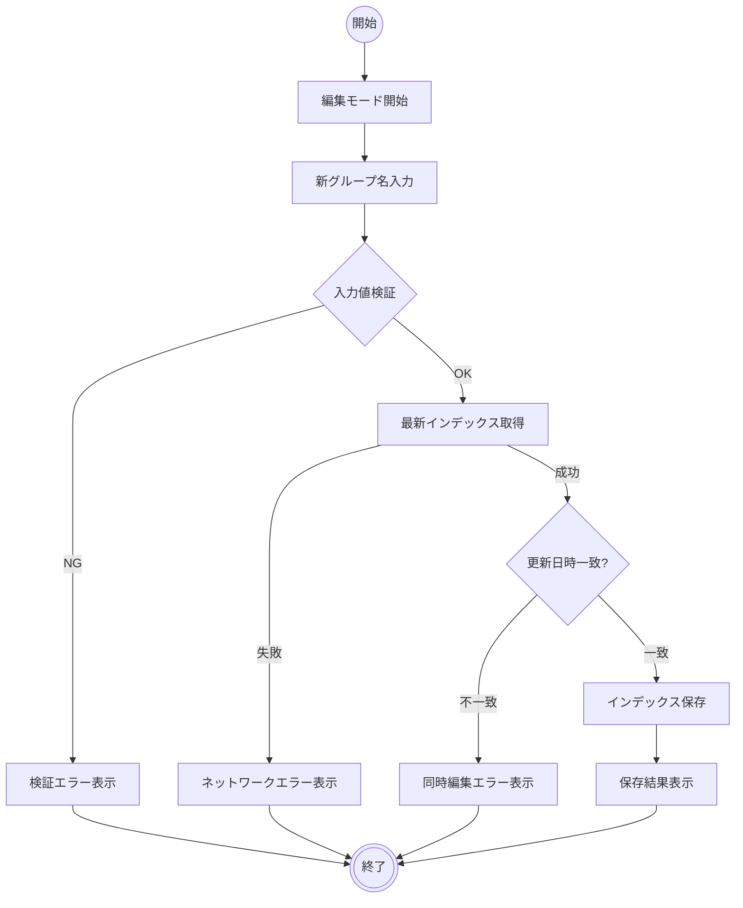

# グループ名修正

## 機能タイプ

画面

## 概要

Teams 会議タイトルから自動生成されたグループ名を、管理者が任意の名称に修正する機能。管理者パネルのグループ管理区画でインライン編集を行い、入力値検証と楽観的ロック制御を経てインデックスを更新・保存する。

業務定義のアクティビティ B01「グループ名修正」に対応する。

### 画面一覧

| # | 画面名 | 説明 |
|---|--------|------|
| 1 | 管理者パネル | グループ一覧の表示とインライン編集を行う画面。AdminPage のグループ編集区画 |

## アクティビティ

### 正常系の事前条件

- 管理者が SAS トークン付き URL でシステムにアクセスしている
- 管理者パネルが表示されている
- 修正対象のグループがインデックスに登録されている

### 正常系の事後条件

- インデックスの対象グループの name フィールドが新しい名称に更新されている
- グループIDは変更されていない
- インデックスの updatedAt が保存時刻に更新されている

## シナリオ一覧

| No. | シナリオ | 概要 |
|-----|---------|------|
| 1 | 正常修正 | グループ名を変更し、正常に保存される |
| 2 | 入力値検証エラー | 空文字や256文字超の名称を入力し、検証エラーが表示される |
| 3 | 同時編集エラー | 他のユーザーが先にインデックスを更新しており、楽観的ロックにより保存が拒否される |
| 4 | ネットワークエラー | 最新インデックスの取得に失敗し、保存処理が中断される |
| 5 | 編集キャンセル | 編集モード中に Escape キーまたはキャンセルボタンで変更を破棄する |

## 制約

### 入力値検証

- グループ名は文字列であること
- グループ名は1文字以上256文字以内であること
- 空文字および空白のみの名称は許可されない（前後の空白はトリムされる）
- 検証エラー時のメッセージ：
    - 空文字・空白のみ：「グループ名を入力してください」
    - 256文字超：「グループ名は256文字以内で入力してください」

### 楽観的ロック

- 保存前に最新のインデックスを取得し、updatedAt タイムスタンプを比較する
- 不一致の場合（他のユーザーが先に更新済み）、「他のユーザーが同時に編集しています。最新データを再読み込みしてください」のエラーメッセージを表示し、保存を中断する
- 最新インデックスの取得に失敗した場合、「最新データの取得に失敗しました。ネットワーク接続を確認してください」のエラーメッセージを表示する

### UI 制御

- グループ名保存中は他のグループの編集操作が無効化される
- 編集モードでは対象グループのインライン入力欄が自動フォーカスされる
- グループIDは不変であり、編集対象に含まれない
