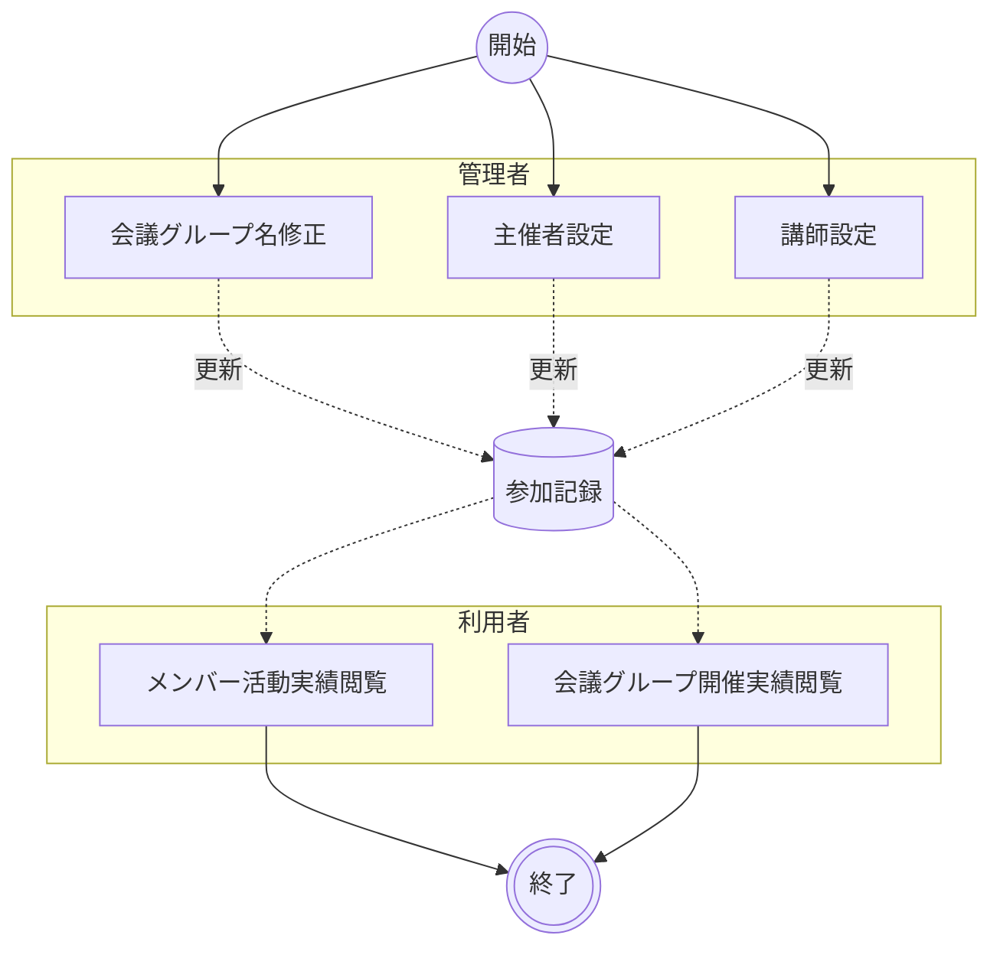

# 会議グループ管理

Teams会議タイトルから自動生成された会議グループ名を、組織の命名規則に準拠した名称へ修正する。参加者レポートの取り込み時に会議タイトルがそのまま会議グループ名となるため、表記ゆれや不要な装飾文字列を含む場合がある。管理者が会議グループ名を修正し、利用者がダッシュボードで修正結果を確認することで、参加記録の可読性を向上させる。また、会議グループへの主催者の割り当てやセッションへの講師指定もスコープに含む。

!!! info
    本業務は日常的な参加状況管理とは異なり、必要に応じて実施するメンテナンス業務として位置づけられる。管理者による修正・設定（B01〜B03）の後、利用者は確認（B04・B05）を行う。

## ユースケース

### 正常系の事前条件

- 管理者が管理機能ににアクセスできる
- 修正対象の会議グループがすでに登録されている

### アクティビティ図

### 正常系の事後条件

- 対象会議グループの名称が新しい名称に更新されている
- 会議グループに主催者が設定されている
- セッションに講師が指定されている

### ユースケース一覧

| # | アクター | ユースケース | 説明 |
|--|--|--|--|
| B01 | 管理者 | 会議グループ名修正 | 管理者パネルの会議グループ管理で会議グループ名を編集・検証・保存する |
| B02 | 管理者 | 主催者設定 | 管理者パネルで会議グループに主催者を割り当てる |
| B03 | 管理者 | 講師設定 | 管理者パネルでセッションに講師メンバーを指定する |
| B04 | 利用者 | メンバー活動実績閲覧 | メンバー詳細画面で会議グループ別の参加履歴と講師実績を確認する |
| B05 | 利用者 | 会議グループ開催実績閲覧 | 会議グループ詳細画面で会議別の参加者・開催実績・主催者情報を確認する |

## シナリオ一覧

| # | シナリオ | 概要 |
|--|--|--|
| 1 | [会議グループ名の修正とメンバー活動実績の確認](シナリオ/01.グループ名の修正とメンバー活動実績の確認.md) | 管理者が会議グループ名を修正し、利用者がメンバーの活動実績で修正結果を確認する |
| 2 | [会議グループ名の修正と会議グループ開催実績の確認](シナリオ/02.グループ名の修正と会議グループ開催実績の確認.md) | 管理者が会議グループ名を修正し、利用者が会議グループの開催実績で修正結果を確認する |
| 3 | [主催者の設定と会議グループ開催実績の確認](シナリオ/03.主催者の設定と会議グループ開催実績の確認.md) | 管理者が会議グループに主催者を設定し、利用者が会議グループ詳細で主催者名を確認する |
| 4 | [講師の設定とメンバー活動実績の確認](シナリオ/04.講師の設定とメンバー活動実績の確認.md) | 管理者がセッションに講師を指定し、利用者がメンバー詳細で講師履歴を確認する |
