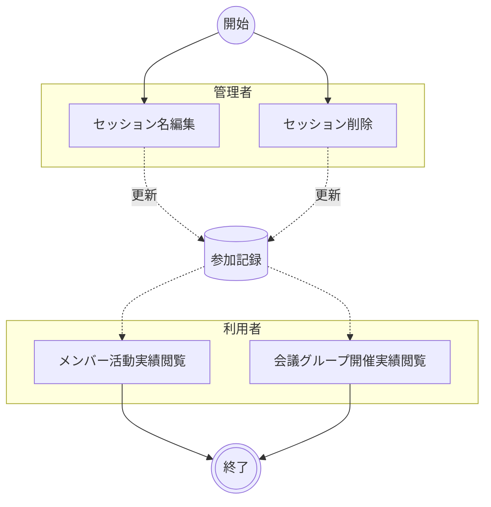

# セッション管理

会議グループに登録されたセッションの別名（セッション名）を編集し、不要になったセッションを削除する。参加者レポートの取り込み時に会議タイトルがそのままセッション名となるが、内容を端的に表す別名を付与することで参加履歴の可読性を向上させる。また、誤って取り込んだセッションや不要なセッションを削除することで、開催実績の正確性を維持する。

!!! info
    本業務は日常的な参加状況管理とは異なり、必要に応じて実施するメンテナンス業務として位置づけられる。管理者による編集・削除（C01・C02）の後、利用者は確認（C03・C04）を行う。

## ユースケース

### 正常系の事前条件

- 管理者が管理機能にアクセスできる
- 編集・削除対象のセッションがすでに登録されている

### アクティビティ図

### 正常系の事後条件

- 対象セッションの別名が新しい名称に更新されている
- 不要なセッションが会議グループから削除されている

### ユースケース一覧

| # | アクター | ユースケース | 説明 |
|--|--|--|--|
| C01 | 管理者 | セッション名編集 | 管理者パネルのセッション管理でセッションの別名を編集・保存する |
| C02 | 管理者 | セッション削除 | 会議グループ詳細画面で不要なセッションを削除する |
| C03 | 利用者 | メンバー活動実績閲覧 | メンバー詳細画面で会議グループ別の参加履歴とセッション別名を確認する |
| C04 | 利用者 | 会議グループ開催実績閲覧 | 会議グループ詳細画面で会議別の参加者・開催実績・セッション別名を確認する |

## シナリオ一覧

| # | シナリオ | 概要 |
|--|--|--|
| 1 | [セッション名の編集とメンバー活動実績の確認](シナリオ/01.セッション名の編集とメンバー活動実績の確認.md) | 管理者がセッション別名を編集し、利用者がメンバーの活動実績で編集結果を確認する |
| 2 | [セッションの削除と会議グループ開催実績の確認](シナリオ/02.セッションの削除と会議グループ開催実績の確認.md) | 管理者が不要なセッションを削除し、利用者が会議グループの開催実績で削除結果を確認する |
