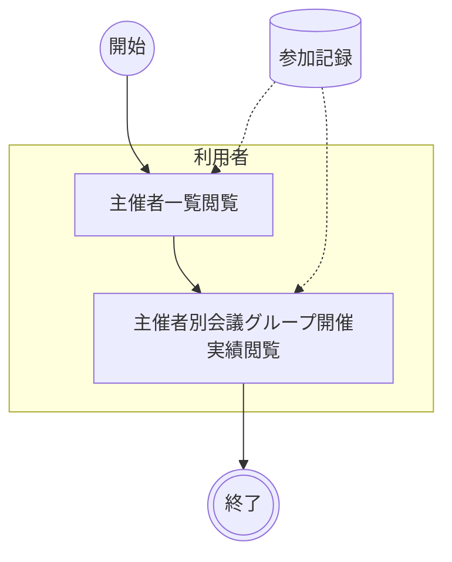

# 主催者管理

主催者ごとの会議グループ開催実績を一覧・詳細で確認する。ダッシュボードの主催者一覧から主催者を選択し、主催者詳細画面で紐づく会議グループの開催状況や合計参加時間を把握することで、主催者単位での活動傾向を可視化する。

!!! info
    本業務は参加状況管理（A業務）で登録されたデータと、会議グループ管理（B業務）で設定された主催者情報を前提とした閲覧業務である。利用者がダッシュボードから主催者を起点に会議グループの開催実績を確認する。

## ユースケース

### 正常系の事前条件

- 会議グループに主催者が設定されている
- 対象の会議グループで1回以上の会議が開催されている

### アクティビティ図

### 正常系の事後条件

- 利用者が主催者ごとの会議グループ開催実績を確認できている

### ユースケース一覧

| # | アクター | ユースケース | 説明 |
|--|--|--|--|
| C01 | 利用者 | 主催者一覧閲覧 | ダッシュボードの主催者一覧で主催者名・グループ数・合計参加時間を確認する |
| C02 | 利用者 | 主催者別会議グループ開催実績閲覧 | 主催者詳細画面で紐づく会議グループの一覧・セッション数・合計参加時間を確認する |

## シナリオ一覧

| # | シナリオ | 概要 |
|--|--|--|
| 1 | [主催者別の会議グループ開催実績の確認](シナリオ/01.主催者別の会議グループ開催実績の確認.md) | 利用者が主催者一覧から主催者を選択し、主催者詳細で会議グループの開催実績を確認する |
