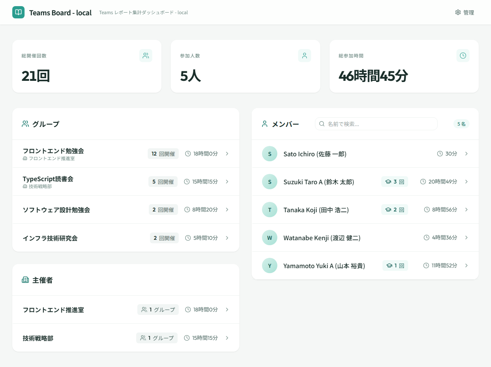

# ダッシュボード

## 画面概要

Teams Board のランディングページ。会議グループ・メンバー・主催者の一覧と統計サマリーを表示し、各詳細画面への導線を提供する。全利用者がアクセスできる。

## ルート

`#/`（デフォルトルート）

## ページコンポーネント

`DashboardPage`（`src/pages/DashboardPage.jsx`）

## 画面レイアウト

## 表示項目

### サマリーカード

| # | 項目名 | 説明 | アイコン |
|---|--------|------|---------|
| 1 | 総開催回数 | 全会議グループのセッション合計数 | Clock |
| 2 | 参加人数 | 登録されているメンバーの総数 | Users |
| 3 | 総参加時間 | 全メンバーの参加時間の合計（フォーマット済み） | User |

!!! info "設計決定： サマリーカードの表示順（Issue #103）"
    表示順は「総開催回数→参加人数→総参加時間」とする。総参加時間は各メンバーの合計を集計した計算値であり直感的に把握しにくいため右端に配置し、即座に把握できる開催回数・参加人数を先に提示する。

### 会議グループ一覧

| # | 項目名 | 説明 |
|---|--------|------|
| 1 | グループ名 | 会議グループの名称 |
| 2 | 主催者名 | 会議グループに設定された主催者（設定済みの場合） |
| 3 | セッション数 | 会議グループに含まれるセッションの数 |
| 4 | 合計参加時間 | 会議グループの参加時間合計 |

!!! info "設計決定： 会議グループ一覧のレイアウト安定化（Issue #147, #149, #151）"
    - **グループ名の省略表示（#147）**: グループ名は `truncate` + `min-w-0` で省略表示し、回数・時間列は `flex-shrink-0` で固定幅とする。長いグループ名（全角15文字以上）でもカード行の高さを統一するため。
    - **時間列の折り返し防止（#151）**: 時間列は `whitespace-nowrap` で折り返しを防止し、3桁時間（例：404時間8分）にも対応できる幅を確保する。
    - **ツールチップによるフルネーム確認（#149）**: 省略表示されたグループ名・メンバー名には CSS ツールチップを適用する。`scrollWidth > clientWidth`（実際に省略されている場合）のみ表示し、不要なツールチップを抑制する。

### 主催者一覧

| # | 項目名 | 説明 |
|---|--------|------|
| 1 | 主催者名 | 主催者の名称 |
| 2 | グループ数 | 主催する会議グループの数 |
| 3 | 合計参加時間 | 主催する全グループの参加時間合計 |

### メンバー一覧

| # | 項目名 | 説明 |
|---|--------|------|
| 1 | メンバー名 | メンバーの名称 |
| 2 | セッション数 | メンバーが参加したセッションの総数 |
| 3 | 合計参加時間 | メンバーの参加時間合計 |

!!! info "設計決定： メンバー一覧の講師回数表示（Issue #169）"
    メンバー行には参加回数ではなく講師回数を表示する。参加回数はメンバー詳細画面で確認可能なため、ダッシュボードでは講師としての活動を一覧で把握できることを優先した。講師回数が0回の場合は非表示とする。

## 操作仕様

| # | 操作 | 振る舞い |
|---|------|----------|
| 1 | 会議グループをクリック | 会議グループ詳細画面（`#/groups/:groupId`）へ遷移する |
| 2 | メンバーをクリック | メンバー詳細画面（`#/members/:memberId`）へ遷移する |
| 3 | 主催者をクリック | 主催者詳細画面（`#/organizers/:organizerId`）へ遷移する |
| 4 | ヘッダーの管理アイコンをクリック | 管理画面（`#/admin`）へ遷移する（管理者のみ表示） |

## 画面遷移

| 方向 | 遷移先 | 条件 |
|------|--------|------|
| → | 会議グループ詳細 | グループ選択時 |
| → | メンバー詳細 | メンバー選択時 |
| → | 主催者詳細 | 主催者選択時 |
| → | 管理画面 | 管理者のみ |
| ← | （なし） | ランディングページのため遷移元なし |

!!! info "設計決定： DataFetcher キャッシュの共有（Issue #96）"
    DataFetcher インスタンスはアプリケーション全体で共有し、管理画面でのデータ更新時にキャッシュを無効化する。ページごとに独立した DataFetcher を保持すると、管理画面での更新がダッシュボードの TTL キャッシュ（30秒）に伝播せず、画面遷移後に古いデータが表示されるため。

## 権限

- 全利用者がアクセス可能
- ヘッダーの管理アイコンは管理者（SAS トークン認証済み）のみ表示される

## 関連する業務

- [参加状況管理](../01.参加状況管理/参加状況管理.md) — メンバー活動実績閲覧・会議グループ開催実績閲覧の起点
- [会議グループ管理](../02.会議グループ管理/会議グループ管理.md) — 会議グループ名修正後の確認
- [主催者管理](../03.主催者管理/主催者管理.md) — 主催者一覧閲覧の起点
- [セッション管理](../03.セッション管理/セッション管理.md) — セッション名編集後の確認
