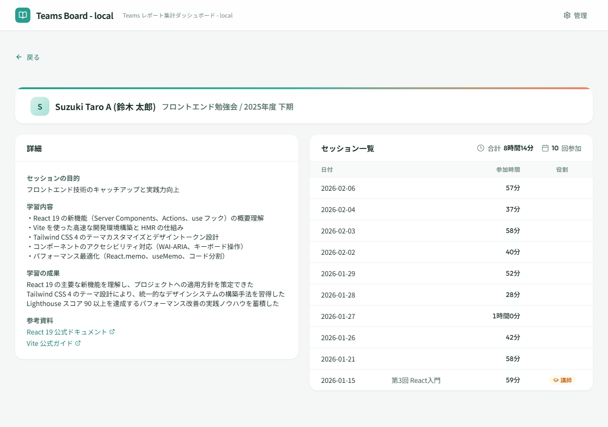

# メンバー期別グループ詳細

## 画面概要

特定メンバーの特定会議グループ・期間における参加履歴と学習記録を表示する画面。セッションごとの参加時間・講師実績に加え、学習目的・内容・成果・参考資料などの詳細情報を記録・閲覧できる。

!!! info "設計決定： 独立画面としての分離（Issue #196）"
    グループの期単位で詳細情報（目的・学習内容・成果など）を管理するため、メンバー詳細画面から遷移する独立画面として設ける。メンバー詳細画面内にアコーディオンでセッションを直接展開する構成では、情報量の多さから見通しが悪くなるため分離した。

## ルート

`#/members/:memberId/groups/:groupId/terms/:termKey`

## ページコンポーネント

`MemberGroupTermDetailPage`（`src/pages/MemberGroupTermDetailPage.jsx`）

## 画面レイアウト

## 表示項目

### ヘッダーカード

| # | 項目名 | 説明 |
|---|--------|------|
| 1 | アバター | メンバー名の先頭文字 |
| 2 | メンバー名 | メンバーの表示名 |
| 3 | グループ名 | 会議グループの名称 |
| 4 | 期間ラベル | 年度期間の名称 |

### 詳細情報カード（左カラム）

共通情報タブとメンバー固有情報タブの2つのタブで構成される。

| # | 項目名 | 説明 |
|---|--------|------|
| 1 | 目的 | 学習・参加の目的（テキスト） |
| 2 | 学習内容 | 学習した内容の記録（テキストエリア） |
| 3 | 学習成果 | 学習の成果・所感（テキストエリア） |
| 4 | 参考資料 | 参考資料のリンク一覧（タイトル + URL） |

!!! info "設計決定： 詳細情報のタブ構成とデータ保存方式（Issue #196）"
    詳細情報は「共通情報」と「メンバー固有情報」の2種類をタブで切り替える。共通情報は管理者が会議グループ詳細画面で登録・更新し、メンバー固有情報は認証済みユーザーが本画面で登録・更新・削除する。タブの表示ルールは以下のとおり：

    - 未登録の種別のタブは非表示
    - 一種のみ登録済みの場合は単一タブ表示
    - 両方未登録の場合はタブ非表示で中央に「メンバー情報を追加」ボタンを表示

    データは `data/group-term-details/{groupId}/{termKey}.json`（共通）と `data/member-group-term-details/{memberId}/{groupId}/{termKey}.json`（個別）に分離して保存する。共通情報とメンバー固有情報はライフサイクル・権限が異なるため、ファイルを分離する。ファイル未存在を未登録として扱い、初回保存時に作成、削除時はファイル自体を削除する。競合時は後勝ち（最後に保存した内容を採用）とする。

### セッション一覧テーブル（右カラム）

| # | 項目名 | 説明 |
|---|--------|------|
| 1 | 日付 | セッションの開催日 |
| 2 | タイトル | セッションのタイトル |
| 3 | 参加時間 | メンバーの参加時間 |
| 4 | 役割 | 講師として参加した場合に講師バッジを表示 |
| 5 | 合計参加時間 | ヘッダーに合計参加時間を表示 |
| 6 | セッション数 | ヘッダーにセッション数を表示 |

## 操作仕様

| # | 操作 | 振る舞い |
|---|------|----------|
| 1 | 戻るボタンをクリック | メンバー詳細画面に戻る |
| 2 | 編集ボタンをクリック | 詳細情報を編集モードに切り替える |
| 3 | メンバー情報を追加ボタンをクリック | メンバー固有情報タブに切り替え、編集モードにする |
| 4 | 保存ボタンをクリック | 編集内容を Blob Storage に保存する（URL の形式を検証） |
| 5 | キャンセルボタンをクリック | 編集を中止し、元の内容に戻す |
| 6 | 参考資料の追加（＋）ボタンをクリック | 参考資料の入力行を追加する |
| 7 | 参考資料の削除（×）ボタンをクリック | 対応する参考資料の入力行を削除する |
| 8 | 削除ボタンをクリック | メンバー固有情報の削除確認ダイアログを表示する |
| 9 | 削除確認ダイアログで削除をクリック | メンバー固有情報を Blob Storage から削除する |

## 画面遷移

| 方向 | 遷移先 | 条件 |
|------|--------|------|
| ← | メンバー詳細 | 戻るボタン |

## 権限

- 全利用者が閲覧可能
- 詳細情報の編集・保存・削除は認証済みユーザーが実行可能

## 関連する業務

- [参加状況管理](../01.参加状況管理/参加状況管理.md) — メンバー活動実績閲覧（A03）の詳細確認
