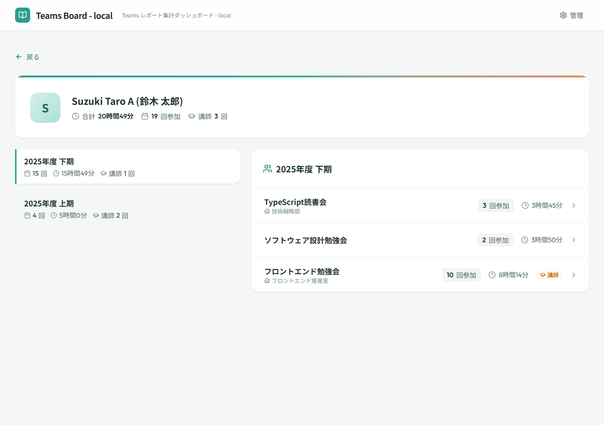

# メンバー詳細

## 画面概要

特定メンバーの会議グループ別参加履歴を年度期間ごとに表示する画面。メンバーの参加時間・セッション数・講師実績を可視化し、活動傾向を把握できる。全利用者がアクセスできる。

!!! info "設計決定： 期選択＋グループ一覧構成（#196）"
    本画面は「期を選択→参加グループ一覧→グループ期詳細画面へ遷移」の3段階構成とする。グループ期単位で詳細情報（目的・学習内容・成果など）を管理する要件があり、アコーディオンでセッションを直接展開する構成では情報量の多さから見通しが悪くなるため。期を選択するとその期内で参加したグループの一覧をダッシュボードと同様のカード形式で表示する。

## ルート

`#/members/:memberId`

## ページコンポーネント

`MemberDetailPage`（`src/pages/MemberDetailPage.jsx`）

## 画面レイアウト

## 表示項目

### メンバーヘッダーカード

| # | 項目名 | 説明 |
|---|--------|------|
| 1 | アバター | メンバー名の先頭文字 |
| 2 | メンバー名 | メンバーの表示名 |
| 3 | 合計参加時間 | 全期間の参加時間合計 |
| 4 | セッション数 | 全期間のセッション合計数 |
| 5 | 講師セッション数 | 講師として参加したセッション数（該当がある場合のみ表示） |

### 期間選択リスト（左カラム）

| # | 項目名 | 説明 |
|---|--------|------|
| 1 | 期間ラベル | 年度期間の名称（例：「2025年度 上期」） |
| 2 | セッション数 | 当該期間のセッション合計数 |
| 3 | 合計参加時間 | 当該期間の参加時間合計 |
| 4 | 講師セッション数 | 当該期間の講師セッション数（該当がある場合のみ表示） |

!!! info "設計決定： 2カラムレイアウトと期セレクター（#101）"
    年度の上期（4月〜9月）・下期（10月〜3月）で区切った2カラムレイアウトを採用する。左列に期のサマリーリスト、右列に選択中の期で絞り込んだグループ一覧を表示する。期は降順（最新が上）で、デフォルトで最新の期を選択する。レスポンシブ対応として lg 以上で2カラム、それ以下で縦積みとする。

!!! info "設計決定： 期サマリーカードのフォントサイズ（#105）"
    期サマリーカードのフォントサイズは右カラムのグループカードと揃える。期ラベルは `text-base`、数値は `text-sm`、アイコンは `w-3.5 h-3.5` とし、左右カラム間の視覚的一貫性を確保する。

!!! info "設計決定： 期セレクターの選択状態表現（#141）"
    選択中の期は `bg-white shadow-sm` でカードのように浮き上がらせ、`rounded-r-lg`（左辺は直線）+ `border-l-4` で選択を示す。`bg-primary-50` はページ背景（#f5f7f6）とほぼ同色で選択状態が不明瞭になるため採用しない。

### グループ一覧（右カラム）

| # | 項目名 | 説明 |
|---|--------|------|
| 1 | グループ名 | 会議グループの名称 |
| 2 | 主催者名 | 会議グループの主催者名 |
| 3 | セッション数 | 当該期間・グループのセッション数 |
| 4 | 合計参加時間 | 当該期間・グループの参加時間合計 |
| 5 | 講師バッジ | 講師として参加したセッションがある場合に表示 |

!!! info "設計決定： セッション表示の日付優先レイアウト（#141）"
    セッション表示は日付を先頭に固定する（例：`2024-03-15 チーム会議`）。日付が常に左端に揃うことで時系列のスキャンが容易になるため。別名は `text-text-secondary` で日付と視覚的に区別する。列ヘッダー（「日付」「参加時間」）は自明な情報のため省略する。

## 操作仕様

| # | 操作 | 振る舞い |
|---|------|----------|
| 1 | 戻るボタンをクリック | 前の画面に戻る |
| 2 | 期間ボタンをクリック | 選択した期間のグループ一覧を右カラムに表示する |
| 3 | グループ行をクリック | メンバー期別グループ詳細画面（`#/members/:memberId/groups/:groupId/terms/:termKey`）へ遷移する |

## 画面遷移

| 方向 | 遷移先 | 条件 |
|------|--------|------|
| ← | ダッシュボード | 戻るボタン |
| → | メンバー期別グループ詳細 | グループ行選択時 |

## 権限

- 全利用者がアクセス可能
- 管理者のみの機能はなし

## 関連する業務

- [参加状況管理](../01.参加状況管理/参加状況管理.md) — メンバー活動実績閲覧（A03）
- [会議グループ管理](../02.会議グループ管理/会議グループ管理.md) — メンバー活動実績閲覧（B04）
- [セッション管理](../03.セッション管理/セッション管理.md) — メンバー活動実績閲覧（C03）
