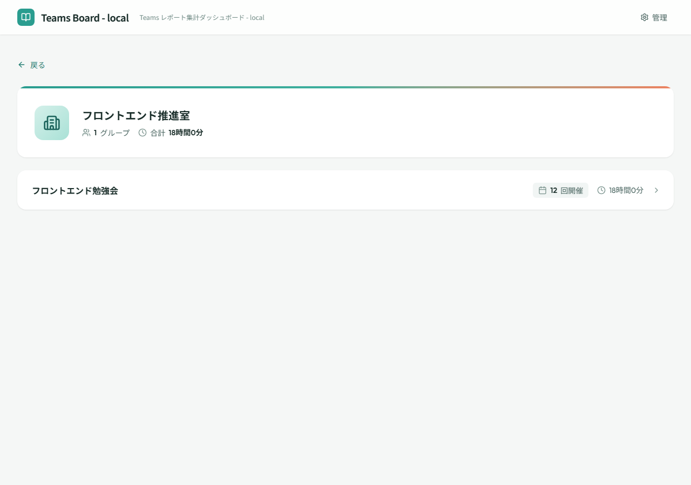

# 主催者詳細

## 画面概要

特定の主催者が管理する会議グループの一覧と開催実績を表示する画面。主催者単位での活動傾向を把握できる。全利用者がアクセスできる。

## ルート

`#/organizers/:organizerId`

## ページコンポーネント

`OrganizerDetailPage`（`src/pages/OrganizerDetailPage.jsx`）

## 画面レイアウト

## 表示項目

### 主催者ヘッダーカード

| # | 項目名 | 説明 |
|---|--------|------|
| 1 | 主催者アイコン | Building2 アイコン |
| 2 | 主催者名 | 主催者の名称 |
| 3 | グループ数 | 主催する会議グループの数 |
| 4 | 合計参加時間 | 主催する全グループの参加時間合計 |

### 会議グループ一覧

| # | 項目名 | 説明 |
|---|--------|------|
| 1 | グループ名 | 会議グループの名称 |
| 2 | セッション数 | 会議グループに含まれるセッションの数 |
| 3 | 合計参加時間 | 会議グループの参加時間合計 |

## 操作仕様

| # | 操作 | 振る舞い |
|---|------|----------|
| 1 | 戻るボタンをクリック | 前の画面に戻る |
| 2 | グループ行をクリック | 会議グループ詳細画面（`#/groups/:groupId`）へ遷移する |

## 画面遷移

| 方向 | 遷移先 | 条件 |
|------|--------|------|
| ← | ダッシュボード | 戻るボタン（ダッシュボードから遷移した場合） |
| ← | 会議グループ詳細 | 戻るボタン（会議グループ詳細から遷移した場合） |
| → | 会議グループ詳細 | グループ行選択時 |

## 権限

- 全利用者がアクセス可能
- 管理者のみの機能はなし

## 関連する業務

- [主催者管理](../03.主催者管理/主催者管理.md) — 主催者別会議グループ開催実績閲覧（C02）
