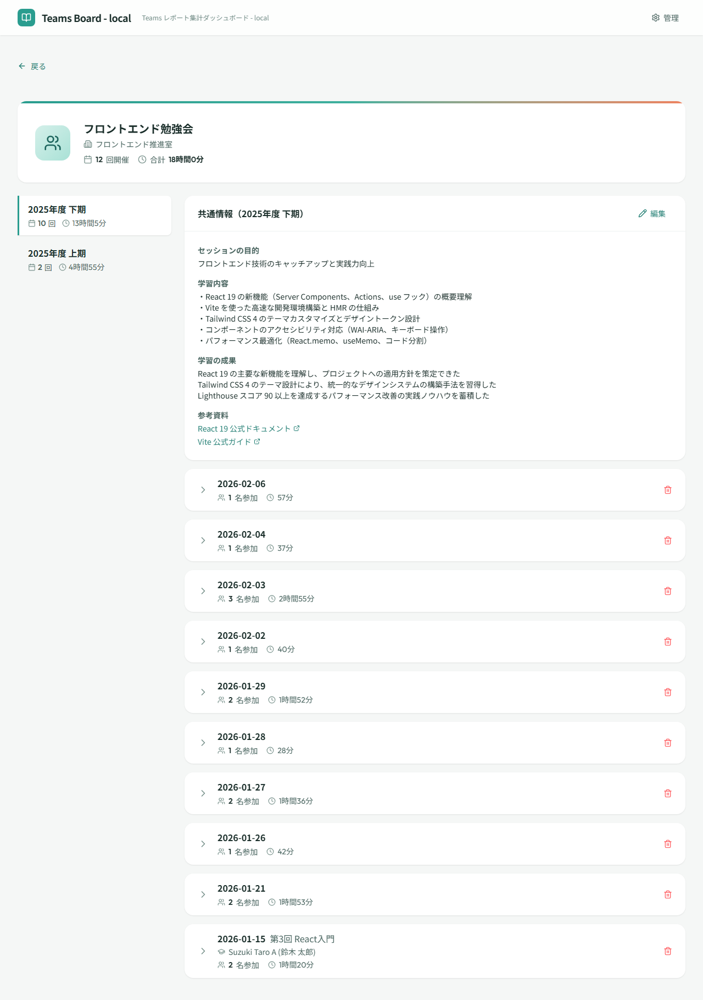

# 会議グループ詳細

## 画面概要

特定の会議グループの開催履歴を年度期間ごとに表示する画面。セッション別の参加者・講師・参加時間を確認でき、管理者はセッションの削除や共通情報の編集が可能。

## ルート

`#/groups/:groupId`

## ページコンポーネント

`GroupDetailPage`（`src/pages/GroupDetailPage.jsx`）

## 画面レイアウト

## 表示項目

### グループヘッダーカード

| # | 項目名 | 説明 |
|---|--------|------|
| 1 | グループアイコン | Users アイコン |
| 2 | グループ名 | 会議グループの名称 |
| 3 | 主催者名 | 設定されている場合に主催者名を表示 |
| 4 | セッション数 | 会議グループに含まれるセッションの総数 |
| 5 | 合計参加時間 | 全セッションの参加時間合計 |

### 期間選択リスト（左カラム）

| # | 項目名 | 説明 |
|---|--------|------|
| 1 | 期間ラベル | 年度期間の名称 |
| 2 | セッション数 | 当該期間のセッション数 |
| 3 | 合計参加時間 | 当該期間の参加時間合計 |

### 共通情報セクション（右カラム上部）

| # | 項目名 | 説明 |
|---|--------|------|
| 1 | 目的 | 会議グループの目的（テキスト） |
| 2 | 学習内容 | 学習内容の記録（テキストエリア） |
| 3 | 学習成果 | 学習成果の記録（テキストエリア） |
| 4 | 参考資料 | 参考資料のリンク一覧（タイトル + URL） |

### セッションアコーディオン（右カラム下部）

| # | 項目名 | 説明 |
|---|--------|------|
| 1 | 開催日 | セッションの開催日 |
| 2 | セッション名 | セッションのタイトル（別名が設定されている場合はそちらを表示） |
| 3 | 参照 URL | セッションの参照 URL（設定されている場合に外部リンクアイコンで表示） |
| 4 | 講師名 | 講師として指定されたメンバー名 |
| 5 | 参加者数 | セッションの参加者数 |
| 6 | 合計参加時間 | セッションの参加時間合計 |

### セッション展開時の参加者テーブル

| # | 項目名 | 説明 |
|---|--------|------|
| 1 | 参加者名 | 参加メンバーの名前 |
| 2 | 参加時間 | メンバーの参加時間 |

## 操作仕様

| # | 操作 | 振る舞い |
|---|------|----------|
| 1 | 戻るボタンをクリック | 前の画面に戻る |
| 2 | 期間ボタンをクリック | 選択した期間のセッション一覧と共通情報を表示する |
| 3 | セッションヘッダーをクリック | セッションのアコーディオンを展開/折りたたみする |
| 4 | 参照 URL をクリック | 外部リンクを新しいタブで開く |
| 5 | 主催者名をクリック | 主催者詳細画面（`#/organizers/:organizerId`）へ遷移する |
| 6 | 共通情報の編集ボタンをクリック（管理者） | 共通情報を編集モードに切り替える |
| 7 | 共通情報の保存ボタンをクリック（管理者） | 編集内容を Blob Storage に保存する |
| 8 | セッション削除ボタンをクリック（管理者） | セッション削除確認ダイアログを表示する |
| 9 | 削除確認ダイアログで削除をクリック（管理者） | セッションを会議グループから削除する |

## 画面遷移

| 方向 | 遷移先 | 条件 |
|------|--------|------|
| ← | ダッシュボード | 戻るボタン |
| → | 主催者詳細 | 主催者名クリック時 |

## 権限

- 全利用者が閲覧可能
- 以下は管理者のみ実行可能：
    - 共通情報の編集・保存
    - セッションの削除

## 関連する業務

- [参加状況管理](../01.参加状況管理/参加状況管理.md) — 会議グループ開催実績閲覧（A04）
- [会議グループ管理](../02.会議グループ管理/会議グループ管理.md) — 会議グループ開催実績閲覧（B05）
- [セッション管理](../03.セッション管理/セッション管理.md) — セッション削除（C02）、会議グループ開催実績閲覧（C04）
