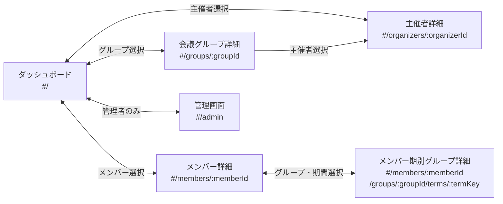

# 画面遷移図

Teams Board は6つの画面で構成される。利用者はダッシュボードを起点に各詳細画面へ遷移し、管理者は管理画面で参加者レポートの登録や各種設定を行う。

## 画面遷移図

## 画面一覧

| # | 画面名 | 英語名 | ルート | ページコンポーネント | 対象ユーザー |
|---|--------|--------|--------|---------------------|-------------|
| 1 | [ダッシュボード](ダッシュボード.md) | Dashboard | `#/` | `DashboardPage` | 全利用者 |
| 2 | [メンバー詳細](メンバー詳細.md) | MemberDetail | `#/members/:memberId` | `MemberDetailPage` | 全利用者 |
| 3 | [メンバー期別グループ詳細](メンバー期別グループ詳細.md) | MemberGroupTermDetail | `#/members/:memberId/groups/:groupId/terms/:termKey` | `MemberGroupTermDetailPage` | 全利用者 |
| 4 | [会議グループ詳細](会議グループ詳細.md) | SessionGroupDetail | `#/groups/:groupId` | `GroupDetailPage` | 全利用者 |
| 5 | [主催者詳細](主催者詳細.md) | OrganizerDetail | `#/organizers/:organizerId` | `OrganizerDetailPage` | 全利用者 |
| 6 | [管理画面](管理画面.md) | AdminPanel | `#/admin` | `AdminPage` | 管理者のみ |

## 遷移パス一覧

| # | 遷移元 | 遷移先 | トリガー | 双方向 |
|---|--------|--------|----------|--------|
| 1 | ダッシュボード | 会議グループ詳細 | グループ一覧からグループを選択 | ○ |
| 2 | ダッシュボード | メンバー詳細 | メンバー一覧からメンバーを選択 | ○ |
| 3 | ダッシュボード | 主催者詳細 | 主催者一覧から主催者を選択 | ○ |
| 4 | ダッシュボード | 管理画面 | ヘッダーの管理アイコンを選択（管理者のみ） | ○ |
| 5 | メンバー詳細 | メンバー期別グループ詳細 | 期間別グループ一覧からグループを選択 | ○ |
| 6 | 会議グループ詳細 | 主催者詳細 | 主催者名を選択 | 片方向 |
