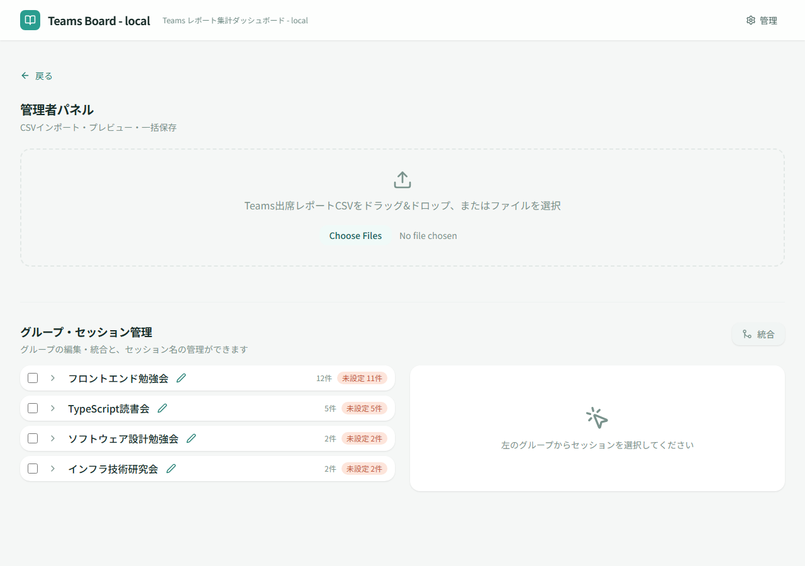

# 管理画面

## 画面概要

管理者向けの機能を集約した画面。参加者レポートの CSV 取込、会議グループ名の修正、主催者の設定、講師の設定、セッション管理、グループの統合を行う。管理者（SAS トークン認証済み）のみアクセスできる。

## ルート

`#/admin`

## ページコンポーネント

`AdminPage`（`src/pages/AdminPage.jsx`、遅延読み込み）

## 画面レイアウト

## 表示項目

### CSV アップロードセクション

| # | 項目名 | 説明 |
|---|--------|------|
| 1 | ファイルドロップゾーン | CSV ファイルのドラッグ＆ドロップ受付エリア |
| 2 | ファイルキューリスト | アップロードされたファイルの一覧（ファイル名、解析状態、プレビュー） |
| 3 | プログレスバー | 一括保存の進捗（現在/合計） |

### 会議グループ一覧（左カラム）

| # | 項目名 | 説明 |
|---|--------|------|
| 1 | チェックボックス | グループ選択用（統合操作に使用） |
| 2 | グループ名 | 会議グループの名称（インライン編集可能） |
| 3 | セッション数 | グループに含まれるセッション数 |
| 4 | 未設定バッジ | 主催者・講師が未設定のセッション数 |

### グループ展開時

| # | 項目名 | 説明 |
|---|--------|------|
| 1 | 主催者セレクター | 会議グループの主催者を選択するドロップダウン |
| 2 | セッション一覧 | グループ内のセッションボタンリスト |

### セッション編集パネル（右カラム）

| # | 項目名 | 説明 |
|---|--------|------|
| 1 | セッション名 | セッションの別名（256文字以内） |
| 2 | 参照 URL | セッションの参照 URL |
| 3 | 講師一覧 | セッションの講師メンバー（複数選択可能） |
| 4 | 参加者テーブル | セッションの参加者一覧 |

### グループ統合ダイアログ

| # | 項目名 | 説明 |
|---|--------|------|
| 1 | 統合対象グループ | 選択されたグループの一覧（ラジオボタンで統合先を選択） |
| 2 | グループ情報 | グループ名、ID、セッション数、合計参加時間 |

## 操作仕様

### CSV アップロード

| # | 操作 | 振る舞い |
|---|------|----------|
| 1 | CSV ファイルをドロップ | ファイルを解析してキューに追加する |
| 2 | 一括保存ボタンをクリック | キュー内の全ファイルを Blob Storage に保存する |
| 3 | リトライボタンをクリック | 失敗した操作を再実行する |

### 会議グループ管理

| # | 操作 | 振る舞い |
|---|------|----------|
| 4 | グループ名をインライン編集 | グループ名を編集・保存する |
| 5 | グループのチェックボックスを選択 | グループを統合対象として選択する |
| 6 | 統合ボタンをクリック | 2つ以上のグループが選択されている場合、統合ダイアログを表示する |
| 7 | 統合ダイアログで統合先を選択して実行 | 選択したグループを統合先グループに統合する（ソースグループは削除） |
| 8 | グループを展開して主催者を選択 | ドロップダウンで主催者を選択する（新規主催者の追加も可能） |
| 9 | 主催者の保存ボタンをクリック | 主催者の設定を保存する |

### セッション管理

| # | 操作 | 振る舞い |
|---|------|----------|
| 10 | グループ展開時にセッションボタンをクリック | セッション編集パネルに詳細を表示する |
| 11 | セッション名を編集 | セッションの別名を編集する（256文字以内） |
| 12 | 参照 URL を編集 | セッションの参照 URL を編集する |
| 13 | 講師を選択・追加 | ドロップダウンで講師メンバーを選択する（複数選択可能、新規メンバーの追加も可能） |
| 14 | セッションの保存ボタンをクリック | セッションの変更を保存する（新しいリビジョンを作成） |

### 共通操作

| # | 操作 | 振る舞い |
|---|------|----------|
| 15 | 戻るボタンをクリック | ダッシュボードに戻る |

## 画面遷移

| 方向 | 遷移先 | 条件 |
|------|--------|------|
| ← | ダッシュボード | 戻るボタン |

## 権限

- **管理者のみ**アクセス可能（未認証の場合、ダッシュボードにリダイレクトされる）
- SAS トークンによる認証が必要（URL クエリパラメーター `token` で認証）

## 関連する業務

- [参加状況管理](../01.参加状況管理/参加状況管理.md) — 参加者レポート登録（A02）
- [会議グループ管理](../02.会議グループ管理/会議グループ管理.md) — 会議グループ名修正（B01）、主催者設定（B02）、講師設定（B03）、グループ統合（B06）
- [セッション管理](../03.セッション管理/セッション管理.md) — セッション名編集（C01）
