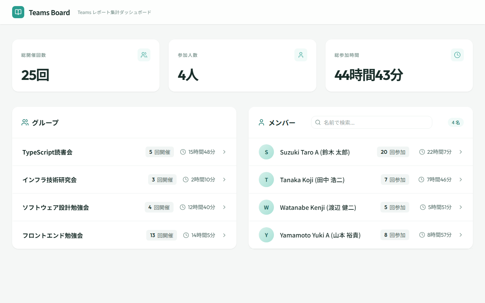
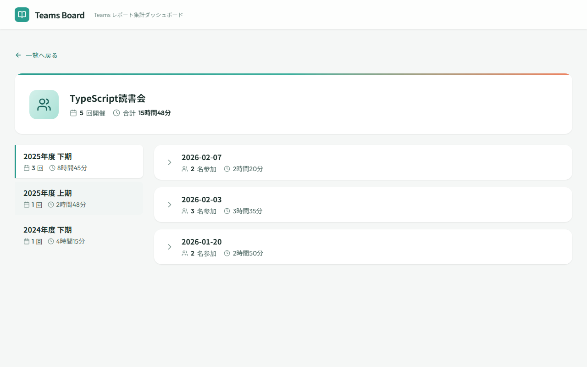
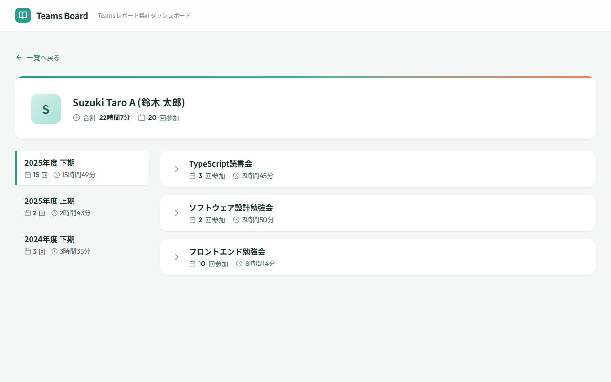
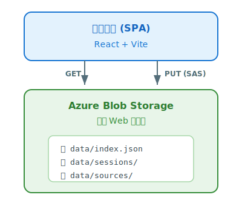

<!-- _class: lead -->
<!-- _paginate: false -->
<!-- _header: '' -->
<!-- _footer: '' -->

# Teams Board

**Microsoft Teams 参加状況 可視化ダッシュボード**

Teams 会議の出席レポート（CSV）を集約・可視化し、
メンバーとグループの活動状況を一元管理するシンプルなWebアプリケーション

---

# プロジェクト概要

## 目的

Microsoft Teams の出席レポート（CSV）を集計・可視化し、
メンバーとグループの活動状況を一元管理する

## 特長

- **サーバーレス** — バックエンドサーバー不要、Azure Blob Storage で動作
- **低コスト** — 静的ホスティングのみで完結
- **閉域網対応** — PaaS FW + Private Endpoint で社内配置可能
- **直感的** — CSV をドラッグ&ドロップするだけで可視化

---

# ダッシュボード

統計サマリーとグループ/メンバー一覧を一画面で表示

---

# グループ詳細

会議グループの期間別開催実績と各回の参加者数・時間を表示

---

# メンバー詳細

メンバーの期間別参加実績と会議グループごとの参加回数・時間を表示

---

# 技術スタック

## フロントエンド

| 技術 | 用途 |
|------|------|
| **React 19 + Vite** | UI・ビルド |
| **Tailwind CSS 4** | スタイリング |
| **HashRouter** | クライアントルーティング |
| **PapaParse** | CSV パース |
| **Recharts** | データ可視化 |

## テスト・品質

| 技術 | 用途 |
|------|------|
| **Vitest + RTL** | ユニットテスト |
| **Playwright** | E2E テスト |
| **ESLint + Prettier** | コード品質 |
| **GitHub Actions** | CI/CD |

---

# システム構成

## アーキテクチャ

## 設計方針

- **サーバーレス** — API サーバーなし、Blob への直接アクセス
- **集約と明細の分離** — `index.json` で集約、`sessions/` で明細
- **DI パターン** — 開発/本番を同一ロジックで切替
- **楽観ロック** — `version` フィールドで同時更新を制御

---

# データフロー

## 閲覧系（利用者）

1. `index.json` を取得
2. ダッシュボードで集約値を描画
3. 詳細画面で `sessions/` を並列取得

## 更新系（管理者）

1. CSV をドラッグ&ドロップ
2. 解析 → マージ → SAS で PUT

## ドメインモデル

| 概念 | 説明 |
|------|------|
| **会議グループ** | 同名会議のまとまり |
| **会議** | グループの1回の開催 |
| **参加** | メンバーの参加記録 |
| **メンバー** | 参加者 |

グループ → 会議 → 参加 ← メンバー
の関係で構成

---

<!-- _paginate: false -->
<!-- _header: '' -->
<!-- _footer: '' -->

# まとめ — Teams Board の価値

| 観点 | 内容 |
|------|------|
| **シンプル** | バックエンド不要、静的ホスティングのみで完結 |
| **低コスト** | Azure Blob Storage の静的Webサイト機能で運用 |
| **直感的** | CSVドロップで即座にデータを可視化 |
