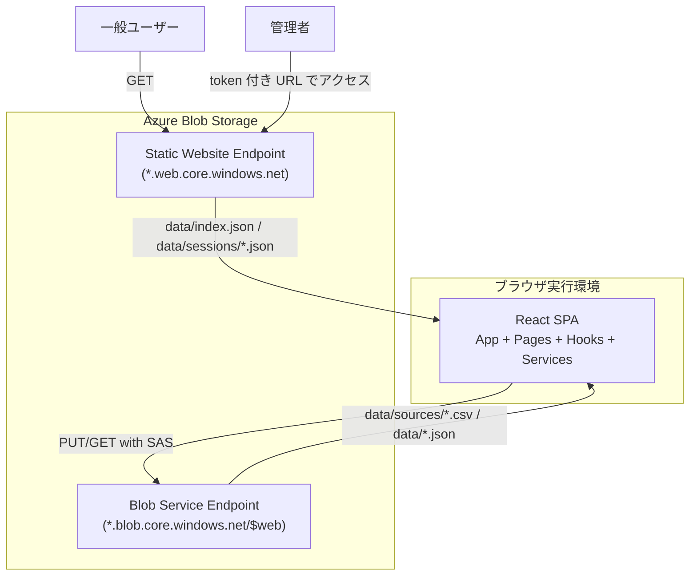
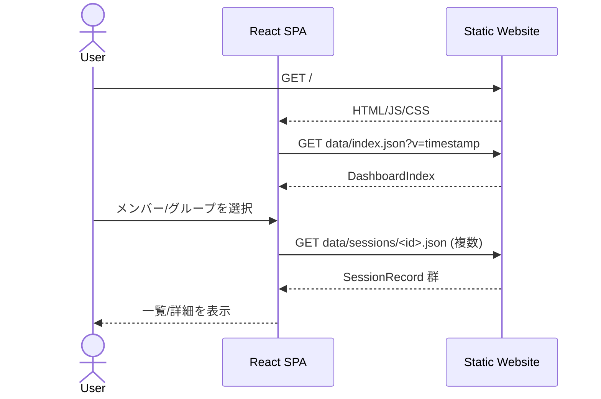
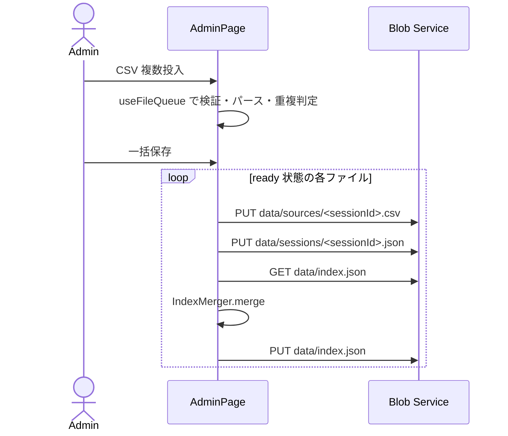
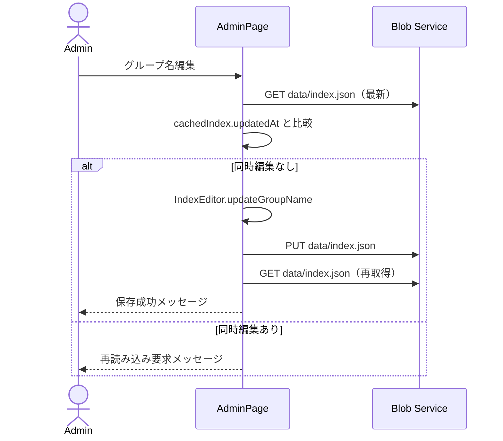

# Teams Board アーキテクチャ（現行実装）

## 1. 目的

本ドキュメントは、`src/` 配下の実装と `.github/workflows/deploy.yml` を基準に、Teams Board の構成・データフロー・運用前提を整理する。

対象は次の2系統である。

- 閲覧フロー（一般ユーザー）
- 管理フロー（SAS トークンを持つ管理者）

本システムは Azure Blob Storage Static Website を中心に構成し、常駐バックエンドを持たない。

## 2. システム境界

- フロントエンド： React SPA（`src/`）
- 配信基盤： Azure Blob Storage Static Website（`*.web.core.windows.net`）
- 書き込み先： Blob Service Endpoint（`*.blob.core.windows.net/$web`、SAS 必須）

## 3. 全体構成



## 4. フロントエンド構成

### 4.1 レイヤー構成

| レイヤー | 主な実装 | 責務 |
|--|--|--|
| App | `src/App.jsx`, `src/main.jsx` | 認証コンテキストとルーティング初期化 |
| Pages | `DashboardPage`, `MemberDetailPage`, `GroupDetailPage`, `AdminPage` | 画面単位のデータ取得・表示・操作 |
| Components | `FileDropZone`, `FileQueueCard`, `GroupNameEditor` など | 再利用 UI 部品 |
| Hooks | `useAuth`, `useFileQueue` | 認証状態・ファイルキュー状態管理 |
| Services | `data-fetcher`, `csv-transformer`, `index-merger`, `index-editor`, `blob-writer` | I/O とドメイン処理 |
| Config | `src/config/app-config.js` | ビルド時設定（`VITE_BLOB_BASE_URL`） |
| Utils | `format-duration` | 表示フォーマット |

### 4.2 ルーティング

- `#/` : ダッシュボード
- `#/members/:memberId` : メンバー詳細
- `#/groups/:groupId` : グループ詳細
- `#/admin` : 管理画面（非管理者は `Navigate to="/"`）
- `*` : ダッシュボードへリダイレクト

### 4.3 認証・管理者モード

- URL クエリ `token` を `useAuth` が初回アクセスで抽出
- 抽出後は `history.replaceState` で URL から `token` を除去
- `isAdmin` が `true` の場合のみ管理導線を表示
- SAS トークンはメモリ保持のみ（`localStorage` / `sessionStorage` 非使用）

## 5. データ構造と契約

### 5.1 配信・更新対象データ

- `data/index.json`（可変・集約）
- `data/sessions/<sessionId>.json`（不変・明細）
- `data/sources/<sessionId>.csv`（管理者取り込み時の原本保存）

`index.json` 例：

```json
{
  "groups": [
    {
      "id": "52664958",
      "name": "フロントエンド勉強会",
      "totalDurationSeconds": 47105,
      "sessionIds": ["52664958-2026-02-06"]
    }
  ],
  "members": [
    {
      "id": "c6606539",
      "name": "Suzuki Taro A (鈴木 太郎)",
      "totalDurationSeconds": 29683,
      "sessionIds": ["52664958-2026-02-06"]
    }
  ],
  "updatedAt": "2026-02-06T07:52:50.022Z"
}
```

### 5.2 ID 生成規則（`CsvTransformer`）

- `groupId`: 正規化済み会議タイトルの SHA-256 先頭 8 桁
- `memberId`: メールアドレスの SHA-256 先頭 8 桁
- `sessionId`: `${groupId}-${YYYY-MM-DD}`

### 5.3 キャッシュ戦略

| パス | 可変性 | 取得方法 |
|--|--|--|
| `data/index.json` | 可変 | `?v=<timestamp>` 付き GET |
| `data/sessions/<id>.json` | 不変 | キャッシュバスターなし GET |
| `data/sources/*.csv` | 追記のみ | 管理者 PUT のみ |

## 6. 実行フロー

### 6.1 閲覧フロー



### 6.2 CSV 取り込みフロー（管理者）



### 6.3 グループ名修正フロー（管理者）



## 7. デプロイと運用

### 7.1 CI/CD（`deploy.yml`）

- トリガー: `main` への `push`（`src/**`, `tests/**`, `e2e/**`, `package.json`, `pnpm-lock.yaml`, `vite.config.js`, ワークフロー自身の変更時）
- ジョブ： `deploy` のみ（このワークフローでは `test`/`lint` は実行しない）
- 実行内容：
  - `pnpm install --frozen-lockfile`
  - `pnpm run build`
  - `az storage blob upload-batch --source dist --destination '$web'`
  - デプロイ先 URL を `GITHUB_STEP_SUMMARY` へ出力

| ブランチ | GitHub Environment | 用途 |
|--|--|--|
| `main` | `prod` | 本番デプロイ |

### 7.2 インフラ初期設定（Azure CLI）

#### 静的サイト有効化

```bash
az storage blob service-properties update \
  --account-name <ACCOUNT_NAME> \
  --static-website --index-document index.html
```

#### Blob CORS 設定

```bash
az storage cors add \
  --services b \
  --methods GET PUT HEAD OPTIONS \
  --origins "https://<ACCOUNT_NAME>.z11.web.core.windows.net" \
  --allowed-headers "Content-Type,x-ms-blob-type,x-ms-version" \
  --exposed-headers "Content-Length,ETag" \
  --max-age 3600 \
  --account-name <ACCOUNT_NAME>
```

#### Stored Access Policy 設定

```bash
az storage container policy create \
  --container-name '$web' \
  --name dashboard-admin \
  --permissions rwdl \
  --expiry <YYYY-MM-DDTHH:MM:SSZ> \
  --account-name <ACCOUNT_NAME> \
  --account-key <ACCOUNT_KEY>
```

## 8. セキュリティ方針

- 閲覧： Static Website Endpoint から匿名 GET
- 更新： SAS 付き Blob Service Endpoint への PUT/GET
- トークン管理： URL から即時除去し、メモリ内のみ保持
- CORS: Static Website Endpoint から Blob Service Endpoint への `GET, PUT, HEAD, OPTIONS` を許可
- SAS: Stored Access Policy（`dashboard-admin`）に紐づくコンテナー SAS を利用

!!! note
    `staticwebapp.config.json` は Azure Static Web Apps 用設定であり、Blob Static Website 単体運用では適用されない。

## 9. テスト構成

- 単体/結合： Vitest + jsdom（`tests/data`, `tests/logic`, `tests/react`）
- E2E: Playwright（`e2e`）

## 10. 既知の制約

- CSV 一括保存フローは `data/index.json` の条件付き更新（ETag/If-Match）を行っていないため、同時更新時は最終書き込みが優先される。
- グループ名修正の同時編集検知は `updatedAt` 比較ベースであり、サーバー側の強制排他ではない。
- `memberId` はメールアドレス依存のため、メール欠落行は識別精度が低下する。

## 11. ディレクトリ要約

```text
teams-board/
├── src/                               # React SPA
│   ├── components/                    # UI コンポーネント
│   ├── pages/                         # 画面コンポーネント
│   ├── hooks/                         # カスタム Hook
│   ├── services/                      # ドメイン/データ処理
│   ├── config/                        # ビルド時設定
│   └── utils/                         # ユーティリティ
├── dev-fixtures/data/                 # 開発用配信データ
├── tests/                             # 単体/結合テスト
├── e2e/                               # E2E テスト
├── .github/workflows/                 # CI/CD ワークフロー
├── docs/                              # 業務・機能ドキュメント
└── openspec/                          # 仕様管理成果物
```
