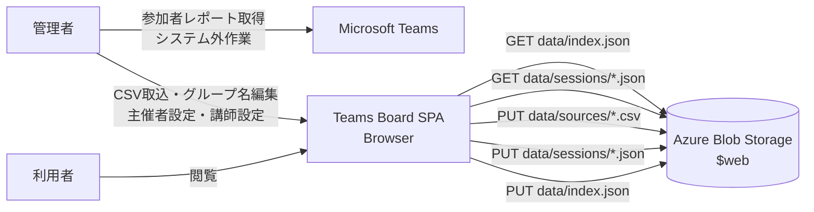
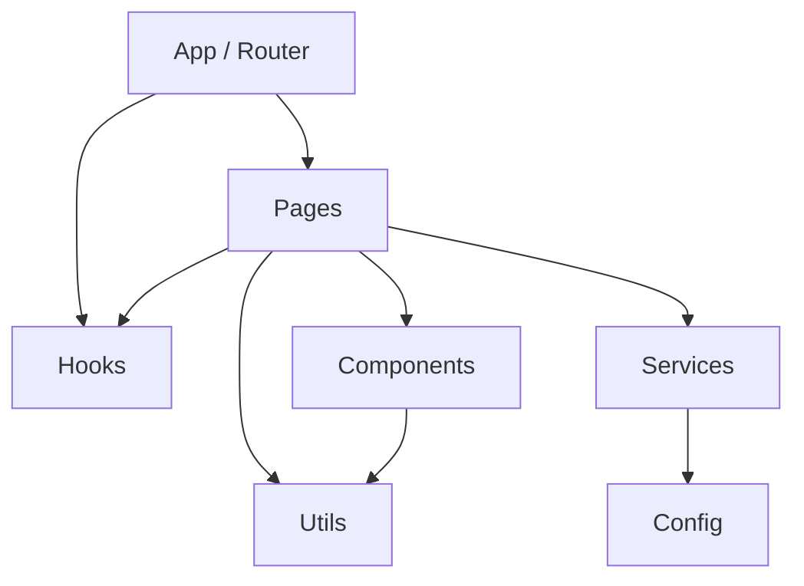
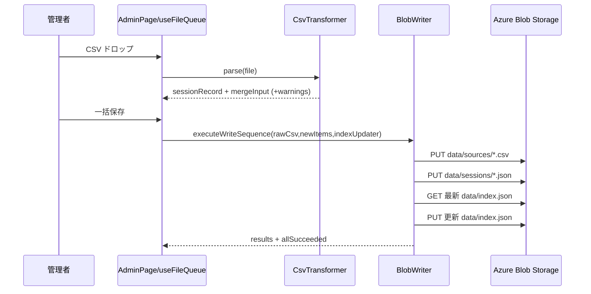

# アーキテクチャ

## 1. 目的と対象範囲

本書は、Teams Board リポジトリに実装されているアプリケーション本体のソフトウェアアーキテクチャを定義する。

- 対象：
  - ブラウザで動作する SPA（React + Vite）
  - データモデル（`data/index.json` / `data/sessions/*.json` / `data/sources/*.csv`）
  - 管理者向け CSV 取込・保存・グループ名編集・主催者設定・講師設定の処理
  - 開発・テスト・デプロイの実装構成
- 非対象：
  - ドキュメントシステム（MkDocs）自体のアーキテクチャ

## 2. システム概要

Teams Board は、Microsoft Teams の参加者レポート CSV を集約し、以下を可視化する静的サイト型ダッシュボードである。

- 会議グループ単位の開催回数・総参加時間・主催者情報
- メンバー単位の参加回数・総参加時間・講師実績
- セッション単位の参加者詳細・講師情報

更新系操作（CSV 取込、グループ名編集、主催者設定、講師設定）は管理者のみ実行でき、SAS トークンを用いて Azure Blob Storage のデータを直接更新する。

## 3. システムコンテキスト

## 4. 設計方針

1. サーバーレス運用  
   動的 API を持たず、静的ファイル配信とブラウザ実行のみで完結させる。
2. 集約データと明細データの分離  
   集約は `index.json`、明細は `sessions/*.json` に分離し、読み込み効率と更新単位を明確化する。
3. 依存方向の単純化  
   `pages -> services/hooks/components` の一方向依存を基本にし、ロジックを `services` に集約する。
4. 開発と本番の同一インターフェイス化  
   `IndexFetcher` / `BlobStorage` を差し替える DI で、開発用ファイル書き込みと本番 Blob 書き込みを同じ上位ロジックで扱う。

## 5. 論理アーキテクチャ

### 5.1 レイヤー構成

| レイヤー | 主なパス | 主責務 |
| --- | --- | --- |
| Pages | `src/pages/` | 画面単位のユースケース実行、データ取得/保存の起点 |
| Components | `src/components/` | 再利用 UI 部品（一覧、カード、入力、進捗表示） |
| Hooks | `src/hooks/` | 認証状態・ファイルキュー状態管理 |
| Services | `src/services/` | CSV 解析、データ取得、マージ、保存、編集ロジック |
| Config | `src/config/` | 環境変数由来設定の集約 |
| Utils | `src/utils/` | 画面表示向けの軽量ユーティリティ |

### 5.2 コンポーネント依存

### 5.3 主要サービス責務

| サービス | 役割 | 入力 | 出力 |
| --- | --- | --- | --- |
| `CsvTransformer` | Teams 参加者レポート（UTF-16LE/TSV）解析 | CSV `File` | `sessionRecord` と `mergeInput`、警告 |
| `IndexMerger` | セッション追加時の `index.json` 更新 | 現在 index + 新規セッション情報 | 更新済み index + warnings |
| `IndexEditor` | グループ名編集、主催者管理、セッションリビジョン作成（講師設定含む）、メンバー追加 | 現在 index + 編集パラメーター | 更新済み index または検証エラー |
| `DataFetcher` | 参照系 JSON 取得 | 相対パス (`data/...`) | `{ ok, data/error }` |
| `ProductionIndexFetcher` / `DevIndexFetcher` | 保存前の最新 index 取得 | Blob URL + SAS / 開発用相対 URL | `{ ok, data/error }` |
| `AzureBlobStorage` / `DevBlobStorage` | PUT 書き込み抽象化 | path + content + contentType | `{ path, success, error? }` |
| `BlobWriter` | 書き込みシーケンス実行 | rawCsv/newItems/indexUpdater | 各操作結果一覧と全体成否 |

## 6. データアーキテクチャ

### 6.1 永続データ配置

| パス | 内容 | 更新方式 |
| --- | --- | --- |
| `data/index.json` | グループ・メンバー・主催者の集約情報 + `version` / `updatedAt` | 上書き更新（楽観ロック） |
| `data/sessions/<sessionId>/<revision>.json` | セッション単位の参加明細・講師情報 | リビジョン追記（既存ファイルは不変） |
| `data/sources/<sessionId>.csv` | 取込元 CSV 原本 | 追記作成 |

### 6.2 `index.json` 論理モデル

| エンティティ | フィールド | 説明 |
| --- | --- | --- |
| Organizer | `id`, `name` | 主催者（組織・部署） |
| GroupSummary | `id`, `name`, `organizerId`, `totalDurationSeconds`, `sessionRevisions[]` | 会議グループ集約 |
| MemberSummary | `id`, `name`, `totalDurationSeconds`, `instructorCount`, `sessionRevisions[]` | メンバー集約 |
| DashboardIndex | `schemaVersion`, `version`, `updatedAt`, `organizers[]`, `groups[]`, `members[]` | ダッシュボード表示基盤 |

### 6.3 `sessions/<sessionId>/<revision>.json` 論理モデル

| フィールド | 説明 |
| --- | --- |
| `sessionId` | セッション ID（ULID） |
| `revision` | リビジョン番号（0 始まり整数） |
| `title` | セッションタイトル |
| `startedAt` | 開始日時（ISO 8601） |
| `endedAt` | 終了日時（ISO 8601 または `null`） |
| `attendances[]` | `memberId`, `durationSeconds` の配列 |
| `instructors[]` | 講師メンバー ID の配列 |
| `createdAt` | 作成日時（ISO 8601） |

所属グループは `sessions/` では保持せず、`index.json` の `groups[].sessionRevisions[]` で一元管理する。

### 6.4 ID 生成ルール

すべての ID（`groupId` / `memberId` / `sessionId` / `organizerId`）は ULID を使用する。

`IndexMerger` は既存 `sessionId` と重複した場合に集約更新を行わず warning を返す。

## 7. 実行時アーキテクチャ

### 7.1 閲覧系（ダッシュボード/詳細画面）

1. `DataFetcher.fetchIndex()` が `data/index.json?v=<timestamp>` を取得する。
2. ダッシュボードは集約値を直接描画する。
3. 詳細画面は `sessionRevisions` を使って `data/sessions/<sessionId>/<revision>.json` を並列取得する。
4. 取得失敗時は画面でエラーメッセージを表示する。

### 7.2 CSV 取込・保存系（管理者）

保存順序は `raw -> session -> index`。途中失敗時は即時中断し、ロールバックは行わない。

### 7.3 グループ・セッション編集系（管理者）

#### グループ名編集

1. 画面初期表示時に `index.json` を取得し、`cachedIndex` として保持する。
2. 保存時に再度 `index.json` を取得し、`updatedAt` を比較する。
3. 一致時のみ `IndexEditor.updateGroupName()` で更新 index を生成する。
4. `BlobWriter` で `data/index.json` を上書きする。
5. 保存後に再取得して画面状態を同期する。

#### 主催者設定

1. 管理者が会議グループに対して主催者を選択・割り当てる。
2. `IndexEditor` が `index.json` の `groups[].organizerId` を更新し、必要に応じて `organizers[]` に新規主催者を追加する。
3. `BlobWriter` で `data/index.json` を上書きする。

#### 講師設定

1. 管理者がセッションに対して講師メンバーを指定する。
2. `IndexEditor` が新しいリビジョンのセッション JSON を生成し、`instructors[]` を設定する。
3. セッション JSON を `data/sessions/<sessionId>/<newRevision>.json` に保存する。
4. `index.json` の `sessionRevisions[]` を新リビジョンに置換し、対象メンバーの `instructorCount` を再集計する。
5. `BlobWriter` で `data/index.json` を上書きする。

### 7.4 業務操作の連携方式

- 管理者の登録・修正・設定操作は `data/index.json` と `data/sessions/*.json` を更新する。
- 利用者の閲覧操作は更新済みの静的データを参照して行われ、管理者の更新操作とは非同期で連携する。
- グループ名修正・主催者設定・講師設定では `index.json` の `version` による楽観ロックで保存時の整合性を確認する。

## 8. 認証・認可・セキュリティ

### 8.1 認証情報の扱い

- 管理者アクセスでは SAS トークン付き URL を利用し、初回ロード時にクエリ `token` から SAS トークンを抽出する。
- 抽出後は `history.replaceState` で URL から `token` を削除する。
- トークンは `AuthProvider` のメモリ状態のみで保持し、永続保存しない。

### 8.2 認可境界

- `auth.isAdmin` が `true` の場合のみ管理画面に遷移可能。
- 管理リンク表示/管理画面アクセスはフロントエンドで制御。
- 実際のデータ更新可否は Blob 側 SAS 権限で最終判定される。

### 8.3 開発モード特例

- `?token=dev` かつ `import.meta.env.DEV` の場合のみダミー管理者を有効化。
- 本番ビルドでは `token=dev` は無効化。
- 開発時書き込みは `/dev-fixtures-write` 経由で `dev-fixtures/data/` を更新。

## 9. 一貫性・排他・障害時挙動

### 9.1 重複制御

- 画面初期取得済み `existingSessionIds` との照合で事前重複検知し、`duplicate_warning` 状態にする。
- 保存時は `IndexMerger` が再度重複判定し、重複時は集約更新をスキップする。

### 9.2 同時更新制御

- グループ名編集は `updatedAt` 比較で楽観的ロックを実施する。
- CSV 取込には同等の比較チェックがなく、最終書き込み優先（last write wins）になり得る。

### 9.3 障害時

- `BlobWriter` は fail-fast で結果を返却し、画面側で `save_failed` として再試行可能にする。
- 途中失敗時に先行 PUT を戻す処理はないため、一時的不整合の可能性がある。

## 10. 非機能特性

| 観点 | 実装方針 | 現在の状態 |
| --- | --- | --- |
| 性能 | 集約データ先読み + 明細遅延取得 | 初期表示の I/O を最小化、詳細は必要時ロード |
| 可用性 | 静的配信中心で依存を最小化 | API サーバー障害点を持たない |
| 保守性 | 層分離 + サービス抽象化 | 開発/本番差異を DI で吸収 |
| テスト容易性 | サービス単位の純粋ロジック化 | Vitest モックでユースケース検証可能 |
| セキュリティ | SAS による書き込み制御 | トークン URL 露出を初期化時に除去 |

## 11. 開発・テストアーキテクチャ

### 11.1 開発データ配信

- Vite プラグイン `serveDevFixtures` が `GET /data/*` を `dev-fixtures/data/` から配信。
- `POST /dev-fixtures-write` で開発用データ更新をサポート。

### 11.2 テスト構成

| 種別 | 主対象 | 代表ファイル |
| --- | --- | --- |
| ロジック/データ単体 | `CsvTransformer`, `IndexMerger`, `IndexEditor`, `BlobWriter`, `DataFetcher` | `tests/unit/logic/`, `tests/unit/data/` |
| React コンポーネント/ページ | 画面表示・遷移・操作 | `tests/unit/react/` |
| E2E | 主要導線（ダッシュボード、管理者導線、開発モード更新） | `tests/e2e/*.spec.js` |

E2E は `global-setup` / `global-teardown` で `dev-fixtures/data/index.json` を退避・復元し、データ変更テストの再現性を担保する。

### 11.3 E2E テストの待機・タイムアウト方針

E2E テストでは、以下の方針で画面遷移とアサーションの安定性を確保する：

| 項目 | 設定値 | 理由 |
| --- | --- | --- |
| `timeout` | 30 秒 | テスト全体のタイムアウト（Playwright デフォルトを明示） |
| `expect.timeout` | 5 秒 | アサーション待機の上限（UI 要素表示を確認） |
| `navigationTimeout` | 10 秒 | `goto` / `reload` など画面遷移操作の上限 |
| `waitUntil` | `'domcontentloaded'` | ナビゲーション完了条件を DOM 構築完了に統一 |
| 画面準備確認 | 主要 UI 要素の `toBeVisible()` | 遷移後は必ず見出しやヘッダーなど主要要素を明示的に待機 |

**ナビゲーション戦略**：  
`page.goto()` は共通ヘルパー `navigateTo()` 経由で `waitUntil: 'domcontentloaded'` に統一し、画像やスタイルシートの完全読み込みを待たない。その後、各テストで必要な UI 要素の表示を `expect(...).toBeVisible()` で明示的に待機する。これにより、ネットワーク待機の不確実性を減らし、テストの安定性を向上させる。

**並列実行とワーカー方針**：  
- CI 環境では `workers: 1` で並列実行を避け、安定性を優先する。
- ローカル開発では `workers: undefined`（CPU コア数に応じた並列化）で高速実行する。
- データ変更テスト（`admin-dev-mode.spec.js`）は読み取り専用テスト完了後にシーケンシャル実行し、フィクスチャ競合を回避する。

## 12. デプロイ・運用アーキテクチャ

### 12.1 CI/CD

以下のワークフローで責務分離して実行する。

1. `.github/workflows/app-deployment.yml`  
   `pull_request: main` / `push: main` で起動し、`lint` と `test` を並列実行し、成功後に `build` と配信を実行する。  
   `pull_request` は `dev`、`push: main` は `prod` に配信し、PR時のみ配信後に E2E を実行する。
2. `.github/workflows/docs-deployment.yml`  
   docs関連変更の `pull_request: main` / `push: main` で起動し、先頭で `pnpm run lint:text` を実行してから preview/production を分岐する。
3. `.github/workflows/preview-environment-cleanup.yml`  
   `pull_request_target: closed` のみで起動し、プレビュー環境クローズを冪等に実行する。

### 12.2 環境変数

| 変数 | 用途 |
| --- | --- |
| `VITE_APP_TITLE` | 画面タイトル |
| `VITE_BLOB_BASE_URL` | Blob 書き込み先ベース URL |

### 12.3 補足

- リポジトリには `staticwebapp.config.json` が存在するが、現行 CI は Azure Blob Static Website への配備を行う構成である。
- 本アプリ本体はバックエンド API 実装を含まない。

## 13. 既知の制約と改善候補

1. 書き込みトランザクションがない  
   `raw/session/index` の途中失敗時にロールバックがなく、不整合が残る可能性がある。
2. CSV 取込の同時更新競合制御が弱い  
   グループ名編集と異なり `updatedAt` 比較を伴わないため、同時操作で上書き競合が起こり得る。
3. ID の衝突可能性
   ULID はタイムスタンプ＋ランダム成分で構成されるため衝突リスクは極めて低いが、理論上ゼロではない。
4. 認可の中心が SAS トークン運用  
   トークン配布・失効・権限範囲は運用設計に依存する。
