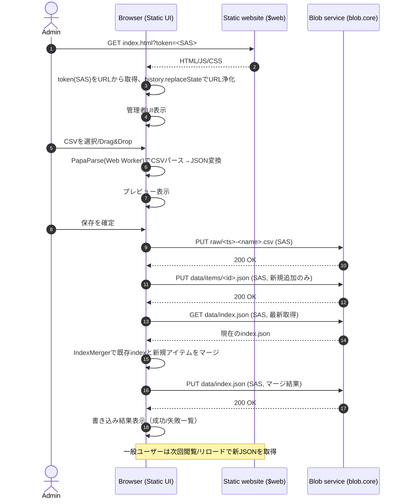

# Blob AccountによるStatic Web Site構築

## 背景

* ダッシュボード／ドリルダウン閲覧を提供する静的サイトを運用したい。
* 利用頻度が低く、常時稼働のDBやバックエンドを置くのはコスト・運用負荷に見合わない。
* 閲覧時UXを損ねたくない（バックエンド待ちやコールドスタートを避けたい）。
* 更新情報はCSVで与えられ、手作業の登録（Issue等）は避けたい。
* Azure Functions は配置ポリシー上 App Service プランのみで安価に使いづらい。
* 環境は専用線により閉域接続が成立しており、イントラ内からのみ利用する前提が取れる。
* 取り扱うデータは機密性が高くなく、SASのURL漏洩は重大問題としない（ただし過度な複雑化は避けたい）。

## 目的

1. **閲覧の安定UX**：静的配信のみで完結し、低頻度アクセスでも高速
2. **最小コスト／最小運用**：DB/常時稼働APIを持たない
3. **更新の省力化**：CSV投入→クライアント側で変換→JSON更新で反映
4. **シンプルな権限制御**：一般ユーザーは読み取りのみ、管理者は書き込み可能（SASで簡易分離）

## アーキテクチャ概要

* ホスティング：**Azure Blob Storage Static website（$web）**

  * 静的サイト本体（HTML/JS/CSS）
  * 描画用JSON（サイトからfetchしてレンダリング）
* 更新処理：**ブラウザJavaScriptのみ**

  * 管理者はSAS付きURLでアクセスし、SASを用いてBlobへPUT（追加）
  * 一般ユーザーはSASなしで読み取りのみ
* アクセス制御：**閉域（専用線）＋Storageネットワーク規則**を基本境界とする

### 技術スタック

| レイヤー | 選択 | 役割 |
|---------|------|------|
| フロントエンド | Vanilla JS（ES Modules） | UI・ロジック全般。ビルドツール不要、`$web` に直接配置可能 |
| CSVパーサー | PapaParse v5.x | Web Worker対応。ローカルファイルとして配置（CDN不使用、閉域対応） |
| テスト | Vitest + jsdom | ES Modulesネイティブ対応 |
| ホスティング | Azure Blob Storage | 静的サイトホスティング + Blob REST API |

## コンポーネントと責務

### 1) Azure Blob Storage（Static website）

* `$web/` に以下を格納

  * `index.html` / JS / CSS（UI）
  * `data/index.json`（一覧・集約）— **可変**、キャッシュバスター必須
  * `data/items/<id>.json`（詳細）— **不変**（追加のみ、上書き禁止）、ブラウザキャッシュ有効
  * `raw/<timestamp>-<name>.csv`（元データ保管）— **不変**（追記のみ）
* エンドポイントは2種類を使い分ける
  * **静的サイトエンドポイント**（`*.web.core.windows.net`）：一般ユーザーの匿名read
  * **Blobサービスエンドポイント**（`*.blob.core.windows.net`）：管理者のSAS付きPUT/GET

### 2) ブラウザ（一般ユーザー）

* 静的サイトエンドポイントから `data/index.json` 等を取得して画面をレンダリング
* `index.json` はキャッシュバスター（`?v=<timestamp>`）付きで常に最新を取得
* `items/<id>.json` は不変リソースとしてブラウザキャッシュを活用（キャッシュバスターなし）
* 管理者UIは非表示（SASトークンがないため AdminPanel が自動的に隠れる）

### 3) ブラウザ（管理者）

* 管理者向けに配布したURL：

  * `https://<site>/index.html?token=<SAS>`
* 初期化時に `token` パラメータからSASを抽出し、`history.replaceState` でURLから除去する
* `token`（SAS）を用いて **Blobサービスエンドポイント** に対し、以下の順序で書き込む

### リポジトリ構成

```
study-log/
├── frontend/
│   ├── dashboard/              # メインアプリケーション（React + Vite）
│   │   ├── index.html          # エントリ HTML（Vite が使用）
│   │   ├── vite.config.js      # Vite + React プラグイン設定
│   │   ├── playwright.config.js
│   │   ├── public/             # Vite の静的アセット（ビルド時に dist/ へコピーされる）
│   │   │   ├── css/style.css
│   │   │   └── data/           # index.json, sessions/*.json（開発用サンプルデータ）
│   │   ├── src/                # React アプリケーションソースコード
│   │   │   ├── components/     # FileDropZone, FileQueueList, PreviewArea, ProgressBar
│   │   │   ├── hooks/          # useAuth, useFileQueue
│   │   │   ├── pages/          # DashboardPage, MemberDetailPage, AdminPage
│   │   │   ├── services/       # DataFetcher, BlobWriter, IndexMerger, CsvTransformer
│   │   │   └── utils/          # formatDuration 等の共有ユーティリティ
│   │   ├── tests/              # Vitest ユニット／統合テスト
│   │   ├── e2e/                # Playwright E2E テスト
│   │   └── dist/               # ビルド成果物（git 管理外）
│   └── staticwebapp.config.json
├── backend/                    # Azure Functions（別機能、本ダッシュボードでは不使用）
├── .kiro/specs/                # 仕様書（要件・設計・タスク）
└── CLAUDE.md                   # AI 開発ガイドライン
```

## データ設計

### 配信用（閲覧用）

* `data/index.json`：ダッシュボードの一覧・集約

  ```json
  {
    "items": [
      { "id": "item-001", "title": "月次売上レポート", "summary": { "期間": "2026年1月", "売上合計": 1500000 } }
    ],
    "updatedAt": "2026-02-01T10:00:00+09:00"
  }
  ```

* `data/items/<id>.json`：ドリルダウン詳細（不変リソース）

  ```json
  {
    "id": "item-001",
    "title": "月次売上レポート",
    "data": { "期間": "2026年1月", "売上合計": 1500000, "件数": 42 }
  }
  ```

### 保管用（復元・監査用）

* `raw/<ISO8601>-<name>.csv`：投入された元CSVをそのまま保存

  * 失敗時の復元がしやすい
  * データの正当性確認や差分比較の材料になる

### データの可変性とキャッシュ戦略

| パス | 可変性 | キャッシュ |
|------|-------|-----------|
| `data/index.json` | 可変（上書き更新） | キャッシュバスター（`?v=<timestamp>`）必須 |
| `data/items/<id>.json` | 不変（追加のみ、上書き禁止） | ブラウザキャッシュ有効 |
| `raw/<ts>-<name>.csv` | 不変（追記のみ） | — |

## 処理フロー

### 閲覧フロー

1. ユーザーが `index.html` を開く
2. JavaScriptが `data/index.json?v=<timestamp>` を取得（キャッシュバスター付き）
3. 取得したJSONをダッシュボード一覧としてレンダリング
4. アイテム選択時に `data/items/<id>.json` を取得して詳細画面を表示（キャッシュ有効）
5. ハッシュベースルーティング（`#/`, `#/items/<id>`）で画面遷移を制御

### 更新フロー（管理者のみ）

1. 管理者が `index.html?token=<SAS>` でサイトを開く（ブックマーク運用）
2. AuthManagerがURLからSASトークンを抽出し、`history.replaceState` でURLから除去
3. 管理者UIが表示される（CSVアップロード領域）
4. CSVをファイル選択/Drag&Dropで受け取る
5. PapaParseがWeb Workerモードでパースし、JSON（DashboardItem + ItemDetail）に変換
6. 変換結果をプレビューテーブルで表示
7. 管理者が「保存を確定」すると、以下の**順序で**Blobに書き込む：
   1. `raw/<timestamp>-<name>.csv` — 元CSVの保管
   2. `data/items/<id>.json` — 新規詳細JSON（既存IDの上書きは行わない）
   3. `data/index.json` — **書き込み直前に最新版をGETし、IndexMergerでマージしてからPUT**
8. 書き込み結果（成功/失敗）をファイルごとに表示。失敗時はリトライボタンを提供
9. 一般ユーザーは次回アクセス/リロードで新JSONを取得して反映

## 更新時シーケンス（Mermaid）



## 前提条件：CORS設定

ブラウザからBlobサービスエンドポイントへのPUT/GETにはCORS設定が必要。

| 項目 | 設定値 |
|------|--------|
| AllowedOrigins | 静的サイトエンドポイントのURL |
| AllowedMethods | `PUT, GET, HEAD` |
| AllowedHeaders | `x-ms-blob-type, x-ms-blob-content-type, content-type, x-ms-version` |
| ExposedHeaders | `x-ms-meta-*` |

PUTリクエスト時のヘッダー：`x-ms-blob-type: BlockBlob`, `x-ms-version: 2025-01-05`

## セキュリティ（割り切りを含む）

* 一般ユーザーにはSASを配布しない（閲覧は匿名read）
* 管理者のみSASを配布し、更新はSASの権限で実施
* SASトークンはメモリ内のみに保持し、localStorage/sessionStorageには保存しない
* URLからのtoken除去は `history.replaceState` で必ず実施し、ブラウザ履歴への残存を防止
* SAS漏洩は重大問題としない前提だが、影響を局所化するために以下を推奨

  * Container SAS + Stored Access Policyの組み合わせで一括失効を可能にする
  * SASの権限は必要最小限（`Read + Write + Create`、`$web` コンテナ限定）
  * 有効期限は短めに設定し、期限切れ時に再配布する運用
  * HTTPS必須
* アカウント/コンテナの到達性は閉域（専用線）とStorageネットワーク規則で制御

## 非機能（性能・可用性）

* 閲覧：静的配信のみで高速・安定（バックエンド依存なし）
* キャッシュ：`items/<id>.json` の不変戦略により、2回目以降のドリルダウンはネットワークアクセスなし
* 更新：PapaParseのWeb Workerモードにより、大規模CSVでもUIスレッドをブロックしない
* 反映：JSON上書き後、次回アクセスまたはリロードで反映（即時通知はしない）

## 運用

* 管理者URL（SAS付き）の配布・更新（期限切れ時の再配布）
* JSON破損時の復旧：`raw/` のCSVから再生成（あるいは前世代JSONを復元）
* 更新は1名ずつ実施する運用ルール（同時更新の楽観的ロック制御はスコープ外）
* `index.json` の肥大化が進んだ場合はページネーション導入を検討

## トレードオフ

* サーバ側の検証・監査が弱く、データ品質はクライアント実装と運用に依存
* 同時更新が起きると上書き競合する可能性（運用ルールで回避。将来的にETag楽観的ロックを検討）
* `items` は不変のため、既存アイテムの修正にはIDを変えて新規追加する運用が必要
* URLにSASを入れる方式は漏洩に弱い（ただし閉域前提で許容）
