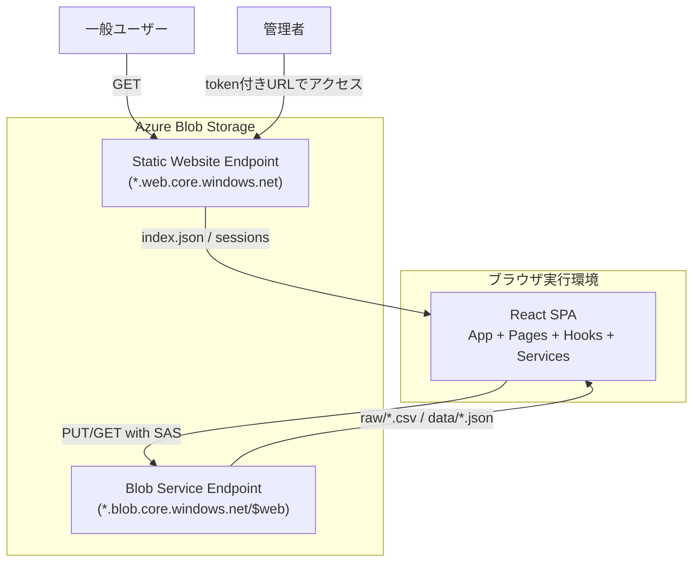
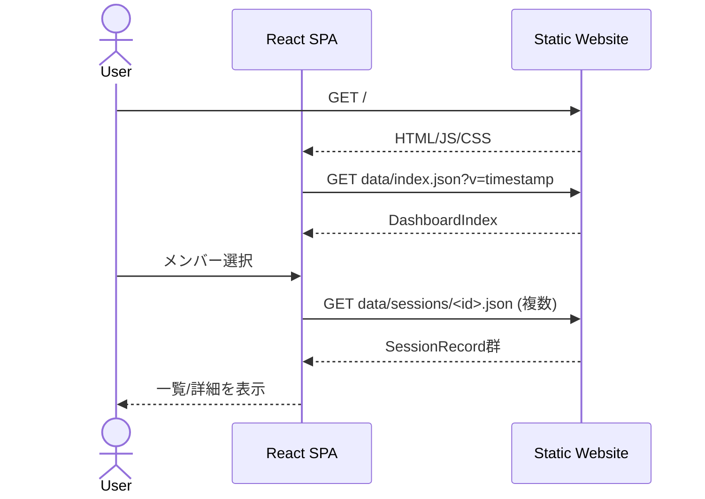
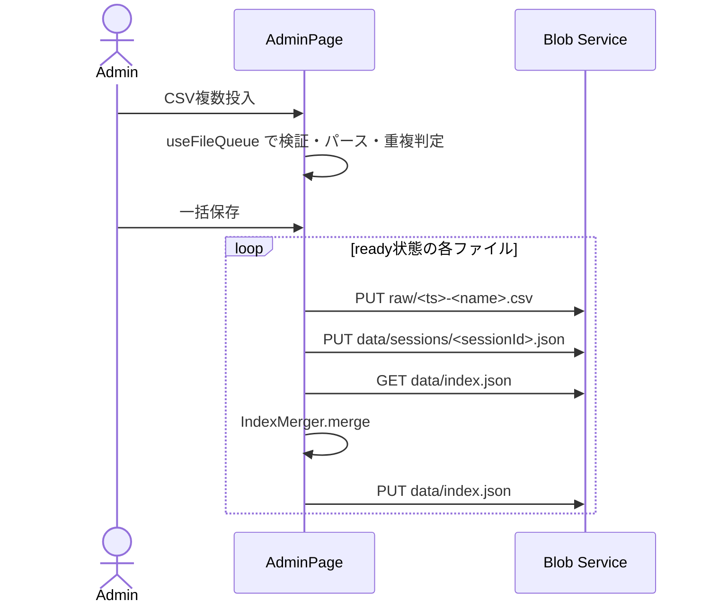

# Teams Board アーキテクチャ（現行実装）

## 1. 目的と前提

本ドキュメントは、Teams Board の**現在の実装**を基準に、構成・責務・データフロー・運用フローを整理したものです。  
対象は以下の2系統です。

- 閲覧系フロー（一般ユーザー）
- 管理者更新フロー（SASトークン付きブラウザ更新）

本システムは、Azure Blob Storage の静的サイト配信を中心に運用し、常時稼働バックエンドなしで成立する構成を採用しています。

### ホスティング選定の背景

Teams の出席情報は社内情報であるため、閉域ネットワーク内での低コスト運用が求められます。

| 候補                              | 評価                                                                                                                                   |
| --------------------------------- | -------------------------------------------------------------------------------------------------------------------------------------- |
| Azure Static Web Apps (SWA)       | パブリックネットワークへの接続が前提であり、ネットワークレベルのアクセス制御が困難                                                     |
| Azure App Service                 | VNet 統合にはBasic 以上のプランが必要で、低頻度利用に対してコストが見合わない                                                          |
| **Azure Blob Storage 静的サイト** | 静的コンテンツとデータを単一ストレージアカウントで管理でき、閉域網のアクセス制御が容易。従量課金のみで低頻度運用のコストを最小化できる |

## 2. システム境界

### 2.1 稼働境界

- フロントエンド: React SPA（`src/`）
- 配信基盤: Azure Blob Storage Static Website（`$web`）
- 更新書き込み先: Blob Service Endpoint（SAS必須）

## 3. 全体アーキテクチャ



## 4. フロントエンド構成（React SPA）

### 4.1 レイヤー構成

| レイヤー   | 主な実装                                                         | 責務                                |
| ---------- | ---------------------------------------------------------------- | ----------------------------------- |
| App        | `src/App.jsx`, `src/main.jsx`                                    | `AuthProvider` + ルーティング初期化 |
| Pages      | `DashboardPage`, `MemberDetailPage`, `AdminPage`                 | 画面単位のデータ取得・表示・操作    |
| Components | `FileDropZone`, `FileQueueCard`, `ProgressBar` など              | 再利用UI部品                        |
| Hooks      | `useAuth`, `useFileQueue`                                        | 認証状態・ファイルキュー状態管理    |
| Services   | `data-fetcher`, `csv-transformer`, `index-merger`, `blob-writer` | I/O とドメイン処理                  |
| Utils      | `format-duration`                                                | 表示フォーマット                    |

### 4.2 ルーティング

- `#/` : ダッシュボード
- `#/members/:memberId` : メンバー詳細
- `#/admin` : 管理画面（非管理者は `Navigate to="/"`）
- `*` : ダッシュボードへリダイレクト

### 4.3 認証・管理者モード

- URL クエリ `token` を `useAuth` が初回に抽出
- 抽出後は `history.replaceState` で URL から `token` を除去
- `isAdmin` が true の場合のみ管理導線を表示
- SAS はメモリ保持のみ（localStorage/sessionStorage 非使用）

## 5. データ契約

### 5.1 配信データ

- `data/index.json`（可変・集約）
- `data/sessions/<sessionId>.json`（不変・明細）

`index.json` 例:

```json
{
  "groups": [
    {
      "id": "52664958",
      "name": "フロントエンド勉強会",
      "totalDurationSeconds": 47105,
      "sessionIds": ["52664958-2026-02-06"]
    }
  ],
  "members": [
    {
      "id": "c6606539",
      "name": "Suzuki Taro A (鈴木 太郎)",
      "totalDurationSeconds": 29683,
      "sessionIds": ["52664958-2026-02-06"]
    }
  ],
  "updatedAt": "2026-02-06T07:52:50.022Z"
}
```

`sessions/<sessionId>.json` 例:

```json
{
  "id": "52664958-2026-02-06",
  "groupId": "52664958",
  "date": "2026-02-06",
  "attendances": [{ "memberId": "c6606539", "durationSeconds": 3645 }]
}
```

### 5.2 保管データ

- `raw/<timestamp>-<filename>.csv`（管理者更新時の原本保存）

### 5.3 キャッシュ戦略

| パス                      | 可変性   | 取得方法                   |
| ------------------------- | -------- | -------------------------- |
| `data/index.json`         | 可変     | `?v=<timestamp>` 付き GET  |
| `data/sessions/<id>.json` | 不変     | キャッシュバスターなし GET |
| `raw/*.csv`               | 追記のみ | 管理者 PUT のみ            |

## 6. ドメイン処理

### 6.1 CSV 変換（`CsvTransformer`）

- 入力: Teams 出席レポート CSV（UTF-16LE）
- 主な処理: `TextDecoder('utf-16le')` によるデコード、`1.要約/2.参加者/3.会議中...` のセクション分割、PapaParse による参加者TSV解析、時間文字列の秒正規化
- 出力: `sessionRecord`（保存用）、`mergeInput`（`IndexMerger` 入力）、`warnings`（不正行スキップ情報）

### 6.2 ID 生成規則

- `groupId`: クリーニング済み会議タイトルの SHA-256 先頭8桁
- `memberId`: メールアドレスの SHA-256 先頭8桁
- `sessionId`: `${groupId}-${YYYY-MM-DD}`

### 6.3 インデックス更新（`IndexMerger`）

- `groups` と `members` をイミュータブルに更新
- 重複 `sessionId` は警告扱いで追加しない
- `updatedAt` を更新

## 7. 実行フロー

### 7.1 閲覧フロー（一般ユーザー）



### 7.2 管理者更新フロー（ブラウザ）



## 8. デプロイと運用

### 8.1 CI/CD パイプライン

GitHub Actions（`.github/workflows/deploy.yml`）により、push 時に自動デプロイを実行する。

```
on: push

┌──────────┐    ┌──────────┐
│  test    │    │   lint   │   ← 並列実行
└────┬─────┘    └────┬─────┘
     └───────┬───────┘
         ┌───▼───┐
         │deploy │  ← 双方成功後にデプロイ
         └───────┘
```

| ブランチ | GitHub Environment | 用途     |
| -------- | ------------------ | -------- |
| `main`   | `prod`             | 本番環境 |
| その他   | `dev`              | 開発検証 |

- Azure 認証: OIDC（`azure/login@v2` + フェデレーション資格情報）
- ビルド成果物 `dist/` を `$web` コンテナにアップロード（`az storage blob upload-batch`）
- `data/*` は除外（コード配備時にデータを上書きしない）

#### ローカルデプロイ（手動）

- `scripts/Deploy-StaticFiles.ps1`（`.env` ベースの認証情報で同等の処理を実行）

### 8.2 インフラ管理

ストレージアカウントの初期設定として、以下の3項目を Azure CLI で構成する必要がある。

#### 静的サイト有効化

```bash
az storage blob service-properties update \
  --account-name <ACCOUNT_NAME> \
  --static-website --index-document index.html
```

#### Blob CORS 設定

管理者更新フロー（`BlobWriter`）は Static Website Endpoint（`*.web.core.windows.net`）から Blob Service Endpoint（`*.blob.core.windows.net`）へクロスオリジンリクエストを送信する。PUT リクエストは `x-ms-blob-type` / `x-ms-version` ヘッダーを含むため、CORS プリフライト（OPTIONS）が必須となる。

```bash
az storage cors add \
  --services b \
  --methods GET PUT HEAD OPTIONS \
  --origins "https://<ACCOUNT_NAME>.z11.web.core.windows.net" \
  --allowed-headers "Content-Type,x-ms-blob-type,x-ms-version" \
  --exposed-headers "Content-Length,ETag" \
  --max-age 3600 \
  --account-name <ACCOUNT_NAME>
```

| 項目                | 値                                         | 理由                                                            |
| ------------------- | ------------------------------------------ | --------------------------------------------------------------- |
| `--methods`         | `GET PUT HEAD OPTIONS`                     | データ取得（GET）、Blob書き込み（PUT）、プリフライト（OPTIONS） |
| `--origins`         | Static Website Endpoint                    | SPA のオリジン。環境ごとに異なる                                |
| `--allowed-headers` | `Content-Type,x-ms-blob-type,x-ms-version` | `BlobWriter.#putBlob()` が送信するヘッダー                      |

> **注意**: CORS が未設定の場合、管理者のファイルアップロードは「Response to preflight request doesn't pass access control check」エラーで失敗する。

#### Stored Access Policy 設定

管理者用 SAS トークンは `$web` コンテナの Stored Access Policy に紐づける。ポリシーが存在しない場合、SAS トークンは `SAS identifier cannot be found` エラーで無効となる。

```bash
az storage container policy create \
  --container-name '$web' \
  --name dashboard-admin \
  --permissions rwdl \
  --expiry <YYYY-MM-DDTHH:MM:SSZ> \
  --account-name <ACCOUNT_NAME> \
  --account-key <ACCOUNT_KEY>
```

| ポリシー名        | 権限                                     | 用途                              |
| ----------------- | ---------------------------------------- | --------------------------------- |
| `dashboard-admin` | `rwdl`（読み取り・書き込み・削除・一覧） | CSV アップロード・index.json 更新 |

> **注意**: `$web` コンテナ名に `$` が含まれるため、シェル変数展開に注意が必要。Node.js の `execFile` では文字列リテラルとして安全に渡される。

### 8.3 運用支援スクリプト

- `scripts/new-sas-token.mjs`: Stored Access Policy に紐づく SAS トークンを生成し、管理者用 URL を出力する
- `scripts/clear-data.mjs`: `data/sessions` 削除 + `data/index.json` 初期化
- `scripts/show-urls.mjs`: デプロイ済みの静的サイト URL を表示

## 9. セキュリティ方針（現行実装）

- 閲覧: 静的サイトエンドポイントから匿名 GET
- 更新: SAS 付き Blob Service Endpoint への PUT/GET
- トークン取り扱い: URL から即時除去し、メモリ内のみで保持
- CORS: Static Website Endpoint → Blob Service Endpoint 間で `GET, PUT, HEAD, OPTIONS` を許可（8.2 節参照）
- SAS トークン: Stored Access Policy（`dashboard-admin`）に紐づくコンテナ SAS を使用。ポリシーの有効期限と権限をサーバー側で一元管理可能

補足: `staticwebapp.config.json` は Azure Static Web Apps 向け設定であり、Blob Static Website 単体運用では適用されません。

## 10. 技術スタック

| 要素           | 選択                           | 理由                                       |
| -------------- | ------------------------------ | ------------------------------------------ |
| フレームワーク | React 19 + ReactDOM 19         | 宣言的 UI による保守性向上                 |
| ビルドツール   | Vite + @vitejs/plugin-react    | HMR、高速ビルド、JSX 変換                  |
| ルーティング   | react-router-dom（HashRouter） | SPA ハッシュベースルーティング             |
| CSV パーサー   | PapaParse                      | Teams 出席レポートの UTF-16LE CSV 解析     |
| CI/CD          | GitHub Actions + OIDC          | push 時自動デプロイ、環境別配置            |
| ユニットテスト | Vitest + React Testing Library | jsdom 環境、コンポーネントテスト           |
| E2E テスト     | Playwright                     | ブラウザベースの画面遷移・管理者フロー検証 |
| Lint           | ESLint + Prettier              | コード品質・フォーマット統一               |
| ホスティング   | Azure Blob Storage 静的サイト  | 最小コスト、閉域環境対応                   |

## 11. テスト構成

- 単体/結合: Vitest + jsdom（`tests/data`, `tests/logic`, `tests/react`）
- 画面E2E: Playwright（`e2e`）

## 12. 既知の制約

- `AdminPage` の `BLOB_BASE_URL` はコード内固定値
- 同時更新の排他制御はアプリ側で未実装（最終書き込み勝ち）
- `memberId` はメール依存のため、メール欠落時は識別精度が低下

## 13. ディレクトリ要約

```text
teams-board/
├── src/                                 # React SPA
│   ├── components/                      # UIコンポーネント
│   ├── pages/                           # 画面コンポーネント
│   ├── hooks/                           # カスタムHook
│   ├── services/                        # ビジネスロジック層
│   └── utils/                           # ユーティリティ
├── tests/                               # ユニット・統合テスト
├── e2e/                                 # E2Eテスト
├── public/data/                         # 配信データ（ローカル）
├── scripts/                             # Azure運用スクリプト（ローカル用）
├── .github/workflows/                   # CI/CD ワークフロー
├── docs/                                # ドキュメント
└── .kiro/                               # スペック駆動開発設定
```
