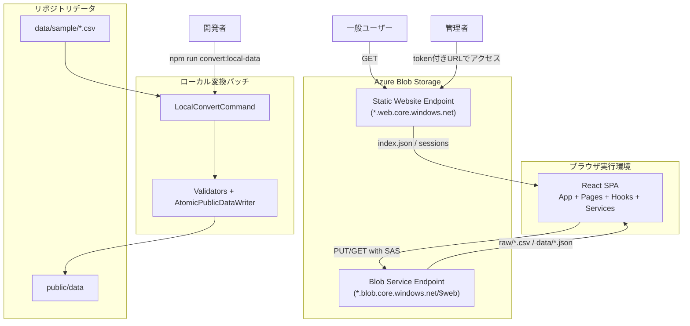
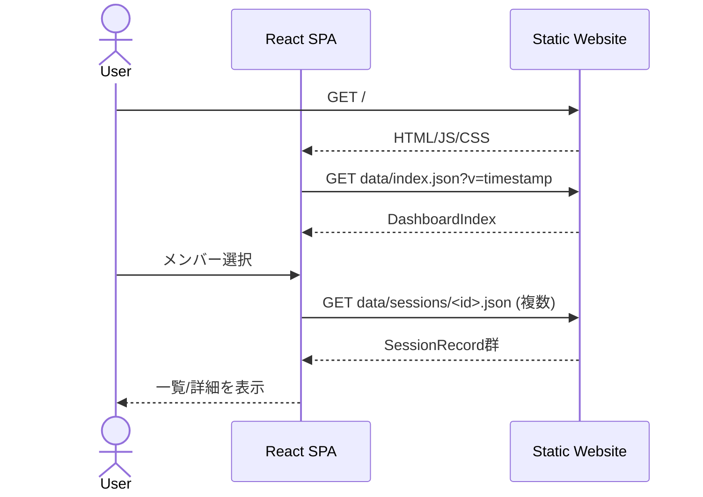
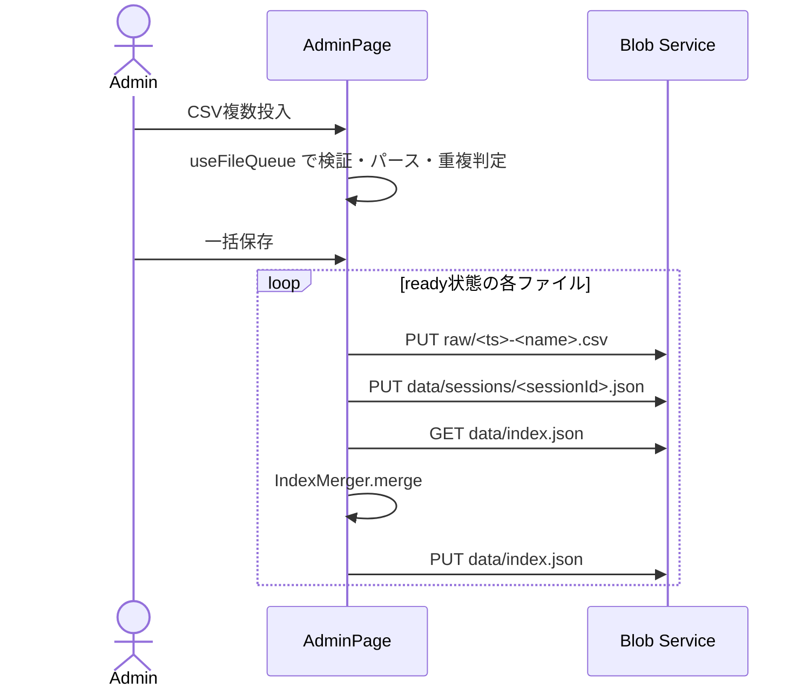
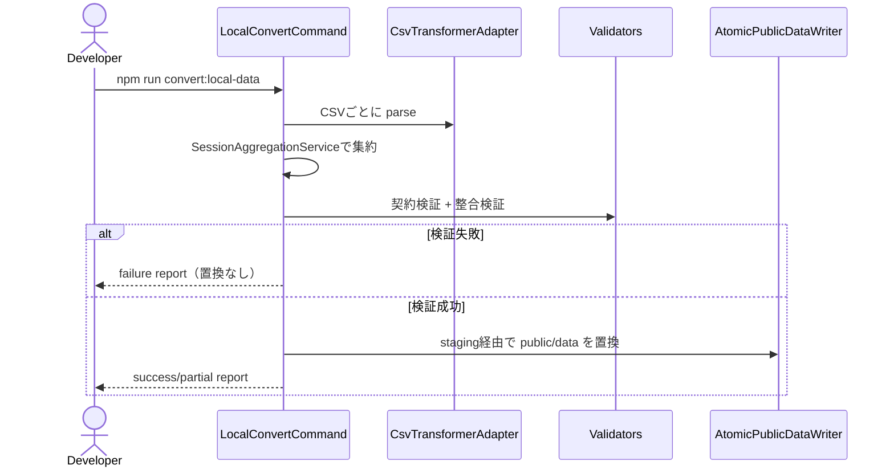

# Study Log アーキテクチャ（現行実装）

## 1. 目的と前提

本ドキュメントは、`study-log` の**現在の実装**を基準に、構成・責務・データフロー・運用フローを整理したものです。  
対象は以下の3系統です。

- 閲覧系フロー（一般ユーザー）
- 管理者更新フロー（SASトークン付きブラウザ更新）
- ローカル変換フロー（`data/sample` → `public/data` の検証付き置換）

本システムは、Azure Blob Storage の静的サイト配信を中心に運用し、常時稼働バックエンドなしで成立する構成を採用しています。

## 2. システム境界

### 2.1 稼働境界

- フロントエンド: React SPA（`src/`）
- 配信基盤: Azure Blob Storage Static Website（`$web`）
- 更新書き込み先: Blob Service Endpoint（SAS必須）
- ローカル変換: Node.js バッチ（`src/local-batch/`）

## 3. 全体アーキテクチャ



## 4. フロントエンド構成（React SPA）

### 4.1 レイヤー構成

| レイヤー | 主な実装 | 責務 |
|---|---|---|
| App | `src/App.jsx`, `src/main.jsx` | `AuthProvider` + ルーティング初期化 |
| Pages | `DashboardPage`, `MemberDetailPage`, `AdminPage` | 画面単位のデータ取得・表示・操作 |
| Components | `FileDropZone`, `FileQueueCard`, `ProgressBar` など | 再利用UI部品 |
| Hooks | `useAuth`, `useFileQueue` | 認証状態・ファイルキュー状態管理 |
| Services | `data-fetcher`, `csv-transformer`, `index-merger`, `blob-writer` | I/O とドメイン処理 |
| Utils | `format-duration` | 表示フォーマット |

### 4.2 ルーティング

- `#/` : ダッシュボード
- `#/members/:memberId` : メンバー詳細
- `#/admin` : 管理画面（非管理者は `Navigate to="/"`）
- `*` : ダッシュボードへリダイレクト

### 4.3 認証・管理者モード

- URL クエリ `token` を `useAuth` が初回に抽出
- 抽出後は `history.replaceState` で URL から `token` を除去
- `isAdmin` が true の場合のみ管理導線を表示
- SAS はメモリ保持のみ（localStorage/sessionStorage 非使用）

## 5. データ契約

### 5.1 配信データ

- `data/index.json`（可変・集約）
- `data/sessions/<sessionId>.json`（不変・明細）

`index.json` 例:

```json
{
  "studyGroups": [
    {
      "id": "52664958",
      "name": "もくもく勉強会",
      "totalDurationSeconds": 47105,
      "sessionIds": ["52664958-2026-02-06"]
    }
  ],
  "members": [
    {
      "id": "c6606539",
      "name": "Nakamura Atsushi A (中村 充志)",
      "totalDurationSeconds": 29683,
      "sessionIds": ["52664958-2026-02-06"]
    }
  ],
  "updatedAt": "2026-02-06T07:52:50.022Z"
}
```

`sessions/<sessionId>.json` 例:

```json
{
  "id": "52664958-2026-02-06",
  "studyGroupId": "52664958",
  "date": "2026-02-06",
  "attendances": [
    { "memberId": "c6606539", "durationSeconds": 3645 }
  ]
}
```

### 5.2 保管データ

- `raw/<timestamp>-<filename>.csv`（管理者更新時の原本保存）

### 5.3 キャッシュ戦略

| パス | 可変性 | 取得方法 |
|---|---|---|
| `data/index.json` | 可変 | `?v=<timestamp>` 付き GET |
| `data/sessions/<id>.json` | 不変 | キャッシュバスターなし GET |
| `raw/*.csv` | 追記のみ | 管理者 PUT のみ |

## 6. ドメイン処理

### 6.1 CSV 変換（`CsvTransformer`）

- 入力: Teams 出席レポート CSV（UTF-16LE）
- 主な処理: `TextDecoder('utf-16le')` によるデコード、`1.要約/2.参加者/3.会議中...` のセクション分割、PapaParse による参加者TSV解析、時間文字列の秒正規化
- 出力: `sessionRecord`（保存用）、`mergeInput`（`IndexMerger` 入力）、`warnings`（不正行スキップ情報）

### 6.2 ID 生成規則

- `studyGroupId`: クリーニング済み会議タイトルの SHA-256 先頭8桁
- `memberId`: メールアドレスの SHA-256 先頭8桁
- `sessionId`: `${studyGroupId}-${YYYY-MM-DD}`

### 6.3 インデックス更新（`IndexMerger`）

- `studyGroups` と `members` をイミュータブルに更新
- 重複 `sessionId` は警告扱いで追加しない
- `updatedAt` を更新

## 7. 実行フロー

### 7.1 閲覧フロー（一般ユーザー）



### 7.2 管理者更新フロー（ブラウザ）



### 7.3 ローカル変換フロー（開発者）



## 8. デプロイと運用

### 8.1 デプロイサイクル分離

- `scripts/infra/Deploy-StaticFiles.ps1`
- `dist/` を `$web` にアップロード
- `data/*` は除外（コード配備時にデータを上書きしない）

### 8.2 インフラ管理

- `scripts/infra/Deploy-Infrastructure.ps1`
- 静的サイト有効化
- Blob CORS 設定
- Stored Access Policy 設定
- ネットワーク規則（`DefaultAction Deny`）適用

### 8.3 運用支援スクリプト

- `scripts/infra/New-SasToken.ps1`: 管理者用 URL 発行
- `scripts/infra/Clear-StudyData.ps1`: `data/sessions` 削除 + `data/index.json` 初期化
- `scripts/convert-local-data.mjs`: ローカル変換実行

## 9. セキュリティ方針（現行実装）

- 閲覧: 静的サイトエンドポイントから匿名 GET
- 更新: SAS 付き Blob Service Endpoint への PUT/GET
- トークン取り扱い: URL から即時除去し、メモリ内のみで保持
- CORS: `GET, PUT, HEAD` と `x-ms-blob-type`, `x-ms-version` などを許可

補足: `staticwebapp.config.json` は Azure Static Web Apps 向け設定であり、Blob Static Website 単体運用では適用されません。

## 10. テスト構成

- 単体/結合: Vitest + jsdom（`tests/data`, `tests/logic`, `tests/react`, `tests/local-batch`）
- 画面E2E: Playwright（`e2e`）
- ローカル変換検証: `local-batch` の統合テストで契約検証・整合検証・原子的置換を確認

## 11. 既知の制約

- `AdminPage` の `BLOB_BASE_URL` はコード内固定値
- 同時更新の排他制御はアプリ側で未実装（最終書き込み勝ち）
- `memberId` はメール依存のため、メール欠落時は識別精度が低下

## 12. ディレクトリ要約

```text
study-log/
├── src/                                 # React SPA + ローカルバッチ
│   ├── components/                      # UIコンポーネント
│   ├── pages/                           # 画面コンポーネント
│   ├── hooks/                           # カスタムHook
│   ├── services/                        # ビジネスロジック層
│   ├── utils/                           # ユーティリティ
│   └── local-batch/                     # ローカル変換パイプライン
├── tests/                               # ユニット・統合テスト
├── e2e/                                 # E2Eテスト
├── public/data/                         # 配信データ（ローカル）
├── data/sample/                         # ローカル変換入力CSV
├── scripts/
│   ├── convert-local-data.mjs           # ローカル変換実行
│   └── infra/                           # Azure運用スクリプト
├── docs/                                # ドキュメント
└── .kiro/                               # スペック駆動開発設定
```
