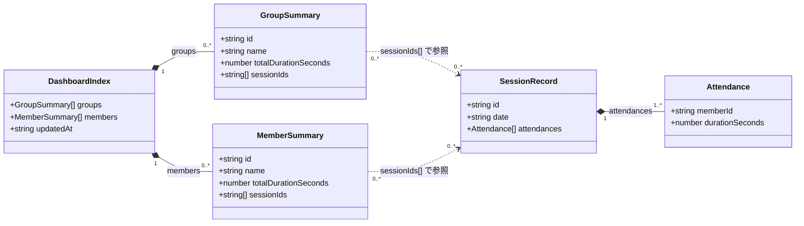

# データモデル（現行仕様）

## 背景（Issue #136）

Issue #136 の検討では、既存データモデルが次の課題を持つことを確認した。

- `sessionId` の構造（`<groupId>-<date>`）に業務意味が入り、Group と Session の関係が ID 形式に強く依存していた
- セッション名変更時に同一 `session.json` を上書きするため、キャッシュ整合と参照整合の扱いが複雑化していた
- `index.json` に派生情報を多く持つと、更新時の置換箇所が増えやすく、整合性維持コストが高くなる

このため、本書後半の改善案では「後方互換性を考慮しない」前提で、データ構造を単純化する方針を採用した。

## 検討結果の概略

- ID は `groupId` / `memberId` / `sessionId` を ULID に統一する
- Session は `sessionId` 固定 + `revision`（0 始まり整数）で版管理する
- `session.json` は `data/sessions/<sessionId>/<revision>.json` に追記保存し、既存ファイルを上書きしない
- `index.json` は `groups[]` / `members[]` が `sessionRevisions`（`<sessionId>/<revision>`）を保持する
- 重複判定は行わない
- 更新整合の要点は `index.json` の楽観ロック（`version` インクリメント）に集約する

## 1. 目的

本書は、Teams Board が現在扱っている永続データ構造を整理するための仕様メモである。  
主な対象は `data/index.json` と `data/sessions/*.json`。

## 2. クラス図



## 3. 属性定義

### 3.1 DashboardIndex（`data/index.json`）

| 属性 | 型 | 必須 | 説明 | 制約・備考 |
| --- | --- | --- | --- | --- |
| `groups` | `GroupSummary[]` | 必須 | 会議グループ集約の一覧 | 配列要素は `id` 一意を想定 |
| `members` | `MemberSummary[]` | 必須 | メンバー集約の一覧 | 配列要素は `id` 一意を想定 |
| `updatedAt` | `string` | 必須 | 最終更新日時 | ISO 8601 形式（例: `2026-02-11T00:00:00.000Z`） |

### 3.2 GroupSummary

| 属性 | 型 | 必須 | 説明 | 制約・備考 |
| --- | --- | --- | --- | --- |
| `id` | `string` | 必須 | 会議グループID | 会議タイトルの SHA-256 先頭 8 桁（hex） |
| `name` | `string` | 必須 | 会議グループ名 | CSV 取込時の正規化済み会議タイトル |
| `totalDurationSeconds` | `number` | 必須 | グループ累計参加秒数 | 0 以上の整数 |
| `sessionIds` | `string[]` | 必須 | グループに属するセッションID一覧 | `SessionRecord.id` を参照 |

### 3.3 MemberSummary

| 属性 | 型 | 必須 | 説明 | 制約・備考 |
| --- | --- | --- | --- | --- |
| `id` | `string` | 必須 | メンバーID | メールアドレスの SHA-256 先頭 8 桁（hex） |
| `name` | `string` | 必須 | 表示名 | CSV の参加者名 |
| `totalDurationSeconds` | `number` | 必須 | メンバー累計参加秒数 | 0 以上の整数 |
| `sessionIds` | `string[]` | 必須 | 参加したセッションID一覧 | `SessionRecord.id` を参照 |

### 3.4 SessionRecord（`data/sessions/<sessionId>.json`）

| 属性 | 型 | 必須 | 説明 | 制約・備考 |
| --- | --- | --- | --- | --- |
| `id` | `string` | 必須 | セッションID | `<groupId>-<YYYY-MM-DD>` 形式 |
| `date` | `string` | 必須 | 開催日 | `YYYY-MM-DD` |
| `attendances` | `Attendance[]` | 必須 | 参加明細一覧 | 1件以上を想定 |

### 3.5 Attendance

| 属性 | 型 | 必須 | 説明 | 制約・備考 |
| --- | --- | --- | --- | --- |
| `memberId` | `string` | 必須 | 参加メンバーID | `MemberSummary.id` を参照 |
| `durationSeconds` | `number` | 必須 | 参加秒数 | 0 以上の整数 |

## 4. 参照整合ルール（現行）

| ルール | 説明 |
| --- | --- |
| セッション参照 | `groups[].sessionIds[]` / `members[].sessionIds[]` は `sessions/*.json` の `id` を参照する |
| グループ所属 | `SessionRecord` は `groupId` を明示保持せず、`id` の prefix から導出する |
| 重複制御 | `IndexMerger` は既存 `sessionId` を検出した場合、集約更新をスキップして warning を返す |
| 更新日時 | `index.json` 更新時に `updatedAt` を現在時刻で更新する |

## 5. 改善案サンプル（後方互換なし / sessionRefs なし）

### 5.1 前提

- すべての ID は ULID を使用する（`groupId` / `memberId` / `sessionId`）
- `sessionId` は会議実体の固定 ID、`revision` は保存版番号（`0` 始まり整数インクリメント）
- 重複判定は行わない
- `groups` と `members` は `sessionRevisions`（`<sessionId>/<revision>` 文字列配列）を持つ
- 別名変更時は既存ファイルを上書きせず、`revision` を増分した `session.json` を追加保存する
- `index.json` は `version` を整数インクリメントして楽観ロックする

### 5.2 `index.json` 例

```json
{
  "schemaVersion": 2,
  "version": 42,
  "updatedAt": "2026-02-17T09:30:00.000Z",
  "groups": [
    {
      "id": "01K2K5K3PXW7CSMMAZ5X6VG5Q1",
      "name": "フロントエンド勉強会",
      "totalDurationSeconds": 12420,
      "sessionRevisions": [
        "01K2K5R30YQWQ4YET5M8Q0M2J0/1",
        "01K2K62G6Q2W3WB8M87J4J96MM/0"
      ]
    }
  ],
  "members": [
    {
      "id": "01K2K5N62DRBQ3DVQTV3EWM0BZ",
      "name": "佐藤 一郎",
      "totalDurationSeconds": 7020,
      "sessionRevisions": [
        "01K2K5R30YQWQ4YET5M8Q0M2J0/1",
        "01K2K62G6Q2W3WB8M87J4J96MM/0"
      ]
    },
    {
      "id": "01K2K5P4XVEJ6SZ1NY80HC84YQ",
      "name": "鈴木 花子",
      "totalDurationSeconds": 5400,
      "sessionRevisions": [
        "01K2K5R30YQWQ4YET5M8Q0M2J0/1"
      ]
    }
  ]
}
```

### 5.3 `data/sessions/<sessionId>/<revision>.json` 例

```json
{
  "sessionId": "01K2K5R30YQWQ4YET5M8Q0M2J0",
  "revision": 1,
  "title": "第1回キックオフ",
  "startedAt": "2026-02-17T10:00:00+09:00",
  "endedAt": "2026-02-17T11:00:00+09:00",
  "attendances": [
    {
      "memberId": "01K2K5N62DRBQ3DVQTV3EWM0BZ",
      "durationSeconds": 3420
    },
    {
      "memberId": "01K2K5P4XVEJ6SZ1NY80HC84YQ",
      "durationSeconds": 5400
    }
  ],
  "createdAt": "2026-02-17T09:10:00.000Z"
}
```

補足：

- `title` の初期値は空文字とし、名称変更機能で値を設定する
- `session.json` は更新しない前提のため、`updatedAt` は持たない
- `groupId` は `session.json` では持たず、`index.json` 側の所属情報で解決する

### 5.4 保存順序サンプル

1. `revision` を +1 した `session.json` を保存する  
2. `index.json` の `groups[].sessionRevisions[]` と `members[].sessionRevisions[]` の対象キーを置換する  
3. `index.json` の `version` を +1 して保存する  
4. 旧 `revision` の `session.json` は削除しない

### 5.5 `sessionRevisions` 方式の特徴

| 観点 | 内容 |
| --- | --- |
| 構造の単純さ | 参照テーブルを作らず、グループ/メンバーの配列だけで参照できる |
| 取得のしやすさ | 参照キー（`sessionId/revision`）から `session.json` のパスを直接組み立てられる |
| 更新コスト | 別名変更時は `groups` と `members` の両方で参照キー置換が必要 |
| 整合性管理 | 整合性の要は `index.json` の更新成功に集約される |
