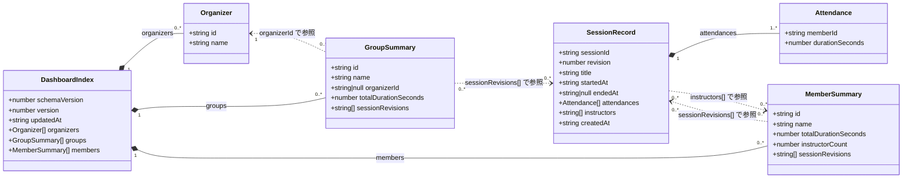

# データモデル

## 1. 目的

本書は、Teams Board が扱う永続データ構造の仕様を定義する。
主な対象は `data/index.json` と `data/sessions/<sessionId>/<revision>.json` である。

### 1.1 設計方針

- すべての ID（`groupId` / `memberId` / `sessionId`）は ULID を使用する
- セッションは `sessionId`（固定）+ `revision`（0 始まり整数）で版管理する
- セッション JSON は `data/sessions/<sessionId>/<revision>.json` に追記保存し、既存ファイルを上書きしない
- `index.json` は `groups[]` / `members[]` が `sessionRevisions`（`<sessionId>/<revision>` 文字列配列）を保持する
- 重複判定は行わない
- 更新整合は `index.json` の楽観ロック（`version` インクリメント）に集約する

## 2. クラス図



## 3. 属性定義

### 3.1 DashboardIndex（`data/index.json`）

| 属性 | 型 | 必須 | 説明 | 制約・備考 |
| --- | --- | --- | --- | --- |
| `schemaVersion` | `number` | 必須 | スキーマバージョン | 固定値 `2` |
| `version` | `number` | 必須 | 楽観ロック用バージョン | 0 始まりの整数。更新のたびにインクリメントする |
| `updatedAt` | `string` | 必須 | 最終更新日時 | ISO 8601 形式（例: `2026-02-17T09:30:00.000Z`） |
| `organizers` | `Organizer[]` | 必須 | 主催者の一覧 | 配列要素は `id` 一意 |
| `groups` | `GroupSummary[]` | 必須 | 会議グループ集約の一覧 | 配列要素は `id` 一意 |
| `members` | `MemberSummary[]` | 必須 | メンバー集約の一覧 | 配列要素は `id` 一意 |

### 3.2 Organizer

| 属性 | 型 | 必須 | 説明 | 制約・備考 |
| --- | --- | --- | --- | --- |
| `id` | `string` | 必須 | 主催者 ID | ULID（26 文字） |
| `name` | `string` | 必須 | 主催者名 | 組織名や部署名など |

### 3.3 GroupSummary

| 属性 | 型 | 必須 | 説明 | 制約・備考 |
| --- | --- | --- | --- | --- |
| `id` | `string` | 必須 | 会議グループ ID | ULID（26 文字） |
| `name` | `string` | 必須 | 会議グループ名 | CSV 取込時の正規化済み会議タイトル。名前ベースで既存グループとマッチングする |
| `organizerId` | `string \| null` | 必須 | 主催者 ID | `Organizer.id`（ULID）を参照。未設定の場合は `null` |
| `totalDurationSeconds` | `number` | 必須 | グループ累計参加秒数 | 0 以上の整数 |
| `sessionRevisions` | `string[]` | 必須 | グループに属するセッション参照一覧 | `<sessionId>/<revision>` 形式 |

### 3.4 MemberSummary

| 属性 | 型 | 必須 | 説明 | 制約・備考 |
| --- | --- | --- | --- | --- |
| `id` | `string` | 必須 | メンバー ID | ULID（26 文字） |
| `name` | `string` | 必須 | 表示名 | CSV の参加者名。名前ベースで既存メンバーとマッチングする |
| `totalDurationSeconds` | `number` | 必須 | メンバー累計参加秒数 | 0 以上の整数 |
| `instructorCount` | `number` | 必須 | 講師担当回数 | 0 以上の整数。セッションの `instructors[]` で指定された回数の集計値 |
| `sessionRevisions` | `string[]` | 必須 | 参加したセッション参照一覧 | `<sessionId>/<revision>` 形式 |

### 3.5 SessionRecord（`data/sessions/<sessionId>/<revision>.json`）

| 属性 | 型 | 必須 | 説明 | 制約・備考 |
| --- | --- | --- | --- | --- |
| `sessionId` | `string` | 必須 | セッション ID | ULID（26 文字）。全リビジョンで共通の固定値 |
| `revision` | `number` | 必須 | リビジョン番号 | 0 始まりの整数 |
| `title` | `string` | 必須 | セッションタイトル | 初期値は空文字。名称変更機能で設定する |
| `startedAt` | `string` | 必須 | 開始日時 | ISO 8601 形式 |
| `endedAt` | `string \| null` | 必須 | 終了日時 | ISO 8601 形式。未設定の場合は `null` |
| `attendances` | `Attendance[]` | 必須 | 参加明細一覧 | 1 件以上 |
| `instructors` | `string[]` | 必須 | 講師メンバー ID 一覧 | `MemberSummary.id`（ULID）を参照。講師がいない場合は空配列 |
| `createdAt` | `string` | 必須 | 作成日時 | ISO 8601 形式 |

補足：

- セッション JSON は追記のみで更新しないため、`updatedAt` は持たない
- `groupId` はセッション JSON では持たず、`index.json` 側の所属情報で解決する

### 3.6 Attendance

| 属性 | 型 | 必須 | 説明 | 制約・備考 |
| --- | --- | --- | --- | --- |
| `memberId` | `string` | 必須 | 参加メンバー ID | `MemberSummary.id`（ULID）を参照 |
| `durationSeconds` | `number` | 必須 | 参加秒数 | 0 以上の整数 |

## 4. 参照整合ルール

| ルール | 説明 |
| --- | --- |
| セッション参照 | `groups[].sessionRevisions[]` / `members[].sessionRevisions[]` は `data/sessions/<sessionId>/<revision>.json` を参照する |
| パス導出 | 参照キー `<sessionId>/<revision>` から保存パス `data/sessions/<sessionId>/<revision>.json` を直接組み立てる |
| グループ所属 | `SessionRecord` は `groupId` を持たず、`index.json` の `groups[].sessionRevisions[]` で所属を解決する |
| 主催者参照 | `groups[].organizerId` は `organizers[].id` を参照する。`null` の場合は主催者未設定を意味する |
| 講師参照 | `SessionRecord.instructors[]` は `members[].id` を参照する。指定されたメンバーはそのセッションの講師として記録される |
| 講師集計 | `members[].instructorCount` は `sessions` 全体で当該メンバーが `instructors[]` に含まれる回数の集計値である |
| 楽観ロック | `index.json` の `version` フィールドで競合を検出する。書き込み前に最新の `version` を確認し、不一致の場合は更新を中止する |
| 更新日時 | `index.json` 更新時に `updatedAt` を現在時刻で更新する |

## 5. 保存順序

セッション追加・更新時は、以下の順序で保存する。

1. 新しいリビジョンのセッション JSON を `data/sessions/<sessionId>/<revision>.json` に保存する
2. `index.json` の `groups[].sessionRevisions[]` と `members[].sessionRevisions[]` の対象キーを置換する
3. `index.json` の `version` を +1 して保存する
4. 旧リビジョンのセッション JSON は削除しない

この順序により、セッション JSON が先に永続化されてから `index.json` が更新されるため、中断時にもデータの不整合を最小化できる。

### `sessionRevisions` 方式の特徴

| 観点 | 内容 |
| --- | --- |
| 構造の単純さ | 参照テーブルを作らず、グループ/メンバーの配列だけで参照できる |
| 取得のしやすさ | 参照キー（`<sessionId>/<revision>`）から保存パスを直接組み立てられる |
| 更新コスト | 別名変更時は `groups` と `members` の両方で参照キー置換が必要 |
| 整合性管理 | 整合性の要は `index.json` の `version` による楽観ロックに集約される |

## 6. JSON 例

### 6.1 `index.json`

```json
{
  "schemaVersion": 2,
  "version": 42,
  "updatedAt": "2026-02-17T09:30:00.000Z",
  "organizers": [
    {
      "id": "01K2K5J1ABCD1234EFGH5678IJ",
      "name": "フロントエンド推進室"
    }
  ],
  "groups": [
    {
      "id": "01K2K5K3PXW7CSMMAZ5X6VG5Q1",
      "name": "フロントエンド勉強会",
      "organizerId": "01K2K5J1ABCD1234EFGH5678IJ",
      "totalDurationSeconds": 12420,
      "sessionRevisions": [
        "01K2K5R30YQWQ4YET5M8Q0M2J0/1",
        "01K2K62G6Q2W3WB8M87J4J96MM/0"
      ]
    }
  ],
  "members": [
    {
      "id": "01K2K5N62DRBQ3DVQTV3EWM0BZ",
      "name": "佐藤 一郎",
      "totalDurationSeconds": 7020,
      "instructorCount": 2,
      "sessionRevisions": [
        "01K2K5R30YQWQ4YET5M8Q0M2J0/1",
        "01K2K62G6Q2W3WB8M87J4J96MM/0"
      ]
    },
    {
      "id": "01K2K5P4XVEJ6SZ1NY80HC84YQ",
      "name": "鈴木 花子",
      "totalDurationSeconds": 5400,
      "instructorCount": 0,
      "sessionRevisions": [
        "01K2K5R30YQWQ4YET5M8Q0M2J0/1"
      ]
    }
  ]
}
```

### 6.2 `data/sessions/<sessionId>/<revision>.json`

```json
{
  "sessionId": "01K2K5R30YQWQ4YET5M8Q0M2J0",
  "revision": 1,
  "title": "第1回キックオフ",
  "startedAt": "2026-02-17T10:00:00+09:00",
  "endedAt": "2026-02-17T11:00:00+09:00",
  "attendances": [
    {
      "memberId": "01K2K5N62DRBQ3DVQTV3EWM0BZ",
      "durationSeconds": 3420
    },
    {
      "memberId": "01K2K5P4XVEJ6SZ1NY80HC84YQ",
      "durationSeconds": 5400
    }
  ],
  "instructors": ["01K2K5N62DRBQ3DVQTV3EWM0BZ"],
  "createdAt": "2026-02-17T09:10:00.000Z"
}
```

---

## 付録: 参考（過去仕様 V1）

以下は V2 導入以前の旧データモデルである。現在は使用されていない。

### V1 の ID 体系

- `groupId`: 会議タイトルの SHA-256 先頭 8 桁（hex）
- `memberId`: メールアドレスの SHA-256 先頭 8 桁（hex）
- `sessionId`: `<groupId>-<YYYY-MM-DD>` 形式

### V1 の保存パス

- セッション JSON: `data/sessions/<sessionId>.json`（1 セッション = 1 ファイル、上書き更新）

### V1 の `index.json` 構造

- `schemaVersion` / `version` フィールドなし
- `groups[]` / `members[]` は `sessionIds`（`string[]`）で `SessionRecord.id` を参照
- 重複制御： `IndexMerger` は既存 `sessionId` を検出した場合、集約更新をスキップして warning を返す

### V1 から V2 への主な変更点

| 観点 | V1 | V2 |
| --- | --- | --- |
| ID 生成 | SHA-256 先頭 8 桁（hex） | ULID（26 文字） |
| セッション参照 | `sessionIds[]` | `sessionRevisions[]`（`<sessionId>/<revision>` 形式） |
| 保存パス | `data/sessions/<sessionId>.json` | `data/sessions/<sessionId>/<revision>.json` |
| 更新方式 | 同一ファイルを上書き | リビジョンを追記（既存ファイルは不変） |
| 整合性管理 | `updatedAt` のみ | `version`（楽観ロック）+ `updatedAt` |
| スキーマバージョン | なし | `schemaVersion: 2` |
