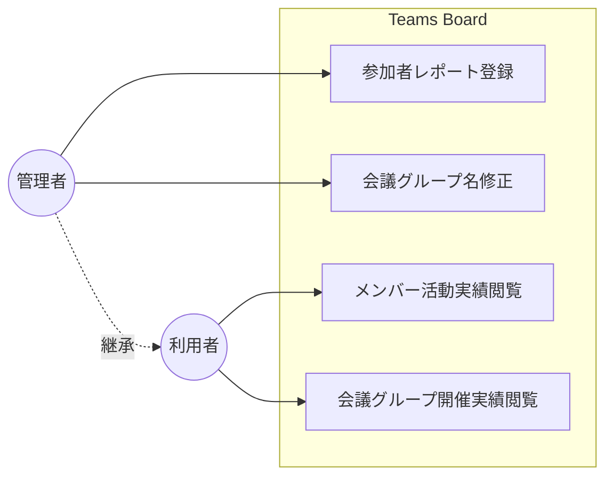
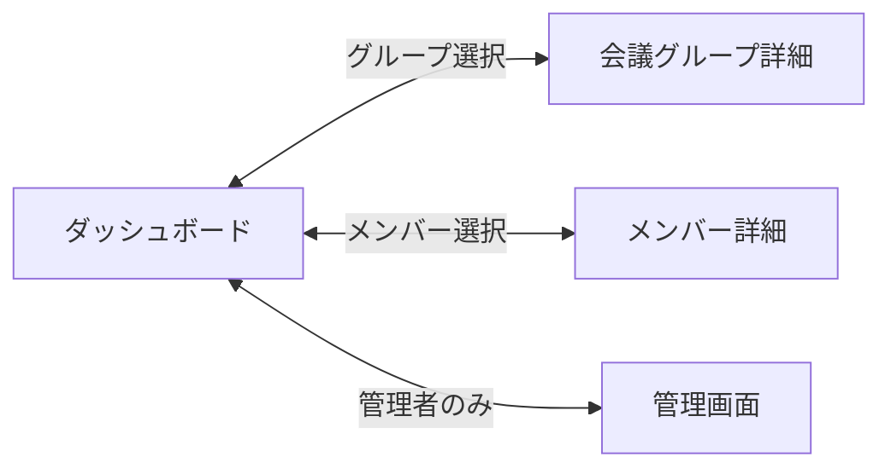

# 概要

## はじめに

Teams Board は、Microsoft Teams の参加者レポート CSV を集約・可視化するダッシュボード。

Teams会議の同名の会議を会議グループとしてまとめ、参加状況を管理し、メンバーの参加時間を可視化する。

## ドメインモデル

| 名称 | 英語名 | 定義 | コード表現 |
|------|------|-----|------------|
| 参加者レポート | AttendanceReport | Microsoft Teams が出力する参加者情報ファイル | — |
| 参加記録 | AttendanceRecord | 会議グループ・メンバー・会議・参加を包含する全体概念。参加者レポートに依存する | — |
| 会議グループ | SessionGroup | 同名の会議をまとめたもの | `group`, `groupId` |
| メンバー | Member | 参加者 | `member`, `memberId` |
| 会議 | Session | 会議グループによる1回の開催 | `session`, `sessionId` |
| 参加 | Attendance | 会議へのメンバーの参加記録（参加時間を含む） | `attendance` |

## ビジネスユースケース図

### アクター一覧

| # | 名称 | 英語名 | 説明 |
|--|--|--|--|
| 1 | 利用者 | User | ダッシュボード・会議グループ詳細・メンバー詳細で実績を閲覧する |
| 2 | 管理者 | Administrator | 利用者を継承。参加者レポートの登録、会議グループ名の修正を行う |

### ビジネスユースケース一覧

| # | 名称 | 英語名 | 説明 |
|--|--|--|--|
| 1 | [参加状況管理](01.参加状況管理/参加状況管理.md) | AttendanceManagement | Microsoft Teams の参加者レポートを取り込み、会議グループの開催実績とメンバーの参加記録を管理・可視化する |
| 2 | [会議グループ管理](02.会議グループ管理/会議グループ管理.md) | SessionGroupManagement | 会議タイトルから自動生成された会議グループ名を組織の命名規則に準拠した名称へ修正する |

## ユースケース図

### ユースケース一覧

| # | 名称 | 英語名 | 説明 |
|--|--|--|--|
| 1 | 参加者レポート登録 | AttendanceReportUpload | 管理者パネルで参加者レポートを投入し、解析結果を確認して一括保存する |
| 2 | 会議グループ名修正 | SessionGroupNameModification | 管理者パネルの会議グループ管理で会議グループ名を編集・検証・保存する |
| 3 | メンバー活動実績閲覧 | MemberActivityHistory | メンバー詳細画面で会議グループ別の参加履歴と参加時間を確認する |
| 4 | 会議グループ開催実績閲覧 | SessionGroupAttendanceRecord | 会議グループ詳細画面で会議別の参加者と開催実績を確認する |

## 画面遷移図

| # | 名称 | 英語名 | 説明 |
|--|--|--|--|
| 1 | ダッシュボード | Dashboard | 会議グループ一覧・メンバー一覧・統計情報を表示する |
| 2 | 会議グループ詳細 | SessionGroupDetail | 会議グループの開催履歴・会議別参加者を表示する |
| 3 | メンバー詳細 | MemberDetail | メンバーの会議グループ別参加履歴・参加時間を表示する |
| 4 | 管理画面 | AdminPanel | 参加者レポートの登録・会議グループ名の修正を行う（管理者のみ） |
