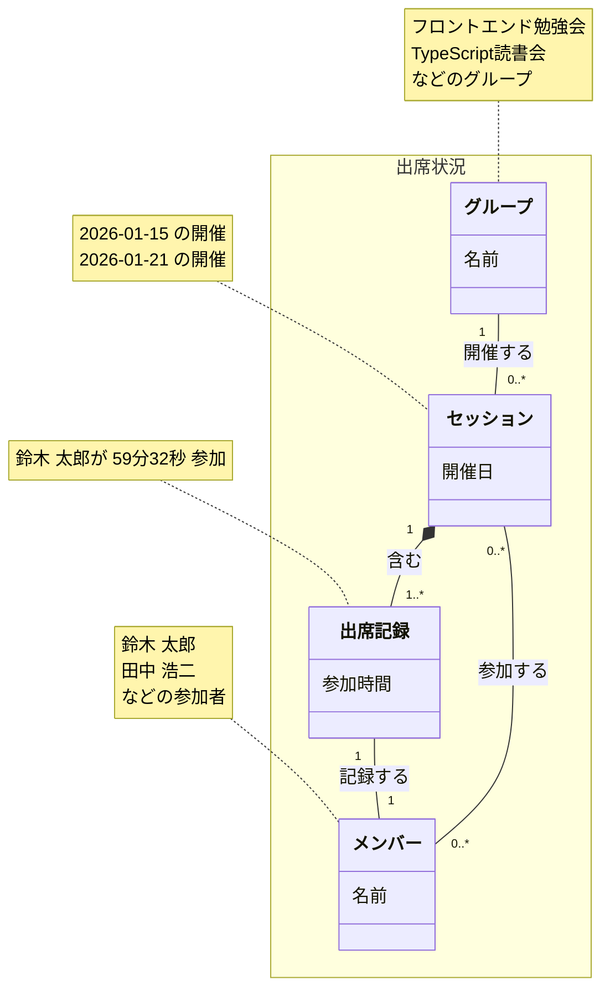

# Teams Board

## システム概要

**Teams Board** は、Microsoft Teams の出席レポート CSV を集約・可視化するダッシュボード SPA である。勉強会やミーティングのグループごとに参加状況を管理し、メンバーの活動時間を可視化する。

## ドキュメント案内

- [アーキテクチャ（現行実装）](architecture.md)
- [01.参加状況管理業務](01.参加状況管理業務/参加状況管理業務.md)
- [02.グループ情報管理業務](02.グループ情報管理業務/グループ情報管理業務.md)

---

## 概念モデル



---

## 登場する概念

| 概念 | 定義 | 例 |
|------|------|-----|
| **出席状況** | グループ・メンバー・セッション・出席記録を包含する全体概念 | — |
| **グループ** | 勉強会やミーティングなどの活動グループ | フロントエンド勉強会、TypeScript読書会 |
| **メンバー** | 参加者 | 鈴木 太郎、田中 浩二 |
| **セッション** | グループによる会議の1回の開催 | フロントエンド勉強会 2026-01-15 開催 |
| **出席記録** | セッションへのメンバーの参加記録（参加時間を含む） | 鈴木 太郎が 59分32秒 参加 |

---

## ユースケース

### CSV インポート
1. 管理者が Teams 出席レポート CSV をアップロード
2. システムが CSV を解析：
   - 会議タイトル → グループを特定または新規作成
   - 開催日 → セッションを新規作成
   - 参加者リスト → 各メンバーの出席記録を作成
3. データが永続化される

### グループ一覧表示
- すべてのグループとそれぞれの総参加時間を表示
- 総参加時間 = そのグループの全セッションの全出席記録の参加時間の合計

### メンバー一覧表示
- すべてのメンバーとそれぞれの総参加時間を表示
- 総参加時間 = そのメンバーの全出席記録の参加時間の合計

### セッション詳細表示
- 特定のセッションの出席者リストと各自の参加時間を表示
- 出席記録を通じてメンバーと参加時間を取得

---

## データの流れ

```
Teams 出席レポート CSV
  ↓
[解析]
  ↓
グループ + セッション + 出席記録 (+ メンバー) の概念が生成される
  ↓
[永続化]
  ↓
JSON ファイルとして Azure Blob Storage に保存
  ↓
[読み取り]
  ↓
ダッシュボードで可視化
```

---

## 実装上の補足

このドキュメントは概念モデルを示している。実装では以下のような形で具体化されている：

- **グループ**: `GroupSummary` として `index.json` に格納（集約データ）
- **メンバー**: `MemberSummary` として `index.json` に格納（集約データ）
- **セッション**: `SessionRecord` として `data/sessions/{id}.json` に個別保存
- **出席記録**: `SessionRecord` 内の配列として保存

詳細な実装構成は [architecture.md](architecture.md) を参照のこと。
