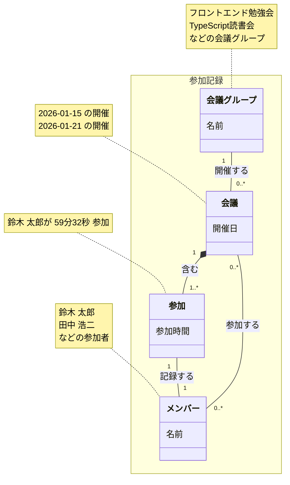
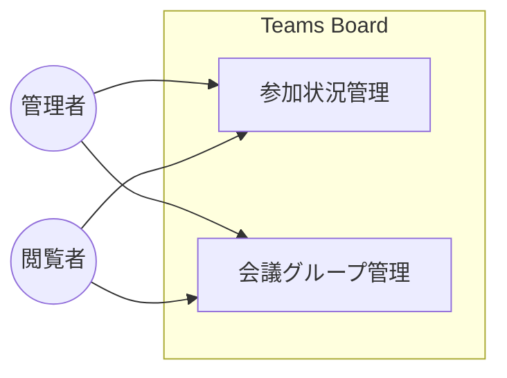

# 概要

## はじめに

Teams Board は、Microsoft Teams の参加レポート CSV を集約・可視化するダッシュボード SPA 。

Teams会議のミーティングや勉強会などの会議グループごとに参加状況を管理し、メンバーの活動時間を可視化する。

## ドメインモデル

| 概念 | 定義 | 例 |
|------|------|-----|
| 参加記録 | 会議グループ・メンバー・会議・参加を包含する全体概念 | — |
| 会議グループ | 勉強会やミーティングなどの活動グループ | フロントエンド勉強会、TypeScript読書会 |
| メンバー | 参加者 | 鈴木 太郎、田中 浩二 |
| 会議 | 会議グループによる1回の開催 | フロントエンド勉強会 2026-01-15 開催 |
| 参加 | 会議へのメンバーの参加記録（参加時間を含む） | 鈴木 太郎が 59分32秒 参加 |

## ビジネスユースケース図

### アクター一覧

| # | アクター名 | 種別 | 説明 |
|--|--|--|--|
| 1 | 管理者 | ビジネスアクター | 参加者レポートの取得・登録、会議グループ名の修正を行う |
| 2 | 閲覧者 | ビジネスアクター | ダッシュボード・会議グループ詳細・メンバー詳細で実績を閲覧する |

### ユースケース一覧

| # | ユースケース | 概要 | 関連アクター |
|--|--|--|--|
| 1 | [参加状況管理](01.参加状況管理/参加状況管理.md) | Microsoft Teams の参加者レポートを取り込み、会議グループの開催実績とメンバーの参加記録を管理・可視化する | 管理者、閲覧者 |
| 2 | [会議グループ管理](02.会議グループ管理/会議グループ管理.md) | 会議タイトルから自動生成された会議グループ名を組織の命名規則に準拠した名称へ修正する | 管理者、閲覧者 |

