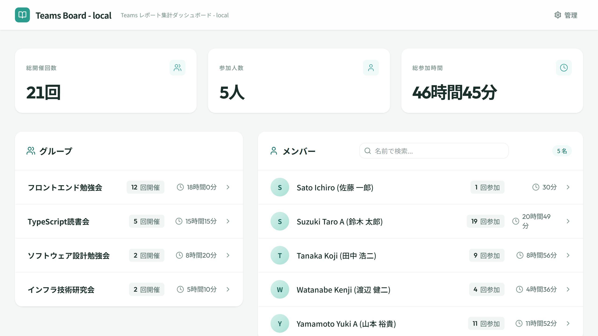
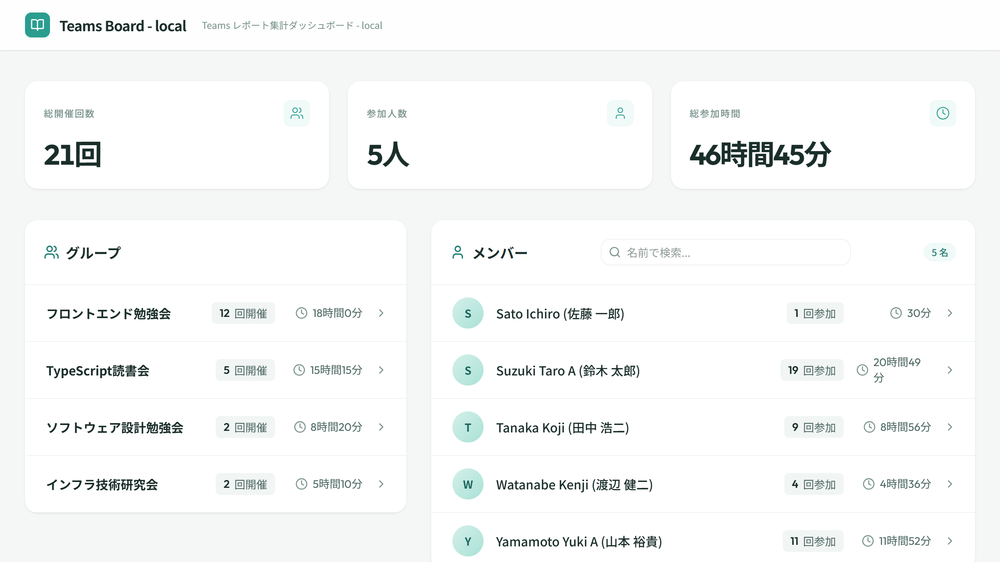
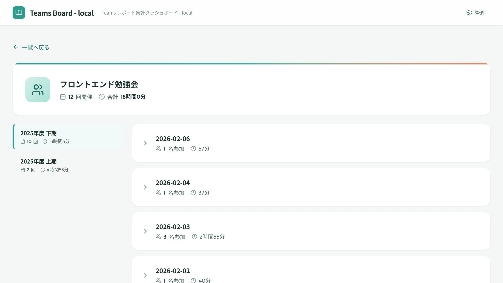
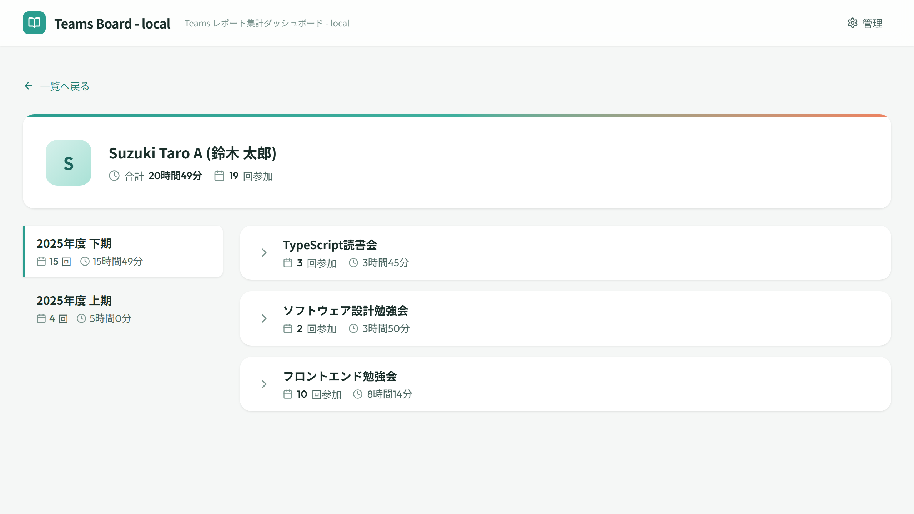

<!-- _class: lead -->
<!-- _paginate: false -->

# Teams Board

## Teams 会議の参加状況を、もっと見やすく

---

# こんな課題ありませんか？

- 参加者の出席状況を**手作業で集計**している
- グループごと・メンバーごとの参加傾向が**把握しづらい**
- 集計結果を**共有する手段がない**

> Teams会議が増えるほど、管理コストも増大...

---

# Teams Board とは

CSV をドラッグ＆ドロップするだけで、参加状況を**自動で可視化**するダッシュボード

- Teams 出席レポート CSV（UTF-16LE）を**そのまま読み込み**
- グループ別・メンバー別に**参加回数・時間を自動集計**
- ブラウザだけで動作、**サーバー不要**
- SAS トークンによるシンプルな認証

---

# ダッシュボード

グループ別・メンバー別の参加状況を一覧表示

---

# CSV アップロード

管理画面でドラッグ＆ドロップするだけでデータ登録

---

# グループ・メンバー分析

グループごとの開催履歴、メンバーごとの参加履歴を詳細に確認

 

---

# アーキテクチャ

**サーバーレス SPA** — Azure Blob Storage の静的サイトホスティングのみで動作

- アプリ本体（HTML/JS/CSS）もデータ（JSON）も **同じ Blob Storage** に格納
- バックエンドサーバーなし — CSV 解析・集計はすべて**ブラウザ内で完結**
- データ書き込みは **SAS トークン付き PUT** で直接 Blob Storage へ
  - 秘匿性の高くない情報が対象 → Entra ID 認証の複雑さより運用の簡素さを優先
- 閉域網対応: PaaS ファイアウォール + Private Endpoint 構成も可能

---

# 技術スタック

| カテゴリ | 技術 |
|---------|------|
| フレームワーク | **React 19** + Vite |
| スタイリング | **Tailwind CSS 4** |
| CSV 解析 | **PapaParse**（UTF-16LE 対応） |
| データ可視化 | **recharts** |
| テスト | **Vitest** + React Testing Library |
| E2E テスト | **Playwright** |
| ホスティング | **Azure Blob Storage** 静的サイト |
| CI/CD | **GitHub Actions**（OIDC 認証） |

---

# 運用コスト

Azure Blob Storage のみで運用 → **月額数十円〜**

| 項目 | 内容 |
|------|------|
| コンピュート | 不要（静的サイト） |
| ストレージ | Azure Blob Storage（Standard_LRS） |
| 認証 | SAS トークン（URL パラメータ） |
| 通信 | HTTPS（静的 Web エンドポイント） |

- サーバー管理不要、スケーリング不要
- クローズド環境での利用に最適
- PaaS ファイアウォール対応（VNet + Private Endpoint）

---

<!-- _class: ending -->
<!-- _paginate: false -->

# まとめ

## Teams Board は、Teams 出席レポートの集計を自動化するダッシュボードです

CSV をドラッグ＆ドロップするだけ
サーバーレスで月額数十円〜
