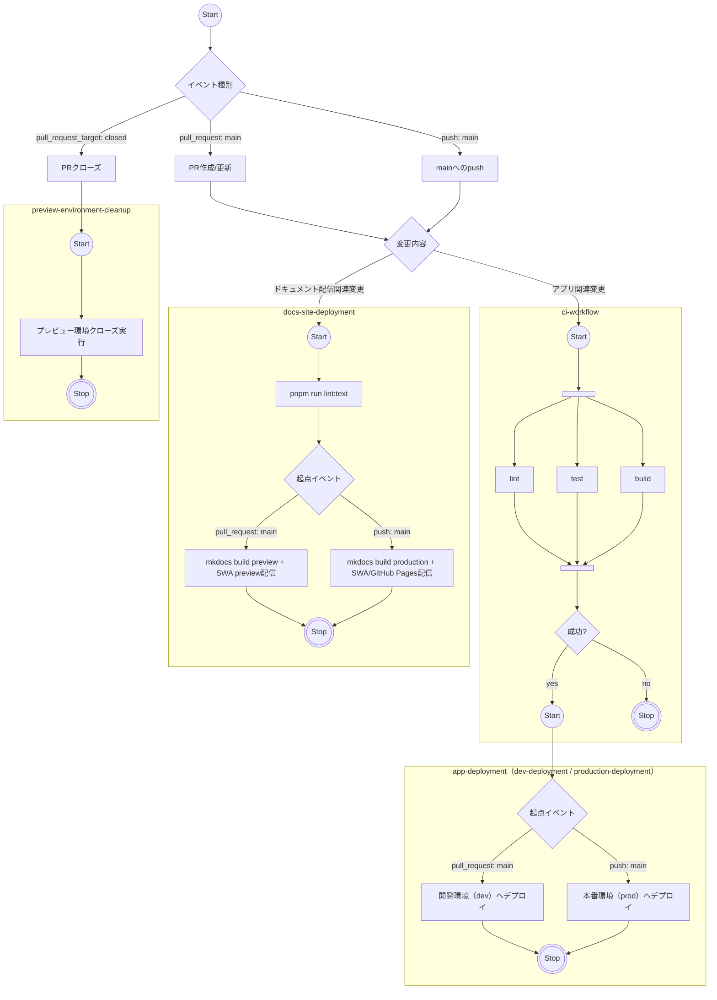

## Context

現状のGitHub Actionsは、アプリ配信系（`deploy.yml`）にCI・デプロイ・E2Eが混在し、ドキュメント配信系（`deploy-site.yml`）とプレビュークローズ（`close-preview.yml`）が別管理になっている。  
加えて文書更新時のtextlintは、配信系フローと個別フローで重複しやすく、実行コストと運用判断の負担を増やしている。

この変更では、文書lintを `docs-site-deployment` に一本化し、配信前ゲートとして扱う。  
また、アプリ配信（dev/prod）は対象コミットのCI成功を必須条件に統一する。

制約として、Azure認証はOIDCを維持し、既存のSecrets/Variables命名は変更しない。

## 最終フロー（Mermaid）

`ci-workflow` は1つで、その後段のアプリ配備は `app-deployment` として統合し、差分は起点イベントとGitHub Environment（dev/prod）のみで表現する。  
`docs-site-deployment` も1つで、差分は起点イベント（PR=preview/main push=production）のみで表現する。  
並列実行は `@{ shape: fork }` を使った `Fork/Join` で明示し、文書lintは `docs-site-deployment` の先頭で実行する。

## Goals / Non-Goals

**Goals:**

- アプリ配信系とドキュメント配信系を含む全ワークフローの責務境界を明確化する。
- 共通セットアップを再利用可能な形に統一し、重複と保守コストを削減する。
- トリガー、パスフィルター、concurrencyを用途別に整理し、不要実行を抑制する。
- アプリのdev/prodデプロイ前にCI成功を必須化し、未検証コミットの配信を防止する。
- 文書lintを `docs-site-deployment` 内に一本化し、配信前ゲートとして運用する。
- PR作成/更新/クローズの一連の運用（配信・検証・クリーンアップ）を予測可能にする。

**Non-Goals:**

- アプリ本体機能やドキュメント本文（`docs/**`）の内容変更。
- Azureリソース構成や認証方式（OIDC以外）への変更。
- textlintルールセット自体（`.textlintrc.json`）の設計変更。
- E2Eテストケースの新規追加。

## Decisions

### 1. ワークフローを責務単位で分離する

**決定:** 各ワークフローを「品質検証」「配信」「クリーンアップ」の責務単位で整理し、1ワークフロー1責務を原則とする。  

**理由:**

- 修正意図と変更対象が一致し、レビューしやすい。
- 障害時に切り分け対象を素早く限定できる。

**代替案:**

- 単一ワークフローへの集約: 一元管理はできるが、条件分岐が増えて保守性が下がる。

### 2. Node.js/pnpm/uvセットアップを共通化する

**決定:** `deploy.yml` と `deploy-site.yml` で重複する環境準備は共通化する（Reusable Workflow または Composite Actionを採用候補）。  

**理由:**

- バージョン更新時の変更点を集約できる。
- 設定ドリフトを防ぎ、検証コストを下げられる。

**代替案:**

- 各ワークフローに個別定義を維持: 初期変更量は少ないが、長期的な運用コストが高い。

### 3. トリガーとパスフィルターを用途別に最適化する

**決定:** アプリ検証、アプリ配信、ドキュメント配信、プレビュークローズでトリガー方針を分離し、対象外変更での実行を抑止する。文書lintは `docs-site-deployment` の配信前ステップとして実行する。  

**理由:**

- 不要実行を減らし、実行時間とActionsコストを抑えられる。
- どの変更でどのワークフローが動くかを説明可能にできる。

**代替案:**

- 文書lintを個別ワークフローで維持: 配信フローと重複実行が発生し、運用負担が増える。

### 4. アプリ配信はCI成功を必須ゲートにする

**決定:** アプリの開発環境・本番環境デプロイは、対象コミット（または対象ref）の `ci-workflow` が成功している場合のみ実行する。  

**理由:**

- 未検証コミットの配信を防止できる。
- 品質ゲートの一貫性を保てる。

**代替案:**

- デプロイをCIと独立実行: 実行速度は上がるが、品質リスクが増える。

### 5. concurrencyをワークフロー特性に合わせて分ける

**決定:** CIは最新優先、配信は環境整合性優先、クローズ処理は冪等性優先でconcurrencyを設定する。  

**理由:**

- 品質検証は鮮度重視、配信は完全性重視という目的差に合わせられる。
- 同一対象への重複処理を抑えつつ、必要な実行は失わない。

**代替案:**

- 全ワークフローで同一方針: 運用は単純だが、用途に対して過不足が出る。

### 6. PRクローズ時のプレビュークリーンアップを安全にする

**決定:** `close-preview.yml` はPRクローズ時のクリーンアップ処理を冪等にし、対象外PRや再実行時でも破壊的失敗を起こさない設計にする。  

**理由:**

- `pull_request_target` の運用では安全性と失敗耐性が重要になる。
- クリーンアップ失敗で運用フロー全体が止まる事態を避けられる。

**代替案:**

- 常に強制クローズ実行: 実装は単純だが、不要実行や失敗ノイズが増える。

### 7. 段階移行で検証可能性を維持する

**決定:** ワークフロー再編は段階適用とし、各段階で実行ログと副作用を確認してから次へ進む。  

**理由:**

- 一括変更時の障害原因特定を避けられる。
- ロールバック単位を小さく保てる。

**代替案:**

- 一括置換: 実装速度は上がるが、障害時の診断範囲が広がる。

## Risks / Trade-offs

- [Risk] パスフィルターの過不足で必要実行が漏れる可能性 → Mitigation: 主要設定ファイルとワークフロー定義変更を対象に含め、初期運用で実行漏れを監視する。
- [Risk] 共通化しすぎるとワークフロー固有の意図が読みにくくなる → Mitigation: 共通化対象をセットアップ層に限定し、ジョブ固有処理は各ワークフローに残す。
- [Risk] `pull_request_target` の扱いを誤ると意図しない権限利用につながる → Mitigation: `close-preview.yml` の入力値と実行条件を最小化し、不要なコンテキスト参照を避ける。
- [Risk] CIゲートの判定実装を誤るとデプロイが過剰停止する可能性 → Mitigation: 対象コミットのcheck status取得方法を標準化し、失敗理由をジョブログに明示する。
- [Trade-off] ファイル数が増えて管理対象が拡大する → Mitigation: 命名規約、責務コメント、運用手順書を統一する。

## Migration Plan

1. 既存ワークフローの責務を「品質検証」「配信」「クリーンアップ」に分類する。
2. `deploy.yml` の再構成方針（CI/配信境界、共通セットアップ）を確定する。
3. アプリ配信（dev/prod）にCI成功ゲートを実装し、未検証refのデプロイを拒否する。
4. `deploy-site.yml` に文書lint先行実行を統合し、配信前ゲートを一本化する。
5. `close-preview.yml` の実行条件と失敗時挙動を見直し、冪等クリーンアップを担保する。
6. PRで全ワークフローの実行結果を確認し、実行回数・所要時間・失敗時の切り分け性を検証する。
7. 運用ドキュメントを更新し、最終的なトリガー対応表とCIゲート条件を明文化する。

**Rollback Strategy:**

- 不具合発生時は対象ワークフロー単位で直前安定コミットへ戻し、段階適用で再検証する。

## Open Questions

- 共通化方式は Reusable Workflow と Composite Action のどちらが保守コスト最小か。
- `deploy-site.yml` の preview/productionモード分岐は単一ワークフロー維持か、責務分離か。
- `close-preview.yml` で対象PRの条件判定をどこまで厳格化するか。
- PR時のdevデプロイで参照するCI成功判定を、head SHA基準とmerge commit基準のどちらに統一するか。
